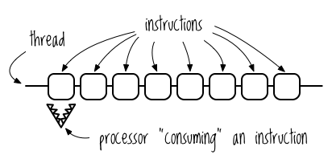
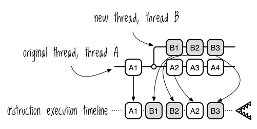
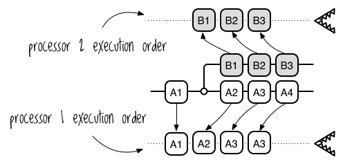
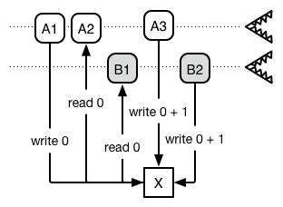
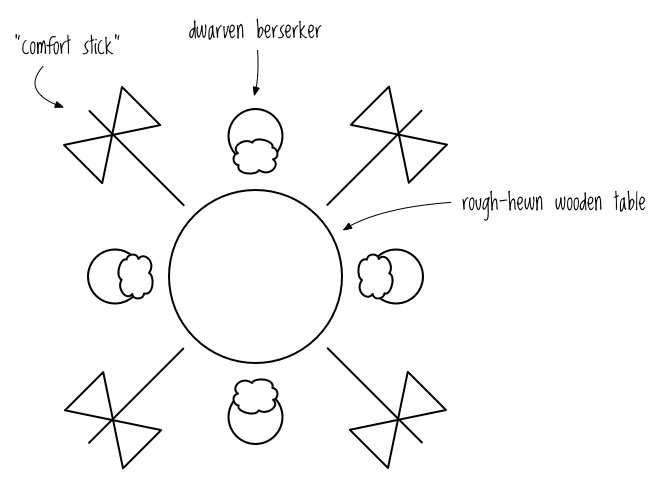
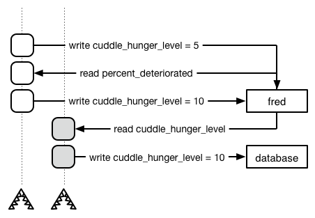
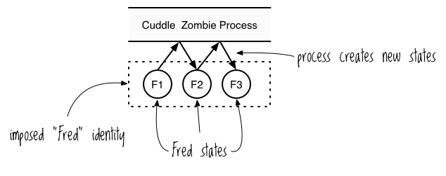
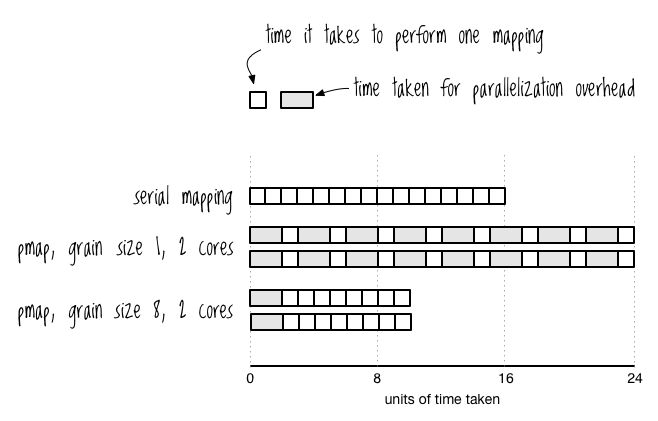

# Concurrency, Parallelism, and State. And Zombies.

In this chapter you'll learn what concurrency and parallelism are and
why they matter. You'll learn about the challenges you'll face when
writing parallel programs and about how Clojure's design helps to
mitigate them. Finally, you'll learn a big boatload of tools and
techniques for writing parallel programs yourself, including: futures,
promises, delays, atoms, refs, vars, pmap, and core.reducers. Also,
there will be zombies. Onward!

## Why Parallel Programming Matters

Why should you bother with any of this? The reason is that parallel
programming is essential for writing performant applications on modern
hardware. You've probably noticed that, in recent years, CPU clock
speeds have barely increased. At the same time, dual-core and
quad-core computers have become common.

This is mostly because increasing clock speed requires exponentially
more power, making it impractical. This is a physical limitation that
is unlikely to be overcome any time soon, if ever. Therefore, you can
expect the trend of increasing cores on a single machine to continue
&mdash; as will the expectation that you as a programmer will know how
to make the most of modern hardware.

Besides this practical consideration, I think you'll also find that
parallel programming is actually fun and fascinating with Clojure.
Learning these techniques will make you a better programmer overall,
even if you don't actually write parallel programs for the near
future.

## Concurrency and Parallelism Concepts

Concurrent and parallel programming involves a lot of messy details at
all levels of program execution, from the hardware to the operating
system to programming language libraries to the code that you're
typing out with your very own fingers. In this section I'll ignore
those details and instead focus on the implementation-independent
high-level concepts.

### Managing Multiple Tasks vs. Executing Tasks Simultaneously

**Concurrency** refers to *managing* more than one task at the same
time. "Task" just means "something that needs to get done." We can
illustrate concurrency with the song "Telephone" by Lady Gaga. Gaga
sings,

> I cannot text you with a drink in my hand, eh

Here, she's explaining that she can only manage one task (drinking).
She flat out rejects the suggestion that she manage more than one
task. However, if she decided to process tasks concurrently, she would
sing,

> I will put down this drink to text you,
> then put my phone away and continue drinking, eh

In this hypothetical universe, Lady Gaga is *managing* two tasks:
drinking and texting. However, she is not *executing* both tasks at
the same time. Instead, she's switching between the two. This is
called **interleaving**. Note that, when talking about interleaving,
you don't have to fully complete a task before switching; Gaga could
type one word, put her phone down, pick up her drink and have a sip,
then switch back to her phone and type another word.

**Parallelism** refers to *executing* more than one task at the same
time. If Madame Gaga were to execute her two tasks in parallel, she
would sing:

> I can text you with one hand
> while I use the other to drink, eh

Clojure has many features which allow you to easily achieve
parallelism. Whereas the Lady Gaga system achieves parallelism by
simultaneously executing tasks on multiple hands, computer systems
generally achieve parallelism by simultaneously executing tasks on
multiple processors.

You can see from this definition that parallelism is a subclass of
concurrency: in order to execute multiple tasks simultaneously, you
first have to manage multiple tasks. Concurrency can be seen as
potential paralellism.

It's important to distinguish parallelism from **distribution**.
Distributed computing is a specialization of parallel computing where
the processors don't reside in the same computer and where tasks are
distributed to computers over a network. It'd be like Lady
Gaga asking Beyoncé, "Please text this guy while I drink."

I'm going to use "parallel" only to refer to cohabitating processors.
While there are Clojure libraries that aid distributed programming,
this book only covers parallel programming.

### Blocking and Async

One of the big use cases for concurrent programming is for
**blocking** operations. "Blocking" really just means waiting for an
operation to finish and you'll most often hear it used in relation to
I/O operations, like reading a file or waiting for an HTTP request to
finish. Let's examine this using the Concurrent Lady Gaga example.

If Lady Gaga texts her interlocutor and then stands there with her
phone in her hand, staring at the screen for a response and not
drinking, then you would say that the "read next text message"
operation is blocking and that these tasks are executing
**synchronously**.

If, instead, she tucks her phone away so that she can drink until it
alerts her by beeping or vibrating, then you could say she's handling
the "read next text message" task **asynchronously**.

### Concurrent Programming, Parallel Programming

"Concurrent programming" and "parallel programming" refer to how you
decompose a task into parallelizable sub-tasks and the techniques you
use to manage the kinds of risks that arise when your program executes
more than one task at the same time. For the rest of the chapter, I'll
use the two terms interchangeably because the risks are pretty much
the same for both.

To better understand those risks and how Clojure help you avoid them,
let's examine how concurrency and parallelism are implemented in
Clojure.

## Clojure Implementation: JVM Threads

I've been using the term "task" to refer to *logical* sequences of
related operations. Texting consists of a series of related operations
separate from those involved in pouring a drink into your face, for
example. So, "task" is an abstract term which says nothing about
implementation.

In Clojure, you can think of your normal, serial code as a sequence of
tasks. You indicate that tasks can be performed concurrently by
placing them on **threads**.

### So What's a Thread?

I'm glad you asked! Rather than giving a technical definition of a
thread, though, I'm going to describe a model of how threads work.

I think of a thread as an actual, physical piece of thread that's been
threaded through a sequence of instructions. In my mind, the
instructions are marshmallows, because marshmallows are delicious. The
processor executes these instructions in order. I envision this as an
alligator consuming the instructions, because alligators love
marshmallows (true fact!). So executing a program looks like a bunch
of marshmallows strung out on a line with an alligator traveling down
the line and eating them one by one. Here's a single-core processor
executing a single-threaded program:



A thread can "spawn" a new thread. In a single-processor system, the
processor switches back and forth between the threads (interleaving).
Here's where we things start to get tricky. While the processor will
execute the instructions on each thread in order, it makes no
guarantees about when it will switch back and forth between threads.

Here's an illustration of two threads, "A" and "B", along with a
timeline of how their instructions could be executed. I've shaded the
instructions on thread B to help distinguish them from the
instructions on thread A.



Note that this is just a *possible* ordering of instruction execution.
The processor could also have executed the instructions in the order,
"A1, A2, A3, B1, A4, B2, B3", for example. The main idea is that you
can't know what order the instructions will actually take. This makes
the program **nondeterministic**. You can't know beforehand what the
result will be because you can't know the execution order.

Whereas the above example showed concurrent execution on a single
processor through interleaving, a multi-core system will assign a
thread to each core. This allows the computer to execute more than one
thread simultaneously. Each core executes its thread's instructions in
order:



As with interleaving on a single core, there are no guarantees for the
overall execution order, so the program is nondeterministic. To make
things even more fun, your programs will typically have more threads
than cores, so each core will likely perform interleaving on multiple
threads.

### The Three Goblins: Reference Cells, Mutual Exclusion, Dwarven Berserkers

To drive this point home, imagine the program in the image above
includes the following pseudo instructions:

| ID | Instruction     |
|----+-----------------|
| A1 | WRITE X = 0     |
| A2 | READ X          |
| A3 | WRITE X = X + 1 |
| B1 | READ X          |
| B2 | WRITE X = X + 1 |

If the processor follows the order "A1, A2, A3, B1, B2" then `X`'s
value will end up `2`, as you'd expect. If it follows the order "A1,
A2, B1, A3, B2", `X`'s value will be `1`, as you can see here:



This little thought experiment demonstrates one of the three central
challenges in concurrent programming, a.k.a "The Three Concurrency
Goblins." We'll call this the "reference cell" problem.

There are two other problems involved in concurrent programming:
mutual exclusion and the dwarven berserkers problem. For mutual
exclusion, imagine two threads are each trying to write the text of a
different spell to a file. Without any way to claim exclusive write
access to the file, the spell will end up garbled as the write
instructions get interleaved. These two spells:

    By the power invested in me
    by the state of California
    I now pronounce you man and wife

    Thunder, lightning, wind and rain,
    a delicious sandwich, I summon again

Could get written as this:

    By the power invested in me
    by Thunder, lightning, wind and rain,
    the state of California
    I now pronounce you a delicious man sandwich, and wife
    I summon again

Finally, the dwarven berserker problem can be stated as follows.
Imagine four berserkers are sitting around a rough-hewn, circular
wooden table and comforting each other. "I know I'm distant toward my
children, but I just don't know how to communicate with them," one
growls. The rest sip their coffees and nod knowingly, care lines
creasing their eyeplaces.

Now, as everyone knows, the dwarven berserker ritual for ending a
comforting coffee klatch is to pick up their "comfort sticks"
("double-bladed waraxes") and scratch each others' backs. One waraxe
is placed between each pair of dwarves, like so:

Their ritual proceeds thusly:

1. Pick up the *left* waraxe, when available
2. Pick up the *right* waraxe, when available
3. Comfort your neighbor with vigorous swings of your "comfort sticks"
4. Release both waraxes
5. Go to 1



Following this ritual, it's entirely possible that all dwarven
berserkers will pick up their left comfort stick and then block
indefinitely waiting for the comfort stick to their right to become
available, resulting in **deadlock**. (By the way, in case you want to
look into this phenomenon more, it's usually referred to as "the dining
philosophers problem." But that's boring.) This book doesn't discuss
deadlock in much detail, but it's good to know the concept and its
terminology.

The takeaway here is that concurrent programming has the potential to
be confusing and terrifying. But! With the right tools, it's
manageable and even fun. Let's start looking at the right tools.

## Futures, Delays, and Promises

Futures, delays, and promises are easy, lightweight tools for
concurrent programming. In this section, you'll learn how each works
and how to use them together to defend against the Reference Cell
Concurrency Goblin and the Mutual Exclusion Concurrency Goblin. You'll
discover that, while simple, these tools can go a long way toward
meeting your concurrency needs.

### Futures

In Clojure, you can use **futures** to place a task on another thread.
You can create a future with the `future` macro. Try this in a REPL:

```clojure
(future (Thread/sleep 4000)
        (println "I'll print after 4 seconds"))
(println "I'll print immediately")
```

`Thread/sleep` tells the current thread to just sit on its bum and do
nothing for the specified number of milliseconds. Normally, if you
evaluated `Thread/sleep` in your REPL you wouldn't be able to evaluate
any other statements until the REPL was done sleeping; the thread
executing your REPL would be blocked. However, `future` throws your
call to `Thread/sleep` into another thread, allowing the REPL's thread
to continue, unblocked.

Futures differ from the values you're used to, like hashes and maps,
in that you have to *dereference* them to obtain their value. The
value of a future is the value of the last expression evaluated. You
can dereference a future with either the `deref` function or the `@`
reader macro. A future's body only executes once and its value gets
cached. Try the following:

```clojure
(let [result (future (println "this prints once")
                     (+ 1 1))]
  (println "deref: " (deref result))
  (println "@: " @result))
; =>
; "this prints once"
; deref: 2
; @: 2
```

Notice that the the string `"this prints once"` indeed only prints
once, showing that the future's body only ran once and the result got
cached.

Dereferencing a future will block if the future hasn't finished
running:

```clojure
(let [result (future (Thread/sleep 3000)
                     (+ 1 1))]
  (println "The result is: " @result)
  (println "It will be at least 3 seconds before I print"))
; =>
; The result is:  2
; It will be at least 3 seconds before I print
```

Sometimes you want to place a time limit on how long to wait for a
future. To do that, you can pass the number of milliseconds to wait to
`deref` along with the value to return if the deref does time out. In
this example, you tell `deref` to return the value `5` if the future
doesn't return a value within 10 milliseconds.

```clojure
(deref (future (Thread/sleep 1000) 0) 10 5)
; => 5
```

Finally, you can interrogate a future to see if it's done running with
`realized?`:

```clojure
(realized? (future (Thread/sleep 1000)))
; => false

(let [f (future)]
  @f
  (realized? f))
; => true
```

Futures are a dead simple way to sprinkle some concurrency on your
program. On their own, they give you the power to chuck tasks onto
other threads, allowing you to increase performance. They don't
protect you against The Three Concurrency Goblins, but you'll learn
some ways to protect yourself with delays and promises in just a
minute. First, though, let's take a closer look at dereferencing.

### Dereferencing

Dereferencing is easy to understand, but it implies some nuances that
aren't immediately obvious. It allows you more flexibility than is
possible with serial code. When you write serial code, you bind
together these three events:

* Task definition
* Task execution
* Requiring the task's result

As an example, take this hypothetical code, which defines a simple api
call task:

```clojure
(web-api/get :dwarven-beard-waxes)
```

As soon as Clojure encounters this task definition, it executes it. It
also requires the result *right now*, blocking until the api call
finishes.

Futures, however, allow you to separate the "require the result" event
from the other two. Calling `future` defines the task and indicates
that it should start being evaluated immediately. *But*, it also
indicates that you don't need the result immediately. Part of learning
concurrent programming is learning to identify when you've created
these chronological couplings when they aren't actually necessary.

When you dereference a future, you indicate that the result is
required *right now* and that evaluation should stop until the result
is obtained. You'll see how this can help you deal with the mutual
exclusion problem in just a little bit.

Alternatively, you can ignore the result. For example, you can use
futures to write to a log file asynchronously.

The flexibility that futures give you is pretty cool. Clojure also
allows you to treat "task definition" and "requiring the result"
independently with delays and promises. Onward!

### Delays

Delays allow you to define a task definition without having to execute
it or require the result immediately. You can create a delay with
`delay`. In this example, nothing is printed:

```clojure
(def jackson-5-delay
  (delay (let [message "Just call my name and I'll be there"]
           (println "First deref:" message)
           message)))
```

You can evaluate the delay and get its result by dereferencing or
using `force`. `force` has the same effect as `deref`; it just
communicates more clearly that you're causing a task to start
as opposed to waiting for a task to finish.

```clojure
(force jackson-5-delay)
; => First deref: Just call my name and I'll be there
; => "Just call my name and I'll be there"
```

Like futures, a delay is only run once and its result is cached.
Subsequent dereferencing will return the Jackson 5 message without
printing anything:

```clojure
@jackson-5-delay
; => "Just call my name and I'll be there"
```

One way you can use a delay is to fire off a statement the first time
one future out of a group of related futures finishes. For example,
pretend your app uploads a set of headshots to a headshot-sharing site
and notifies the owner as soon as the first one is up, as in the
following:

```clojure
(def gimli-headshots ["serious.jpg" "fun.jpg" "playful.jpg"])
(defn email-user
  [email-address]
  (println "Sending headshot notification to" email-address))
(defn upload-document
  "Needs to be implemented"
  [headshot]
  true)
(let [notify (delay (email-user "and-my-axe@gmail.com"))]
  (doseq [headshot gimli-headshots]
    (future (upload-document headshot)
            (force notify))))
```

In this example, Gimli will be grateful to know when the first
headshot is available so that he can begin tweaking it and sharing it.
He'll also appreciate not being spammed, and you'll appreciate not
facing his reaction to being spammed.

This technique can help protect you from the Mutual Exclusion
Concurrency Goblin. You can view a delay as a resource in the same way
that a printer is a resource. Since the body of a delay is guaranteed
to only ever fire once, you can be sure that only one thread will ever
have "access" to the "resource" at a time. Of course, no thread will
ever be able to access the resource ever again. That might be too
drastic a constraint for most situations, but in cases like the
example above it works perfectly.

### Promises

Promises allow you to express the expectation of a result independently
of the task that should produce it and when that task should run. You
create promises with `promise` and deliver a result to them with
`deliver`. You obtain the result by dereferencing:

```clojure
(def my-promise (promise))
(deliver my-promise (+ 1 2))
@my-promise

; => 3
```

You can only deliver a result to a promise once. Just like with
futures and delays, dereferencing a promise will block until a result
is available.

One potential use for promises is to find the first satisfactory
element in a collection of data. Suppose, for example, that you're
gathering ingredients for a spell to summon a parrot that repeats what
people say, but in James Earl Jones's voice. Because James Earl Jones
has the smoothest voice on earth, one of the ingredients is premium
yak butter with a smoothness rating of 97 or greater. Because you
haven't yet summoned a tree that grows money, you have a budget of
$100 for one pound (or 0.45kg if you're a European sorcerer).

Because you are a modern practitioner of the magico-ornithological
arts, you know that yak butter retailers now offer their catalogs
online. Rather than tediously navigate each site, you create a script
to give you the URL of the first yak butter offering that meets your
needs.

In this scenario, the collection of data is the yak butter options
provided by each store. You can model that by defining some yak butter
products, creating a function to mock out an API call, and creating
a function to test whether a product is satisfactory:

```clojure
(def yak-butter-international
  {:store "Yak Butter International"
    :price 90
    :smoothness 90})
(def butter-than-nothing
  {:store "Butter than Nothing"
   :price 150
   :smoothness 83})
;; This is the butter that meets our requirements
(def baby-got-yak
  {:store "Baby Got Yak"
   :price 94
   :smoothness 99})

(defn mock-api-call
  [result]
  (Thread/sleep 1000)
  result)

(defn satisfactory?
  "If the butter meets our criteria, return the butter, else return false"
  [butter]
  (and (<= (:price butter) 100)
       (>= (:smoothness butter) 97)
       butter))
```

The API call waits 1 second before returning a result to simulate the
time it would take to perform an actual call.

To show how long it will take to check site synchronously, we'll need
to use the `some` function. `some` takes two arguments: a function and
a collection. It applies the function to each element of the
collection and returns the first truthy result, or nil if there are
none:

```clojure
(some odd? [2 3 4 5])
; => true

;; return the value which had the truthy result
(some #(and (odd? %) %) [2 3 4 5])
; => 3
```

When you check each site synchronously, it could take more than 3
seconds to obtain a result, as the following code shows. Note that
`time` prints the time taken to evaluate a form and `comp` composes
functions, as discussed in the chapter "Functional Programming":

```clojure
(time (some (comp satisfactory? mock-api-call)
            [yak-butter-international butter-than-nothing baby-got-yak]))
; => "Elapsed time: 3002.132 msecs"
; => {:store "Baby Got Yak", :smoothness 99, :price 94}
```

You can use a promise and futures to perform each check on a separate
thread. If your computer has multiple cores, you could cut down the
time taken to about 1 second:

```clojure
(time
 (let [butter-promise (promise)]
   (doseq [butter [yak-butter-international butter-than-nothing baby-got-yak]]
     (future (if-let [satisfactory-butter (satisfactory? (mock-api-call butter))]
               (deliver butter-promise satisfactory-butter))))
   (println "And the winner is:" @butter-promise)))
; => "Elapsed time: 1002.652 msecs"
; => And the winner is: {:store Baby Got Yak, :smoothness 99, :price 94}
```

By decoupling the requirement for a result from how the result is
actually computed, you can perform multiple computations in parallel
and save yourself some time.

You can view this as a way to protect yourself from the Reference Cell
Concurrency Goblin. Since promises can only be written to once, you're
can't create the kind of inconsistent state that arises from
nondeterministic reads and writes.

The last thing I should mention is that you can also use promises to
register callbacks, achieving the same functionality that you might be
used to in JavaScript. Here's how to do it:

```clojure
(let [ferengi-wisdom-promise (promise)]
  (future (println "Here's some Ferengi wisdom:" @ferengi-wisdom-promise))
  (Thread/sleep 100)
  (deliver ferengi-wisdom-promise "Whisper your way to success."))
; => Here's some Ferengi wisdom: Whisper your way to success.
```

In this example, you're creating a future that begins executing
immediately. However, it's blocking because it's waiting for a value
to be delivered to `ferengi-wisdom-promise`. After 100 milliseconds,
you deliver the value and the `println` statement in the future runs.

Futures, delays, and promises are great, simple ways to manage
concurrency in your application. In the next section, we'll look at
one more fun way to keep your concurrent applications under control.

### Simple Queueing

So far you've looked at some simple ways to combine futures, delays,
and promises to make your concurrent programs a little safer. In this
section, you'll use a macro to combine futures and promises in a
slightly more complex manner. You might not necessarily ever use this
code, but it'll show the power of these simple tools a bit more. It
gets a little wonky with macros farther down; if that get's too crazy,
just skip to the next section.

Sometimes the best way to handle concurrent tasks is to re-serialize
them. You can do that by placing your tasks onto a queue. In this
example, you'll make API calls to pull random quotes from
[I Heart Quotes](http://www.iheartquotes.com/) and write them to your
own quote library. For this process, you want to allow the API calls
to happen concurrently but you want to serialize the writes so that
none of the quotes get garbled, like the spell example above.

Here's the un-queued quote for retrieving a random quote and writing
it:

```clojure
(defn append-to-file
  [filename s]
  (spit filename s :append true))

(defn format-quote
  [quote]
  (str "=== BEGIN QUOTE ===\n" quote "=== END QUOTE ===\n\n"))

(defn snag-quotes
  [n filename]
  (dotimes [_ n]
    (->> (slurp "http://www.iheartquotes.com/api/v1/random")
         format-quote
         (append-to-file filename)
         (future))))
```

If you call `(snag-quotes 2 "quotes.txt")` you'll end up with a file
that contains something like:

```
=== BEGIN QUOTE ===
Leela: You buy one pound of underwear and you're on their list forever.

[futurama] http://iheartquotes.com/fortune/show/1463
=== END QUOTE ===

=== BEGIN QUOTE ===
It takes about 12 ears of corn to make a tablespoon of corn oil.

[codehappy] http://iheartquotes.com/fortune/show/39667
=== END QUOTE ===
```

Most likely you got lucky like I did and your quotes weren't
interleaved. To ensure that you'll always be this lucky, you can use
this macro:

```clojure
(defmacro enqueue
  [q concurrent-promise-name & work]
  (let [concurrent (butlast work)
        serialized (last work)]
    `(let [~concurrent-promise-name (promise)]
       (future (deliver ~concurrent-promise-name (do ~@concurrent)))
       (deref ~q)
       ~serialized
       ~concurrent-promise-name)))
```

`enqueue` works by splitting a task into a concurrent and serialized
portion. It creates a future, which is what allows the concurrent
portion to run concurrently. You can see this with `(future (deliver
~concurrent-promise-name (do ~@concurrent)))`. The next line, `(deref
~q)`, blocks the thread until `q` is done, preventing the serialized
portion from running until the previous job in the queue is done.
Finally, the macro returns a promise which can then be used in another
call to `enqueue`.

To demonstrate that this works, you're going to pay homage to the
British, since they invented queues. You'll use a queue to ensure that
the customary British greeting, "'Ello, gov'na! Pip pip! Cheerio!" is
delivered in the correct order. This demonstration is going to involve
an abundance of `sleep`ing, so here's a macro to do that more
concisely:

```clojure
(defmacro wait
  "Sleep `timeout` seconds before evaluating body"
  [timeout & body]
  `(do (Thread/sleep ~timeout) ~@body))
```

Now here's an example of the greeting being delivered in the wrong
order:

```clojure
(future (wait 200 (println "'Ello, gov'na!")))
(future (wait 400 (println "Pip pip!")))
(future (wait 100 (println "Cheerio!")))

; => Cheerio!
; => 'Ello, gov'na!
; => Pip pip!
```

This is the wrong greeting completely, though no British person would
be so impolite as to correct you. Here's how you can `enqueue` it so
as not to embarrass yourself:

```clojure
(time @(-> (future (wait 200 (println "'Ello, gov'na!")))
           (enqueue saying (wait 400 "Pip pip!") (println @saying))
           (enqueue saying (wait 100 "Cheerio!") (println @saying))))
; => 'Ello, gov'na!
; => Pip pip!
; => Cheerio!
; => "Elapsed time: 401.635 msecs"
```

Blimey! The greeting is delivered in the correct order, and you can
see by the elapsed time that the "work" of sleeping was shunted onto
separate cores.

Now let's use this to read from "I Heart Quotes" concurrently while
writing serially. Here's the final product. I'll walk through it below.

```clojure
(defn append-to-file
  [filename s]
  (spit filename s :append true))

(defn format-quote
  [quote]
  (str "=== BEGIN QUOTE ===\n" quote "=== END QUOTE ===\n\n"))

(defn random-quote
  []
  (format-quote (slurp "http://www.iheartquotes.com/api/v1/random")))

(defmacro snag-quotes-queued
  [n filename]
  (let [quote-gensym (gensym)
        queue `(enqueue ~quote-gensym
                        (random-quote)
                        (append-to-file ~filename @~quote-gensym))]
    `(-> (future)
         ~@(take n (repeat queue)))))
```

`append-to-file` and `format-quote` are the same as above, they're
just shown here again so you don't have to flip back and forth.
`random-quote` simply grabs a quote and formats it.

The interesting bits are in `snag-quotes-queued`. The point of the
macro is to returns a form that looks like:

```clojure
(snag-quotes-queued 4 "quotes.txt")
; => expands to:
(-> (future)
    (enqueue G__627 (random-quote) (append-to-file "quotes.txt" @G__627))
    (enqueue G__627 (random-quote) (append-to-file "quotes.txt" @G__627))
    (enqueue G__627 (random-quote) (append-to-file "quotes.txt" @G__627))
    (enqueue G__627 (random-quote) (append-to-file "quotes.txt" @G__627)))
```

There are a couple things going on here. You have to "seed" the queue
with a no-op future because `enqueue` expects a dereferenceable object
as its first argument. Then, you just repeat instances of `(enqueue
G__627 (random-quote) (append-to-file "quotes.txt" @G__627))`. This
mirrors the way the British example above uses `enqueue`.

And that's it for futures, delays, and promises! This section has
shown how you can combine them together to make your concurrent
program safer.

In the rest of the chapter, you'll dive deeper into Clojure's
philosophy and discover how the language's design enables even more
power concurrency tools.

## Escaping The Pit of Evil

Literature on concurrency generally agrees that the Three Concurrency
Goblins are all spawned from the same pit of evil: shared access to
mutable state. You can see this in the Reference Cell discussion
above. When two threads make uncoordinated changes to the reference
cell, the result is unpredictable.

Rich Hickey designed Clojure so that it would specifically address the
problems which arise from shared access to mutable state. In fact,
Clojure embodies a very clear conception of state that makes it
inherently safer for concurrency. It's safe all the way down to its
*meta-freakin-physics*.

You'll learn Clojure's underlying metaphysics in this section. To
fully illustrate it, I'll compare it to the metaphysics embodied by
object-oriented languages. I'll also introduce a new type, Clojure's
**atom**. By learning this philosophy, you'll be fully equipped to
handle Clojure's remaining concurrency tools.

As the ever-trusty
[Wikipedia](http://en.wikipedia.org/wiki/Metaphysics) explains,
metaphysics attempts to answer two basic questions in the broadest
possible terms:

* What is there?
* What is it like?

To draw out the differences, let's go over two different ways of
modeling a cuddle zombie. Unlike a regular zombie, a cuddle zombie
does not want to devour your brains. It wants only to spoon you and
maybe smell your neck. That makes its undead, shuffling, decaying
state all the more tragic. How could you try to kill something that
only wants love? Who's the *real* monster here?

### Object-Oriented Metaphysics

In OO metaphysics, a cuddle zombie is something which actually exists
in the world. I know, I know, I can hear what you're saying: "Uh...
yeah? So?" But believe me, the accuracy of that statement has caused
many a sleepless night for philosophers.

The wrinkle is that the cuddle zombie is always changing. Its body
slowly deteriorates. Its unceasing hunger for cuddles grows fiercer
with time. In OO terms, we would say that the cuddle zombie is an
object with mutable state, and that its state is ever fluctuating. No
matter how much the zombie changes, though, we still identify it as
the same zombie. Here's how you might model and interact with a cuddle
zombie in Ruby:

```ruby
class CuddleZombie
  # attr_accessor is just a shorthand way for creating getters and
  # setters for the listed instance variables
  attr_accessor :cuddle_hunger_level, :percent_deteriorated

  def initialize(cuddle_hunger_level = 1, percent_deteriorated = 0)
    self.cuddle_hunger_level = cuddle_hunger_level
    self.percent_deteriorated = percent_deteriorated
  end
end

fred = CuddleZombie.new(2, 3)
fred.cuddle_hunger_level  # => 2
fred.percent_deteriorated # => 3

fred.cuddle_hunger_level = 3
fred.cuddle_hunger_level # => 3
```

You can see that this is really just a fancy reference cell. It's
subject to the same non-deterministic results in a multi-threaded
environment. For example, if two threads both try to increment Fred's
hunger level with something like `fred.cuddle_hunger_level =
fred.cuddle_hunger_level + 1`, one of the increments could be lost,
just like in the example with two threads writing to `X` toward the
beginning of the chapter.

You program will be nondeterministic even if you're only performing
*reads* on a separate thread. For example, suppose you're conducting
research on cuddle zombie behavior. You want to log a zombie's hunger
level whenever it reaches 50% deterioration, but you want to do this
on another thread to increase performance. You could do this:

```ruby
if fred.percent_deteriorated >= 50
  Thread.new { database_logger.log(fred.cuddle_hunger_level) }
end
```

...but another thread could change `fred` before the write actually
takes place. In the following diagram, it would be correct to write
5 to the database, but 10 gets written instead (time is flowing from
top to bottom):



This would be unfortunate. You don't want your data to be inconsistent
when recovering from the cuddle zombie apocalypse. However, there's no
way to hold on to the state of an object at a specific moment in time.

Finally, you have to take extra care to express a change to both
`cuddle_hunger_level` and `percent_deteriorated` simultaneously. You
can do this using mutexes. I won't go into details, but basically
mutexes are a way of manually addressing the mutual exclusion problem.
In this case, the "resource" is the `fred` object and a mutex ensures
that only one thread can access it at for the duration of the mutex.
Without it, it's possible for `fred` to be viewed in an inconsistent
state:

```ruby
fred.cuddle_hunger_level = fred.cuddle_hunger_level + 1
# At this time, another thread could read fred's attributes and
# "perceive" fred in an inconsistent state unless you use a mutex
fred.percent_deteriorated = fred.percent_deteriorated + 1
```

Still, the fact that the state of the Cuddle Zombie Object and that
Objects in general are never stable doesn't stop us from treating them
as the fundamental building blocks of programs. In fact, this is seen
as an advantage of OOP. It doesn't matter how the state changes, you
can still interact with a stable interface and all will work as it
should.

This conforms to our intuitive sense of the world. The coffee in my
mug is still coffee no matter how much I swirl it around.

Finally, in OOP, objects do things. They act on each other, changing
state all along the way. We call this behavior. Again, this conforms
to our intuitive sense of the world: change is the result of objects
acting upon each other. A Person object pushes on a Door object and
enters a House object.

You can visualize an Object as a box that only holds one thing at a
time. You change its state by replacing its contents. The object's
identity doesn't change no matter how you change its state.

### Clojure Metaphysics

In Clojure metaphysics, we would say that we never encounter the same
cuddle zombie twice. What we see as a discrete *thing* which actually
exists in the world independent of its mutations is in reality a
succession of *atoms* (in the sense of indivisible, unchanging, stable
entities).

Atoms correspond to the idea of *values* in Clojure. It's clear that
numbers are values. How would it make sense for the number 15 to
"mutate" into another number? It wouldn't! All of Clojure's built-in
data structures are likewise values. They're just as unchanging and
stable as numbers.

These atoms are produced by some metaphysical *process*. (This might
sound hand-wavey, but that's because metaphysics is hand-wavey. You'll
see how Clojure implements this idea in a minute.) For example, the
"Cuddle Zombie" process gets applied to the atom F1 to produce atom
F2. The process then gets applied to the atom F2 to produce atom
F3, and so on.

So, the zombie is not a thing in and of itself. It's a concept that we
superimpose on a succession of related atoms. Identity is not
inherent; it is an endowment. We humans choose to make this endowment
because it's a handy way to *refer* to one succession of related atoms
as opposed to some other succession of related atoms. "Fred" is a
handy way to refer to "F1", "F2", "F3", and so on. From this
viewpoint, there's no such thing as "mutable state". Instead, "state"
means "the value of an identity at a point in time."

This makes even more sense when you consider that, in your programs,
you are dealing with *information* about the world. It doesn't make
sense to say that information has changed; it only makes sense to say
that you've received new information. At 12:00pm on Friday, Fred the
Cuddle Zombie was in a state of 50% decayed. At 1:00pm, he was 60%
decayed. These are both facts that you can process, and the
introduction of a new fact does not invalidate a previous fact.

Here's how you might visualize atoms, process, identity, and state:



These atoms don't act upon each other and they can't be changed. They
can't _do_ anything. Change is not the result of one object acting on
another. What we call "change" results when a) a process generates a new
atom and b) we choose to associate the identity with the new atom.

How can we do this in Clojure, though? The tools we've introduced so
far don't allow it. To handle change, Clojure uses *reference types*.
Let's look at the simplest of these, the *atom*.

## Atoms

Clojure's atom reference type allows you to endow a succession of
related values with an identity. Here's how you create one:

```clojure
(def fred (atom {:cuddle-hunger-level 0
                 :percent-deteriorated 0}))
```

To get an atom's current state, you dereference it. Unlike futures,
delays, and promises, dereferencing an atom (or any other reference
type) will never block. When you deref futures, delays, and promises,
it's like you're saying "I expect a value now, and I will wait until I
get it," so it makes sense that the operation would block. When you
dereference a reference type, however, it's like you're saying, "give
me this identity's state as it is right now," so it makes sense that
the operation doesn't block. Here's Fred's current state:

```clojure
@fred
; => {:cuddle-hunger-level 0, :percent-deteriorated 0}
```

In our Ruby example above, I mentioned that data could change when
trying to log it on a separate thread. There's no danger of that when
using atoms to manage state because each state is immutable. Here's
how you could "log" a zombie's state with `println`:

```clojure
(let [zombie-state @fred]
  (if (>= (:percent-deteriorated zombie-state) 50)
    (future (println (:percent-deteriorated zombie-state)))))
```

To update the atom to refer to a new state, you use `swap!`. This
might seem contradictory. You might be shouting at me, "You said atoms
are unchanging!" Indeed, they are! Now, though, we're working with the
atom *reference type*, a construct which refers to atomic values. From
here on out we'll take "atom" to mean "atom reference type" and
"value" to mean "unchanging entity."

`swap!` receives an atom and a function as arguments. `swap!` applies
the function to the atom's current state in order to produce a new
value, and then updates the atom to refer to this new value. The new
value is also returned. Here's how you might increase Fred's cuddle
hunger level by 1:

```clojure
(swap! fred
       (fn [current-state]
         (merge-with + current-state {:cuddle-hunger-level 1})))
; => {:cuddle-hunger-level 1, :percent-deteriorated 0}
```

Dereferencing `fred` will return the new state:

```clojure
@fred
; => {:cuddle-hunger-level 1, :percent-deteriorated 0}
```

Unlike Ruby, it's not possible for `fred` to be in an inconsistent state.
You can update both "attributes" at the same time:

```clojure
(swap! fred
       (fn [current-state]
         (merge-with + current-state {:cuddle-hunger-level 1
                                      :percent-deteriorated 1})))
; => {:cuddle-hunger-level 2, :percent-deteriorated 1}
```

In the example above, you passed `swap!` a function which only takes
one argument, `current-state`. However, you can also pass `swap!` a
function which takes multiple arguments. For example, you could create
a function which takes two arguments, a zombie state and the amount by
which to increase its cuddle hunger level:

```clojure
(defn increase-cuddle-hunger-level
  [zombie-state increase-by]
  (merge-with + zombie-state {:cuddle-hunger-level increase-by}))
```

Let's test it out real quick on a zombie state. Note that this doesn't
actually update `fred` because we're not using `swap!`. We're just
calling the `increase-cuddle-hunger-level` function like any normal
function call:

```clojure
(increase-cuddle-hunger-level @fred 10)
; => {:cuddle-hunger-level 12, :percent-deteriorated 1}
```

Now call `swap!` with the additional arguments:

```clojure
(swap! fred increase-cuddle-hunger-level 10)
; => {:cuddle-hunger-level 12, :percent-deteriorated 1}
@fred
; => {:cuddle-hunger-level 12, :percent-deteriorated 1}
```

Or you could express the whole thing using Clojure's built-in
functions. The `update-in` function takes three arguments: a
collection, a vector for "navigating" the collection to a value, and a
function to "update" that value. It can also take additional arguments
which get passed to the update function. Here are a couple examples:

```clojure
(update-in {:a {:b 3}} [:a :b] inc)
; => {:a {:b 4}}

(update-in {:a {:b 3}} [:a :b] + 10)
; => {:a {:b 13}}
```

Here's how you can use it to change Fred's state:

```clojure
(swap! fred update-in [:cuddle-hunger-level] + 10)
; => {:cuddle-hunger-level 22, :percent-deteriorated 1}
```

This is all interesting and fun, but what happens if two separate
threads call `(swap! fred increase-cuddle-hunger-level 1)`? Is it
possible for one of the increments get "lost" the way it did in the
Ruby example?

The answer is no! `swap!` implements "compare-and-set" semantics,
meaning it does the following internally:

1. It reads the current state of the atom
2. It then applies the update function to that state
3. Next, it checks whether the value it read in step 1 is identical to
   the atom's current value
4. If it is, then `swap!` updates the atom to refer to the result of
   step 2
5. If it isn't, then `swap!` *retries*, going through the process
   again with step 1.

The result is that no swaps will ever get lost.

One thing to note about `swap!`: atom updates happen synchronously.
For example, if your update function calls `Thread/sleep 1000` for
some reason, then the thread will block for at least a second while
`swap!` completes.

Lastly, sometimes you'll want to update an atom without checking its current
value. For example, you may develop a serum to "reset" a cuddle
zombie's hunger level and deterioration. For those cases, there's the
`reset!` function:

```clojure
(reset! fred {:cuddle-hunger-level 0
              :percent-deteriorated 0})
```

And that covers all the core functionality for atoms! To recap: atoms
implement Clojure's concept of state. They allow you to endow a series
of immutable values with an identity. They offer a solution to the
reference cell and mutual exclusion problems through their
check-and-set semantics. They also allow you to work with past states
without fear of them mutating in place.

Beyond these core features, atoms also share two features with the
other reference types. You can attach both *watches* and *validators*
to atoms. Let's look at those now.

## Watches and Validators

Watches allow you to be super creepy and check in on your reference
types' every move. Validators allow you to be super controlling and
restrict what states are allowable. Both watches and validators are
plain ol' functions.

### Watches

A watch is a function which takes four arguments: a key, the thing
being watched, its previous state, and its new state. You can
register any number of watches with a reference type.

Let's say that a zombie's shuffle speed (measured in shuffles per
hour, or SPH) is dependent on its hunger level and deterioration:

```clojure
(defn shuffle-speed
  [zombie]
  (* (:cuddle-hunger-level zombie)
     (- 100 (:percent-deteriorated zombie))))
```

You want to be alerted whenever its shuffle speed reaches the
dangerous level of 5000 SPH. Otherwise you want to told that
everything's OK. Here's a watch function you could use:

```clojure
(defn shuffle-alert
  [key watched old-state new-state]
  (let [sph (shuffle-speed new-state)]
    (if (> sph 5000)
      (do
        (println "Run, you fool!")
        (println "The zombie's SPH is now " sph)
        (println "This message brought to your courtesy of " key))
      (do
        (println "All's well with " key)
        (println "Cuddle hunger: " (:cuddle-hunger-level new-state))
        (println "Percent deteriorated: " (:percent-deteriorated new-state))
        (println "SPH: " sph)))))
```

Just attach it to fred with `add-watch`:

```clojure
;; General form of add-watch is (add-watch ref key watch-fn)
(add-watch fred :fred-shuffle-alert shuffle-alert)
(swap! fred update-in [:percent-deteriorated] + 1)
; => All's well with  :fred-shuffle-alert
; => Cuddle hunger:  22
; => Percent deteriorated:  3
; => SPH:  2134

(swap! fred update-in [:cuddle-hunger-level] + 30)
; => Run, you fool!
; => The zombie's SPH is now  5044
; => This message brought to your courtesy of  :fred-shuffle-alert
```

This example watch function didn't use `watched` or `old-state`, but
they're there for you if the need arises. Now let's cover
validators.

### Validators

Validators let you specify what states are allowable for a reference.
For example, here's a validator that you could use to ensure that a
zombie's `:percent-deteriorated` was between 0 and 100:

```clojure
(defn percent-deteriorated-validator
  [{:keys [percent-deteriorated]}]
  (and (>= percent-deteriorated 0)
       (<= percent-deteriorated 100)))
```

As you can see, the validator takes only one argument. When you add a
validator to reference, then it will call this validator with the
value that results from the update function. If the validator fails by
returning false or throwing an exception, then the reference won't be
changed to point to the proposed new state.

You can attach a validator during atom creation:

```clojure
(def bobby
  (atom
   {:cuddle-hunger-level 0 :percent-deteriorated 0}
   :validator percent-deteriorated-validator))
(swap! bobby update-in [:percent-deteriorated] + 200)
; => throws "Invalid reference state"
```

In this example, `percent-deteriorated-validator` returned false and
the atom update failed. You can throw an exception to get a more
descriptive error message:

```clojure
(defn percent-deteriorated-validator
  [{:keys [percent-deteriorated]}]
  (or (and (>= percent-deteriorated 0)
           (<= percent-deteriorated 100))
      (throw (IllegalStateException. "That's not mathy!"))))
(def bobby
  (atom
   {:cuddle-hunger-level 0 :percent-deteriorated 0}
   :validator percent-deteriorated-validator))
(swap! bobby update-in [:percent-deteriorated] + 200)
; => throws "IllegalStateException That's not mathy!"
```

Pretty great! Now let's look at refs.

## Refs

Atoms are great for managing the state of independent identities.
Sometimes, though, we need to express that an event should update the
state of more than one identity simultaneously.

The classic example of this is modeling sock gnome transactions. As we
all know, sock gnomes take one of a pair of socks from clothes dryers
worldwide. They use these socks to incubate their young. In return for
this "gift", sock gnomes protect your home from El Chupacabra. If you
haven't been visited by El Chupacabra lately, you have sock gnomes to
thank.

When modeling sock transfers, we need to express that a dryer has lost
a sock and a gnome has gained a sock simultaneously. One moment, the
sock belongs to the dryer; the next, it belongs to the gnome. The sock
should never appear to belong to both the dryer and the gnome, nor
should it appear to belong to neither.

### Modeling Sock Transfers

You can model this transfer with refs. Refs allow you to update the
state of multiple identities using transaction semantics. Transactions
are:

* Atomic, meaning that all refs are updated or none of them are
* Consistent, meaning that the refs always appear to have valid
  states. A sock will always belong to a dryer or a gnome, but never
  both or neither
* Isolated, meaning that transactions behave as if they executed
  serially; if two threads are simultaneously running transactions
  which alter the same ref, then one transaction will retry. This is
  similar to the "check-and-set" semantics of atoms.

You might recognize these as the "A", "C", and "I" in the "ACID"
properties of database transactions. You can think of refs as giving
you the same concurrency safety as database transactions, only with
in-memory data.

(In case you were wondering, Clojure uses *Software Transaction
Memory* (STM) to implement this behavior. STM is really cool, but when
you're starting with Clojure you don't need to know much about it. You
only need to know how to make use of it. Which is what this section
does.)

Let's get to actually performing the sock transfer. First, you'll
need to code up some sock-and-gnome creation technology:

```clojure
(def sock-varieties
  #{"darned" "argyle" "wool" "horsehair" "mulleted"
    "passive-aggressive" "striped" "polka-dotted"
    "athletic" "business" "power" "invisible" "gollumed"})

(defn sock-count
  [sock-variety count]
  {:variety sock-variety
   :count count})

(defn generate-sock-gnome
  "Create an initial sock gnome state with no socks"
  [name]
  {:name name
   :socks #{}})
```

Now you can create your actual refs. The gnome will have 0 socks. The
dryer, on the other hand, will have a set of sock pairs generated from
the set of sock varieties. Notice that you can deref refs just like
can with atoms:

```clojure 
;; Here are our actual refs
(def sock-gnome (ref (generate-sock-gnome "Barumpharumph")))
(def dryer (ref {:name "LG 1337"
                 :socks (set (map #(sock-count % 2) sock-varieties))}))

(:socks @dryer)
;; The order of your socks will probably be different because we're
;; using an unordered set
; =>
#{{:variety "passive-aggressive", :count 2} {:variety "power", :count 2}
  {:variety "athletic", :count 2} {:variety "business", :count 2}
  {:variety "argyle", :count 2} {:variety "horsehair", :count 2}
  {:variety "gollumed", :count 2} {:variety "darned", :count 2}
  {:variety "polka-dotted", :count 2} {:variety "wool", :count 2}
  {:variety "mulleted", :count 2} {:variety "striped", :count 2}
  {:variety "invisible", :count 2}}
```

Everything's in place for you to actually perform the transfer. We'll
want to modify the `sock-gnome` ref to show that it has gained a sock
and the `dryer` ref to show that it's lost a sock. You modify refs by
using `alter`, and you must use `alter` within a transaction. `dosync`
initiates a transaction and defines its extent; you put all
transaction operations in its body:

```clojure
(defn steal-sock
  [gnome dryer]
  (dosync
   (when-let [pair (some #(if (= (:count %) 2) %) (:socks @dryer))]
     (let [updated-count (sock-count (:variety pair) 1)]
       (alter gnome update-in [:socks] conj updated-count)
       (alter dryer update-in [:socks] disj pair)
       (alter dryer update-in [:socks] conj updated-count)))))
(steal-sock sock-gnome dryer)

;; Your gnome may have stolen a different sock because socks are
;; stored in an unordered set
(:socks @sock-gnome)
; => #{{:variety "passive-aggressive", :count 1}}

;; Make sure all passive-aggressive socks are accounted for
(defn similar-socks
  [target-sock sock-set]
  (filter #(= (:variety %) (:variety target-sock)) sock-set))

(similar-socks (first (:socks @sock-gnome)) (:socks @dryer))
;; ({:variety "passive-aggressive", :count 1})
```

There are a few things to note here. First, when you `alter` a ref the
change isn't immediately visible outside of the current transaction.
This is what lets you call `alter` on the `dryer` twice within a
transaction without worrying about whether `dryer` will be read in an
inconsistent state. Similarly, if you `alter` a ref and then deref it
within the same transaction, the deref will return the new state.
Here's a toy example to demonstrate this idea of in-transaction state:

```clojure
(def counter (ref 0))
(future
  (dosync
   (alter counter inc)
   (println @counter)
   (Thread/sleep 500)
   (alter counter inc)
   (println @counter)))
(Thread/sleep 250)
(println @counter)

;; prints:
1
0
2
```

The transaction will only try to commit its changes when it ends. The
commit works similarly to the `compare-and-set` semantics of atoms.
Each ref is checked to see whether it's changed since you first tried
to alter it. If *any* of the refs have changed, then *none* of the
refs are updated and the transaction is retried. For example, this
order of events will result in Transaction A being retried:

1. Transaction A: alter gnome
2. Transaction B: alter gnome
3. Transaction B: alter dryer
4. Transaction B: alter dryer
5. Transaction B: commit - succesfully updates gnome and dryer
6. Transaction A: alter dryer
7. Transaction A: alter dryer
8. Transaction A: commit - fails because dryer and gnome have changed.
   Retries.

And there you have it! Safe, easy, concurrent coordination of state
changes. But that's not all! Refs have one more trick up their
suspiciously long sleeve: `commute`.

### Commute

`commute` allows you to update update a ref's state within a
transaction, just like `alter`. However, its behavior at commit time
is complete different. Here's how `alter` behaves:

1. Reach outside the transaction and read the ref's *current* state.
2. Compare the current state to the state the ref started within
   within the transaction.
2. If the two differ, make the entire transaction retry
3. Otherwise commit the altered ref state

`commute`, on the other hand, behaves like this:

1. Reach outside the transaction and read the ref's current state.
1. Run the commute function *again* using the current state
2. Commit the result

As you can see, commute doesn't ever force a transaction retry. This
can help improve performance, but it's important that you only use
`commute` when you're sure that it's not possible for your refs to end
up in an invalid state. Let's look at examples of safe and unsafe uses
of commute.

Here's an example of a safe use. The `sleep-print-update` function
returns the updated state, but also sleeps the specified number of
milliseconds so that we can force transaction overlap. It prints the
state which it's attempting to update so that we can get insight into
what's going on:

```clojure
(defn sleep-print-update
  [sleep-time thread-name update-fn]
  (fn [state]
    (Thread/sleep sleep-time)
    (println (str thread-name ": " state))
    (update-fn state)))
(def counter (ref 0))
(future (dosync (commute counter (sleep-print-update 100 "Thread A" inc))))
(future (dosync (commute counter (sleep-print-update 150 "Thread B" inc))))
```

Here's a timeline of what prints:

```
Thread A: 0 | 100ms
Thread B: 0 | 150ms
Thread A: 0 | 200ms 
Thread B: 1 | 300ms
```

Notice that the last printed line reads `Thread B: 1`. That means that
`sleep-print-update` receives `1` as the argument for state the second
time it runs. That makes sense, because Thread A has committed its
result by that point. If you deref `counter` after the transactions
run, you'll see that the value is `2`.

Now here's an example of unsafe commuting:

```clojure
(def receiver-a (ref #{}))
(def receiver-b (ref #{}))
(def giver (ref #{1}))
(future (dosync (let [gift (first (seq @giver))]
                  (Thread/sleep 10)
                  (commute receiver-a conj gift)
                  (commute giver disj gift))))
(future (dosync (let [gift (first (seq @giver))]
                  (Thread/sleep 15)
                  (commute receiver-b conj gift)
                  (commute giver disj gift))))
;; after 15 ms...
@receiver-a
; => #{1}

@receiver-b
; => #{1}

@giver
; => #{}
```

The `1` was given to both `receiver-a` and `receiver-b`, which isn't
valid. What's different about this example is that the function which
are applied, essentially `#(conj % gift)` and `#(disj % gift)`, are
derived from the state of `giver`. Once `giver` changes, the derived
function is invalid but `commute` doesn't care and commits the result
anyway.

The lesson here is that, while `commute` can help speed up your
programs, you have to be judicious in using it.

And that should allow you to start using refs safely and sanely. They
*do* have a few more nuances that I won't cover here. If you're
curious about them, you can research the `ensure` function and the
phenomenon *write skew*. That's it for refs!

On to the final reference type that this book covers: *vars*.

## Vars

You've already learned a bit about vars in the chapter,
[Organizing Your Project: a Librarians's Tale](/organization/).
Briefly, vars are associations between symbols and objects. You create
new vars with `def`.

While vars aren't used to manage state in the same way as atoms and
refs, they do have a couple concurrency tricks. You can alter their
*roots* and *dynamically bind* them. Let's look at dynamic binding
first.

### Dynamic Binding

When I first introduced `def`, I implored you to treat it as if its
defining a constant. It turns out that vars are a little more flexible
than that. You can create a *dynamic* var whose *binding* can be
changed. Let's look at what that actually means.

#### Creating and Binding Dynamic Vars

First, create a dynamic var:

```clojure
(def ^:dynamic *notification-address* "dobby@elf.org")
```

There are two things to notice. First, `^:dynamic`. This is how you
signal to Clojure that a var is dynamic. Second, the var's name is
surrounded in asterisks. Lispers call these *earmuffs*, which is
adorable. Clojure requires you to enclose the names of dynamic vars in
earmuffs. This helps signal the var's dynamicaltude to other
programmers.

Unlike regular vars, however, you can temporarily change the value of
dynamic vars by using `binding`:

```clojure
(binding [*notification-address* "test@elf.org"]
  *notification-address*)
"test@elf.org"
```

You can also stack bindings, just like you can with `let`:

```clojure
(binding [*notification-address* "tester-1@elf.org"]
  (println *notification-address*)
  (binding [*notification-address* "tester-2@elf.org"]
    (println *notification-address*))
  (println *notification-address*))
;; prints:
; => tester-1@elf.org
; => tester-2@elf.org
; => tester-1@elf.org
```

Now that you know how to dynamically bind a var, how would you use
this feature?

#### Dynamic Var Uses

Let's say you have a function which sends a notification email. In
this example, we'll just return a string, but pretend that it actually
sends the email:

```clojure
(defn notify
  [message]
  (str "TO: " *notification-address* "\n"
       "MESSAGE: " message))
(notify "I fell.")
; => "TO: dobby@elf.org\nMESSAGE: I fell."
```

What if you want to test this function? You don't want Dobby getting
spammed every time your specs run. `binding` to the rescue:

```clojure
(binding [*notification-address* "test@elf.org"]
  (notify "test!"))
; => "TO: test@elf.org\nMESSAGE: test!"
```

Of course, you could have just defined `notify` to take an email
address as an argument. That's often the right choice. Why would you
want to use dynamic vars instead?

Dynamic vars are most often used to name a resource that one or more
functions target. In the example above, you can view the email address
as a resource that you write to. In fact, Clojure comes with a ton of
built-in dynamic vars for this purpose. `*out*`, for example,
represents the standard output for print operations. In your program,
you could re-bind `*out*` so that prints statements write to a file
like so:

```clojure
(binding [*out* (clojure.java.io/writer "print-output")]
  (println "A man who carries a cat by the tail learns 
something he can learn in no other way.
-- Mark Twain"))
(slurp "print-output")
; => A man who carries a cat by the tail learns
; => something he can learn in no other way.
; => -- Mark Twain
```

It would be burdensome to have to pass an output destination to every
invocation of `println`. Dynamic vars are a great way to specify a
common resource while retaining the flexibility to change it on an
ad-hoc basis.

Dynamic vars are also often used for configuration. For example, the
built-in var `*print-length*` allows you to specify how many items in
a collection Clojure should print:

```clojure
(println ["Print" "all" "the" "things!"])
; => [Print all the things!]

(binding [*print-length* 1]
  (println ["Print" "just" "one!"]))
; => [Print ...]
```

Finally, it's possible to `set!` dynamic vars which have been bound.
Whereas the examples we've seen so far allow you to convey information
*in* to a function without having to pass in the information as an
argument, `set!` allows you convey information *out* of a function
without having to return it as an argument.

For example, let's say you're a telepath who can only read minds
*after* the knowledge you would gain ceases to be useful. You're
trying to cross a bridge guarded by a troll who will eat you if you
don't answer his "riddle". His riddle is, "What number between 1 and 2
am I thinking of?" In the event that it devours you, you can at least
die knowing what the troll was actually thinking:

```clojure
(def ^:dynamic *troll-thought* nil)
(defn troll-riddle
  [your-answer]
  (let [number "man meat"]
    (when (thread-bound? #'*troll-thought*)
      (set! *troll-thought* number))
    (if (= number your-answer)
      "TROLL: You can cross the bridge!"
      "TROLL: Time to eat you, succulent human!")))

(binding [*troll-thought* nil]
  (println (troll-riddle 2))
  (println "SUCCULENT HUMAN: Oooooh! The answer was" *troll-thought*))

; => TROLL: Time to eat you, succulent human!
; => SUCCULENT HUMAN: Oooooh! The answer was man meat

;; The var returns to its original value outside of binding:
*troll-thought*
; => nil
```

There are probably real-world uses for this feature, too. By the way,
notice that you have to pass `#'*troll-thought*` (note the `#'`) and
not `*troll-thought*` to the function `thread-bound?`. This is because
`thread-bound?` takes the var itself as an argument, not the value it
refers to.

Now that you know the mechanics of dynamic binding, let's have a look
at some its subtleties.

#### Per-Thread Binding

One final thing to note about binding: if you access a dynamically
bound var from within a manually created thread, the var will evaluate
to the *original* value. (If you're new to Java and Clojure, then you
can probably skip this section and come back to you when you need it.)

Ironically, this behavior prevents us from easily creating a fun
demonstration in the REPL. This is because the REPL binds `*out*`.
It's like all the code you run in the REPL is implicitly wrapped in
something like `(binding [*out* repl-printer] your-code`. If you
create a new thread then `*out*` won't be bound to the REPL printer.

This example uses some some basic Java interop, but don't worry too
much about it. You'll learn exactly what's going on in the Java
chapter, but for now it should be understandable

```clojure
;; prints output to repl:
(.write *out* "prints to repl")
; => prints to repl

;; doesn't print output to repl because *out* is not bound to repl printer:
(.start (Thread. #(.write *out* "prints to standard out")))
```

You can work around this, though, with this goofy code:

```clojure
(let [out *out*]
  (.start
   (Thread. #(binding [*out* out]
               (.write *out* "prints to repl from thread")))))
```

The let binding "captures" `*out*` so that we can then re-bind it in
the child thread. It's goofy as hell. The point, though, is that
bindings don't get passed on to *manually* created threads.

They *do*, however, get passed on to futures. This is called *binding
conveyance*. All throughout this chapter we've been printing from
futures without any problem, for example.

That's it for dynamic binding. Let's turn our attention to the last
var topic: altering their roots

### Altering the Var Root

When you create a new var, the initial value that you supply is its
*root*:

```clojure
(def power-source "hair")
```

In this example, `"hair"` is the root value of `*power-source*`.
Clojure lets you permanently change this root value with the function
`alter-var-root`:

```clojure
(alter-var-root #'power-source (fn [_] "7-eleven parking lot"))
power-source
; => "7-eleven parking lot"
```

Like atoms and refs, you use a function to update the state of a var.
In this case you're just returning a new string which bears no relation
to the previous value.

You'll hardly ever want to actually do this. You *especially* don't
want to do this to perform simple variable assignment in the same way
you would in a language like Ruby or Javascript.

I've encountered some reasonable uses of this behavior. One was in the
"monger" library, an enjoyable MongoDB wrapper. When you first use
Monger to connect to a MongoDB database, Monger uses `alter-var-root`
to change the dynamic var `*mongodb-connection*` so that it points to
the connection that was just created. This allows the code within the
Monger library to target the `*mongodb-connection*` resource without
knowing what its actual value will be.

You can also temporarily alter a var's root with `with-redefs`. This
works similarly to binding, except the alteration will appear in child
threads. For example:

```clojure
(with-redefs [*out* *out*]
        (doto (Thread. #(println "with redefs allows me to show up in the REPL"))
          .start
          .join))
```

This may be more appropriate than `bindings` for setting up a test
environment. It's also more widely applicable, in that you can use it
for any var, not just dynamic ones.

Now you know all about vars! Try not to hurt yourself or anyone you
know with them.

Clojure has one additional reference types, *agents*, but this book
doesn't cover them.

## Stateless Concurrency and Parallelism

So far, this chapter has focused on mitigating the risks inherent in
concurrent programming. You've learned about the dangers born of
shared access to mutable state and how Clojure implements a
re-conceptualization of state that helps you write concurrent programs
safely.

Often, though, you'll want to concurrent-ify tasks that are completely
independent of each other. There is no "shared access to mutable
state", therefore there are no risks to running the tasks concurrently
and you don't have to bother with using any of the tools you just
spent your time learning about. Clojure makes it easy for you to
achieve concurrency here as well. In this section, you'll learn about
two tools, `pmap` and the *clojure.core.reducers* library, which give
you concurrency virtually for free.

### pmap

`map` is a perfect candidate for parallelization: all you're doing is
deriving a new collection from an existing collection by applying a
function to each element of the existing collection. There's no need
to maintain state; each function application is completely
independent.

Clojure makes it easy to perform a parallel map with `pmap`. With
`pmap`, Clojure takes care of running each application of the mapping
function on a separate thread.

To show how `map` and `pmap` compare, we need a lot of example data.
In order to generate this data, we're going to use the `repeatedly`
function. This function takes another function as an argument and
returns a lazy sequence. The elements of the lazy sequence are
generated by calling the passed function:

```clojure
(defn always-1
  []
  1)
(take 5 (repeatedly always-1))
; => (1 1 1 1 1)

;; Lazy seq of random numbers between 0 and 9
(take 5 (repeatedly (partial rand-int 10)))
; =>(1 5 0 3 4)
```

Let's use this to create example data which consists of a sequence of
3,000 random strings 7,000 characters long. We'll compare `map` and
`pmap` by using them to run `clojure.string/lowercase` on these
sequences:

```clojure
(def alphabet-length 26)

;; vector of chars, A-Z
(def letters (mapv (comp str char (partial + 65)) (range alphabet-length)))

(defn random-string
  "returns a random string of specified length"
  [length]
  (apply str (take length (repeatedly #(rand-nth letters)))))
  
(defn random-string-list
  [list-length string-length]
  (doall (take list-length (repeatedly (partial random-string string-length)))))

(def orc-names (random-string-list 3000 7000))

;; Use `dorun` to realize the lazy seq returned by map without
;; printing the results in the REPL
(time (dorun (map clojure.string/lower-case orc-names)))
; => "Elapsed time: 270.182 msecs"
(time (dorun (pmap clojure.string/lower-case orc-names)))
; => "Elapsed time: 147.562 msecs"
```

The serial execution with `map` took about 1.8x longer than `pmap`.
And all you had to do was add one extra letter! Your performance may
even be better, depending on the number of cores your computer has;
the above code was run on a dual-core machine.

You might be wondering why the parallel version didn't take exactly
half as long as the serial version. After all, it should take 2 cores
only half as much time as a single core, shouldn't it? The reason is
that there's always some overhead involved with creating and
coordinating threads.

Sometimes, in fact, the time taken by this overhead can dwarf the time
of each function application, and `pmap` can actually take longer than
`map`. Here's how you can visualize this:

We can see this effect at work if we 20,000 abbreviated orc names, 300
characters long:

```clojure
(def orc-name-abbrevs (random-string-list 20000 300))
(time (dorun (map clojure.string/lower-case orc-name-abbrevs)))
; => "Elapsed time: 78.23 msecs"
(time (dorun (pmap clojure.string/lower-case orc-name-abbrevs)))
; => "Elapsed time: 124.727 msecs"
```

Now `pmap` actually takes 1.6 times *longer*.

The solution to this problem is to increase the *grain size*, or the
amount of work done, of your parallel tasks. Here's how you can
visualize an increased grain size:



In order to actually accomplish this in Clojure, you can increase the
grain size by making each thread apply `clojure.string/lower-case` to
multiple elements instead of just one. You can do this using
`partition-all`. `partition-all` takes a seq and divides it into seqs
of the specified length:

```clojure
(def numbers [1 2 3 4 5 6 7 8 9 10])
(partition-all 3 numbers)
; => ((1 2 3) (4 5 6) (7 8 9) (10))
```

Now suppose you started out with code that looked like this:

```clojure
(pmap inc numbers)
```

In this case, you would say that the grain size is 1. Each thread
applies `inc` to an element. Now suppose you changed the code to this:

```clojure
(pmap (fn [number-group] (doall (map inc number-group)))
      (partition-all 3 numbers))
; => ((2 3 4) (5 6 7) (8 9 10) (11))
```

There are a few things going on here. First, you've now increased the
grain size to 3 because each thread now executes 3 applications of the
`inc` function instead of 1. Second, notice that you have to call
`doall` within the mapping function. This forces the lazy sequence
returned by `(map inc number-group)` to be realized within the the
thread. Lastly, we need to "un-group" the result. Here's how we can do
that:

```clojure
(apply concat
       (pmap (fn [number-group] (doall (map inc number-group)))
             (partition-all 3 numbers)))
```

Using this technique, we can increase the grain size of the org name
lower-caseification so that each thread runs
`clojure.string/lower-case` on 1000 names instead of just 1:

```clojure
(time
 (dorun
  (apply concat
         (pmap (fn [name] (doall (map clojure.string/lower-case name)))
               (partition-all 1000 orc-name-abbrevs)))))
; => "Elapsed time: 44.677 msecs"
```

And once again the parallel version takes nearly half the time. Just
for fun, we can generalize this technique into a function called
`ppmap`, for "partitioned pmap". It can receive more than one
collection, just like `map`:

```clojure
(defn ppmap
  "Partitioned pmap, for grouping map ops together to make parallel
  overhead worthwhile"
  [grain-size f & colls]
  (apply concat
   (apply pmap
          (fn [& pgroups] (doall (apply map f pgroups)))
          (map (partial partition-all grain-size) colls))))
(time (dorun (ppmap 1000 clojure.string/lower-case orc-name-abbrevs)))
; => "Elapsed time: 44.902 msecs"
```

I don't know about you, but I think this stuff is just fun. Let's have
even more fun with the clojure.core.reducers library!

### clojure.core.reducers

The *clojure.core.reducers* library re-implements many core seq
functions like `reduce`, `filter`, and `map` so that they'll run more
efficiently. While this happens mostly transparently, there are a few
things you need to know in order to use them correctly.

Whereas `pmap` is conceptually simple &mdash; run each mapping on a
separate thread &mdash; the concepts behind core.reducers are complex
and beyond this scope of this book. Therefore, this section only
focuses on showing you the basics of how to use the core.reducers
library without getting into why things work the way they do.

In the text below, I'll often use the namespace alias `r` to refer to
`clojure.core.reducers`. For example, I'll refer to
`clojure.core.reducers/map` as `r/map`. I'll also refer to the
"clojure.core.reducers" library as just "core.reducers".

#### Parallel Reduce

core.reducers offers a parallel version of `reduce`, `fold`. Wherever
you use `reduce`, you can just use `fold` instead. There are a couple
catches, though. First, it will only run in parallel for vectors and
maps. Second, the function you pass to it has to have a special
property; it has to produce an identity value when called with no
arguments. I'll explain "identity value" below. Here's an example of
`fold` vs `reduce`.

```clojure
(require '[clojure.core.reducers :as r])

;; vector consisting of 1 through 1000000
(def numbers (vec (range 1000000)))

(time (reduce + numbers))
"Elapsed time: 43.264 msecs"

(time (r/fold + numbers))
"Elapsed time: 23.145 msecs"
```

These performance numbers were attained on a dual-core machine, and
you can see that `fold` takes almost half as much time as `reduce`. If
you pass `fold` a collection that's not a vector or map, then its
performance is the same as `reduce`'s:

```clojure
;; lazy seq consisting of 1 through 1000000
(def numbers (range 1000000))

(time (reduce + numbers))
"Elapsed time: 94.991 msecs"

(time (r/fold + numbers))
"Elapsed time: 95.237 msecs"
```

About identity values: an identity value is one which, when given as
an argument in a binary function (a receiving two arguments), returns
the other argument. For example, 0 is the identity value for addition.
Add a number to 0 and the same number is returned:

```clojure
(+ 0 3)
; => 3
```

The function you pass to `fold` has to return an identity value for
that function when it's called with no arguments:

```clojure
(+) ;=> 0
(*) ;=> 1
(str) ;=> ""
```

Meaning this wouldn't work:

```clojure
(time (r/fold bad+ numbers))

;; throws exception:
; => ArityException Wrong number of args (0) passed to:
; => user$bad-PLUS-  clojure.lang.AFn.throwArity (AFn.java:437)
```

In general, you don't have anything to lose by using `fold` instead of
`reduce`. If a collection is foldable, you'll get a performance boost.
Otherwise, it's just like using `reduce`.

#### Faster Collection Functions

The other improvement core.reducers brings is that functions like
`map` and `filter` will take less time when applied in succession. To
illustrate that, let's look at `map` and `r/map` applied to the same
collection:

```clojure
(def numbers (vec (range 1000000)))

(time (dorun (map inc numbers)))
"Elapsed time: 82.601 msecs"

(time (dorun (into [] (r/map inc numbers))))
"Elapsed time: 88.726 msecs"
```

As you can see, the two versions take about the same amount of time,
with `r/map` perhaps taking a bit more time. Just as noticeable is
that you need to call `(into [])` on the result of `(r/map inc
numbers)`.

This is because core.reducers functions don't actually return
collections in the same way as their clojure.core brethren. Instead,
they return what Rich Hickey calls a "recipe for a new collection."
You can continue amending this "recipe" with other core.reducers
functions. You then realize it with `reduce`. For example:

```clojure
;; Returns a "collection recipe"
(r/map inc numbers)

;; Returns a new "collection recipe"
(r/filter odd? (r/map inc numbers))

;; "Bakes" recipe
(reduce + (r/filter odd? (r/map inc numbers)))
```

In the previous example, we used `into`. This worked because `into`
uses `reduce` internally. The takeaway here is that, if you want to
perform a non-reduce operation on "collection recipes" returned by
core.reducers functions, you'll need to first use `into` to convert
the recipe into an actual collection.

Now let's look at the performance of `r/map` and `r/filter` used
together:

```clojure
(time (dorun (filter odd? (map inc numbers))))
"Elapsed time: 120.625 msecs"

(time (dorun (into [] (r/filter odd? (r/map inc numbers)))))
"Elapsed time: 93.937 msecs"
```

That's about a 25% performance increase. Not too bad!

One final benefit of using `r/map` and `r/filter` is that you can pass
them to `r/fold` for a parallel reduction, whereas passing the result
of `clojure.core/map` or `clojure.core/filter` to `r/fold` will result
in a serial reduction, just like `r/reduce`.

There's definitely a lot more to the library. For example, there are
tools for creating your own reduction functions and for extending
other data structures so that they can be reduced in parallel with
`r/fold`. Additionally, the concepts behind core.reduce are
fascinating and worth learning eventually. For now, though, you have
everything you need to get started with core.reducers!

## Summary

You covered a lot of ground in this chapter! You learned what
concurrency and parallelism are, and why they matter. You learned
about the Three Concurrency Goblins: the reference cell problem, the
mutual exclusion problem, and the dwarven berserkers problem. You
learned Clojure's basic concurrency tools: futures, delays, and
promises. You learned about how Clojure models state as a succession
of atoms produced by a process on which we impose an identity. You
learned how to manage state in Clojure with atoms and refs, and you
learned how to dynamically bind vars. Finally, you learned how to
perform stateless computations more efficiently with pmap and
core.reducers. You learned a lot! Awesome job!

*P.S. I left core.async out of this chapter because it's already super
long, and I'm not sure if it belongs in a book for beginners. If you'd
like to see it covered, let me know! Thanks!*
