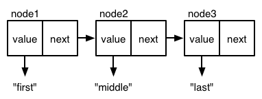

# Core Functions in Depth

If you're a huge *Vampire Diaries* fan like me then you'll remember
the episode where the female teenage love interest, Elena, really
starts to question her mysterious crush's behavior: "Why did he
instantly vanish without a trace, which is impossible, when I scraped
my knee?" and "How come his face turned into a grotesque mask of death
when I nicked my finger?" and so on.

You might be asking yourself similar questions if you've started
playing with Clojure's core functions. "Why did `map` return what
looks like a list when I gave it a vector?" and "How come `reduce`
treats my map like a list of vectors?" and so on. (With Clojure,
though, you're at least spared from contemplating the profound
existential horror of being a seventeen-year-old for eternity.)

In this chapter, you'll learn about Clojure's deep, dark,
bloodthirsty, supernatur&ndash; \**cough*\* I mean, in this chapter,
you'll learn about Clojure's underlying concept of "programming to
abstractions", and about the sequence and collection abstractions.
You'll also learn about lazy sequences. This will give you the
grounding you need to read the documentation for functions you haven't
used before and to understand what's happening when you give them a
try.

Next, you'll get more experience with the functions you'll be reaching
for the most. You'll learn how to work with lists, vectors, maps and
sets with the functions `map`, `reduce`, `into`, `conj`, `concat`,
`some`, `filter`, `take`, `drop`, `sort`, `sort-by`, `identity`.
You'll learn how to create new functions with `apply`, `partial`,
and `complement`. This will help you understand how to do
things the Clojure way and it will give you a solid foundation for
writing your own code and reading and learning from others' projects.

Finally, you'll learn how to parse and query a CSV of vampire data in
order to determine what nosferatu lurk in your hometown.

## Programming to Abstractions

In mosts Lisps, `map`, `reduce`, and related functions are designed to
work list data structures. Clojure, however, emphasizes *programming
to abstractions*. This means that it allows you to use the same
function on different data structures, treating data structures in the
same logical manner regardless of their implementation. That summary
is a little dense, so let's look at some examples.

### Using One Function on Different Data Structures

In the last chapter, you learned that the `map` function creates a
lazy sequence by applying a function to every element in a collection.
Lazy sequences are covered a little later in this chapter; for now,
just think of them as lists. You can use `map` on vectors, lists, and
sets:

```clojure
(defn titleize
  [topic]
  (str topic " for the Brave and True"))

(map titleize ["Hamsters" "Ragnarok"])
; => ("Hamsters for the Brave and True" "Ragnarok for the Brave and True")

(map titleize '("Empathy" "Decorating"))
; => ("Empathy for the Brave and True" "Decorating for the Brave and True")

(map titleize #{"Elbows" "Soap Carving"})
; => ("Soap Carving for the Brave and True" "Elbows for the Brave and True")
```

(Notice that the last example returns titles in a different order from
how the topics were listed in the set literal. This is because sets
aren't ordered.)

This behavior might not seem remarkable. It's intuitive because lists
and vectors both consist of a sequence of elements, and it makes sense
that you should be able to use the same function to traverse the
sequence and return a new result. Sets aren't a sequence because they
aren't ordered, but you can still easily justify treating the set as a
sequence.

What's less obvious is that you can also use the `map` *function* on map
*data structures*. When you do this, each key/value pair gets passed
to the mapping function. In the example below, `label-key-val` uses
argument destructuring, which we covered in the last chapter, to
succinctly assign values to `key` and `val`.

```clojure
(defn label-key-val
  [[key val]]
  (str "key: " key ", val: " val))

(map label-key-val {:name "Edward"
                    :occupation "perennial high-schooler"})
; => ("key: :name, val: Edward"
      "key: :occupation, val: perennial high-schooler")
```

The map data structure clearly isn't a sequence of elements, but the
`map` treats it like one. It might not be obvious why you would want
to do this. One use is to transform a map by applying a function to
each of the map's values:

```clojure
(map (fn [[key val]] [key (inc val)])
     {:max 30 :min 10})
; => ([:max 31] [:min 11])
```

Whoops! We forgot that the `map` function returns a list, not a map.
Let's convert the list back into a map with `into`

```clojure
(into {}
      (map (fn [[key val]] [key (inc val)])
           {:max 30 :min 10}))
; => {:max 31, :min 11}
```

The takeaway here is that you can use `map` on datasets which can be
treated as a logical sequence &mdash; a collection of elements which
can be traversed one at a time &mdash; even if they're not actually
sequences. (By the way, a "logical sequence" is often referred to
simply as a "seq".) This is what's meant by "programming to
abstractions." In this case, vectors, lists, sets, and maps all take
part in the *sequence abstraction*, meaning that they can be treated
as logical sequences even though they aren't implemented as lists,
which would be required in other Lisps, or even as sequential data
structures.

There's more: if a data structure takes part in the sequence
abstraction then it can make use of the extensive seq library, which
includes such superstar functions as `reduce`, `filter`, `distinct`,
`group-by`, and dozens more. So, if you can treat a data structure as
a seq then you get oodles of functionality for free. In general,
programming to abstractions gives us power by letting us use libraries
of functions on a data structure regardless of that data structure's
implementation.

### Distinguishing Abstraction and Implementation

To gain more insight into how "programming to abstractions" makes
Clojure powerful, let's implement a linked list in Javascript so that
we can fully appreciate the distinction between the seq (logical list)
abstraction and the concrete implementation of a linked list. In a
linked list, nodes are linked in a linear sequence. Here's how you
might create one:

```javascript
// "next" is null because this is the last node in the list
var node3 = {
  value: "last",
  next: null
};

// "next" points to node3 - that's the "link" in "linked list"
var node2 = {
  value: "middle",
  next: node3
};

var node1 = {
  value: "first",
  next: node2
};
```

Graphically, you could represent this list like this:



There are three core functions that you can perform on a linked list:
`first`, `rest`, and `cons`. Once those are implemented, you can
implement `map`, `reduce`, `filter`, and so on top of them. Here's how
we would implement and use `first`, `rest`, and `cons` with our
Javascript example. Note that the parameter of `first` and `rest` is
named "node". This might be confusing; you might think, "Ain't I
getting the first element of a *list*? Well, you operate on the
elements of a list one node at a time!

```javascript
var first = function(node) {
  return node.value;
};

var rest = function(node) {
  return node.next;
};

// Prepend a new node to the beginning of the list
var cons = function(newValue, list) {
  return {
    value: newValue,
    next: list
  };
};

first(node1);
// => "first"

first(rest(node1));
// => "middle"

first(rest(rest(node1)));
// => "last"

first(cons("new first", node1));
// "new first"

first(rest(cons("new first", node1)));
// => "first"
```

As noted above, you can implement `map` in terms of `first`, `rest`,
and `cons`:

```javascript
var map = function (list, transform) {
  if (list === null) {
    return null;
  } else {
    return cons(transform(first(list)), map(rest(list), transform));
  }
}
```

Let's see it in action:

```javascript
first(
  map(node1, function (val) { return val + " mapped!"})
);

// => "first mapped!"
```

So here's the cool thing &mdash; since `map` is implemented completely
in terms of `cons`, `first`, and `rest`, you could actually pass it
any data structure and it would work as long as `cons`, `first`, and
`rest` work on that data structure. Those three functions are the
abstraction's *interface*. Here's how they might work for an array:

```javascript
var first = function (array) {
  return array[0];
}

var rest = function (array) {
  var sliced = array.slice(1, array.length);
  if (sliced.length == 0) {
    return null;
  } else {
    return sliced;
  }
}

var cons = function (newValue, array) {
  return [newValue].concat(array);
}


var list = ["Transylvania", "Forks, WA"];
map(list, function (val) { return val + " mapped!"})
// => ["Transylvania mapped!", "Forks, WA mapped!"]
```

Thus, if you can implement `first`, `rest`, and `cons` then you get
`map` for free, along with the aforementioned oodles of other
functions.

The takeaway here is that it's powerful to focus on what we can **do**
with a data structure and to ignore, as much as possible, its
implementation. Implementations rarely matter in and of themselves.
They're only a means to an end. We ultimately only care about what we
do with them, and by programming to abstractions we're able to re-use
libraries and thus do more with them.

By the way: Javascript doesn't provide an easy means of defining
different implementations of a function based on the type(s) of
argument(s), but Clojure does. It's pretty cool! But for now we won't
cover it. For now, just trust that Clojure makes it super easy.

## The Sequence Abstraction

Now that we understand the general approach of programming to
abstractions we can answer some of the questions we posed at the
beginning of the chapter:

* How come my map got turned into a list of vectors?
* Why did `map` return what looks like a list when I gave it a vector?
* Isn't Damon, my crush's hunky and troubled older brother, making
  lots of creepy puns involving consuming my blood as food? What's up
  with that?

### Seq Functions Convert Data Structures to Seqs

In the Javascript examples we gave above, we indicated one way that
you could allow a data structure to participate in the seq
abstraction: make `first`, `rest`, and `cons` work on that data
structure.

But! There's another way: explicitly convert the data structure to a
seq. So, instead of extending `first` etc. to work on your data
structure, you provide some way for your data structure to work with
those functions as they're currently implemented.

Clojure functions often use the `seq` function to do this. From the
[Clojure documentation](http://clojure.org/sequences):

> Clojure uses the ISeq interface to allow many data structures to
> provide access to their elements as sequences. The seq function
> yields an implementation of ISeq appropriate to the collection.

If those details don't really make sense, don't worry about it too
much. The important thing to know is that many functions will call
`seq` on a collection argument before doing anything else. The `map`
function does this, for example. You can use the `identity` function
to easily demonstrate this. All it does is return whatever was passed
to it:

```clojure
(identity "Stefan Salvatore from Vampire Diaries")
; => "Stefan Salvatore from Vampire Diaries"
```

If you call `map` with `identity` as the mapping function, you can see
how a non-sequential data structure like a map gets converted to a seq:

```
(map identity {:name "Bill Compton" :occupation "Dead mopey guy"})
; => ([:name "Bill Compton"] [:occupation "Dead mopey guy"])
```

Since we know that `map` calls `seq` on its collection arguments, and
since `identity` returns whatever value was passed to it, we can
deduce that the `seq` function converts a map data structure into a
sequence of vectors, each of which is a key/value pair:

```clojure
(seq {:name "Bill Compton" :occupation "Dead mopey guy"})
; => ([:name "Bill Compton"] [:occupation "Dead mopey guy"])
```

And that's why `map` treats your maps like lists of vectors! I wanted
to point out this example in particular because it might be surprising
and confusing. It was for me when I first started Clojure. Knowing
these underlying mechanisms will save you from the kind of frustration
and general mopiness of the kind of often seen among male vampires
trying to retain their humanity.

### Seq Function Examples

Clojure's seq library is full of useful functions that you'll use all
the time. Now that you have a deeper understanding of Clojure's sequence
abstraction, let's look at these functions in detail. If you're new to
Lisp and functional programming, some of these examples will be
surprising and delightful.

#### map

You've seen many examples of `map` by now, but this section shows
`map` doing two new things: taking multiple collections as arguments
and taking a collection of functions as an argument.

So far, you've only seen examples of `map` operating on one
collection. In this case, the collection is the vector `[1 2 3]`:

```clojure
(map inc [1 2 3])
; => (2 3 4)
```

However, you can also give `map` multiple collections. Here's a simple
example to show how this works:

```clojure
(map str ["a" "b" "c"] ["A" "B" "C"])
; => ("aA" "bB" "cC")
```

It's as if `map` does the following:

```clojure
(list (str "a" "A") (str "b" "B") (str "c" "C"))
```

When you pass `map` multiple collections, then the elements of the
first collection (`["a" "b" "c"]`) will be passed as the first
argument of the mapping function (`str`), the elements of
the second collection (`["A" "B" "C"]`) will be passed as the
second argument, and so on. Therefore, it's important that your
mapping function be able to take a number of arguments equal to the
number of collections you're passing to `map`.

The example below shows how you could use this capability if you were
a vampire trying to curb your human consumption. You have two vectors,
one representing human intake in liters and another representing
critter intake for the past four days. The `unify-diet-data` function
takes a single day's data for both human and critter feeding and
unifies the two into a single map:

```clojure
(def human-consumption   [8.1 7.3 6.6 5.0])
(def critter-consumption [0.0 0.2 0.3 1.1])
(defn unify-diet-data
  [human critter]
  {:human human
   :critter critter})

(map unify-diet-data human-consumption critter-consumption)
; => ({:human 8.1, :critter 0.0}
      {:human 7.3, :critter 0.2}
      {:human 6.6, :critter 0.3}
      {:human 5.0, :critter 1.8})
```

Good job laying off the human!

The second fun thing you can do with `map` is pass it a collection of
functions. You could use this if you wanted to perform the same set of
calculations on different collections of numbers. In the example
below, the `stats` function iterates over a vector of functions,
applying each function to `numbers`:

```clojure
(def sum #(reduce + %))
(def avg #(/ (sum %) (count %)))
(defn stats
  [numbers]
  (map #(% numbers) [sum count avg]))

(stats [3 4 10])
; => (17 3 17/3)

(stats [80 1 44 13 6])
; => (144 5 144/5)
```

#### reduce

The last chapter covers how `reduce` processes each element in a
sequence to build a result. This section just shows a couple ways to
use it that might not be obvious.

Earlier in this chapter you saw how you can use `map` on a map data
structure to "update" its values. You can do the same thing with
reduce.

```clojure
(reduce (fn [new-map [key val]]
          (assoc new-map key (inc val)))
        {}
        {:max 30 :min 10})
; => {:max 31, :min 11}
```

Another use for `reduce` is to filter out keys from a map based on
their value:

```clojure
(reduce (fn [new-map [key val]]
          (if (> val 4)
            (assoc new-map key val)
            new-map))
        {}
        {:human 4.1
         :critter 3.9})
; {:human 4.1}
```

#### take, drop, take-while, drop-while

`take` and `drop` are straightforward. `take` returns the first n
elements of a sequence, while `drop` returns the sequence but with the
first `n` elements removed:

```clojure
(take 3 [1 2 3 4 5 6 7 8 9 10])
; => (1 2 3)

(drop 3 [1 2 3 4 5 6 7 8 9 10])
; => (4 5 6 7 8 9 10)
```

Their cousins `take-while` and `drop-while` are a bit more interesting. Each
takes a predicate function (a function those return value is evaluated
for truth or falsity) to determine when it should stop taking or
dropping. Suppose, for example, that you had a vector representing
entries in your "food journal". Each entry has the year, month, and
day, along with what you ate. To preserve space, we'll only include a
few entries:

```clojure
(def food-journal
  [{:month 1 :day 1 :human 5.3 :critter 2.3}
   {:month 1 :day 2 :human 5.1 :critter 2.0}
   {:month 2 :day 1 :human 4.9 :critter 2.1}
   {:month 2 :day 2 :human 5.0 :critter 2.5}
   {:month 3 :day 1 :human 4.2 :critter 3.3}
   {:month 3 :day 2 :human 4.0 :critter 3.8}
   {:month 4 :day 1 :human 3.7 :critter 3.9}
   {:month 4 :day 2 :human 3.7 :critter 3.6}])
```

With `take-while`, you can retrieve just January and February's data.
`take-while` traverse the given sequence (in this case,
`food-journal`), applying the predicate function to each element.
The example below uses the anonymous function `#(< (:month %) 3)` to
test whether the journal entry's month is out of range. When
`take-while` reaches the first March entry, the anonymous function
returns false and `take-while` returns a sequence of every element it
tested until that point:


```clojure
(take-while #(< (:month %) 3) food-journal)
; => ({:month 1 :day 1 :human 5.3 :critter 2.3}
      {:month 1 :day 2 :human 5.1 :critter 2.0}
      {:month 2 :day 1 :human 4.9 :critter 2.1}
      {:month 2 :day 2 :human 5.0 :critter 2.5})
```

The same idea applies with `drop-while`, except that it keeps dropping
elements until one tests true:

```clojure
(drop-while #(< (:month %) 3) food-journal)
; => ({:month 3 :day 1 :human 4.2 :critter 3.3}
      {:month 3 :day 2 :human 4.0 :critter 3.8}
      {:month 4 :day 1 :human 3.7 :critter 3.9}
      {:month 4 :day 2 :human 3.7 :critter 3.6})
```

By using `take-while` and `drop-while` together, you can even get data
for just February and March. In the example below, you first use
`drop-while` to get rid of the January entries, then use `take-while`
on the result to keep taking entries until you reach the first April
entry:

```clojure
(take-while #(< (:month %) 4)
            (drop-while #(< (:month %) 2) food-journal))
; => ({:month 2 :day 1 :human 4.9 :critter 2.1}
      {:month 2 :day 2 :human 5.0 :critter 2.5}
      {:month 3 :day 1 :human 4.2 :critter 3.3}
      {:month 3 :day 2 :human 4.0 :critter 3.8})
```

#### filter, some

`filter` to return all elements of a sequence which test true for a
predicate function. Here are the journal entries where human
consumption is less than 5 liters:

```clojure
(filter #(< (:human %) 5) food-journal)
; => ({:month 2 :day 1 :human 4.9 :critter 2.1}
      {:month 3 :day 1 :human 4.2 :critter 3.3}
      {:month 3 :day 2 :human 4.0 :critter 3.8}
      {:month 4 :day 1 :human 3.7 :critter 3.9}
      {:month 4 :day 2 :human 3.7 :critter 3.6})
```

You might be wondering why we didn't just use `filter` in the
`take-while` and `drop-while` examples above. Indeed, filter would
work. Here we're grabbing the January and February data, just like the
`take-while` example:

```clojure
(filter #(< (:month %) 3) food-journal)
; => ({:month 1 :day 1 :human 5.3 :critter 2.3}
      {:month 1 :day 2 :human 5.1 :critter 2.0}
      {:month 2 :day 1 :human 4.9 :critter 2.1}
      {:month 2 :day 2 :human 5.0 :critter 2.5})
```

This is perfectly fine, but `filter` can end up processing all of your
data. Since the food journal is already sorted by date, we know that
`take-while` will return the data we want without having to examine
any of the data we won't. Therefore, `take-while` can be more
efficient.

Often, you want to know whether a collection contains any values at
all which test true for a predicate function. The `some` function does
that, returning the first true value returned by a predicate function:

```clojure
(some #(> (:critter %) 5) food-journal)
; => nil

(some #(> (:critter %) 3) food-journal)
; => true
```

You don't have any food journal entries where you consumed more than 5
liters from critter sources, but you do have at least one where you
consumed more than 3 liters. Notice that the return value in the
second example is `true` and not the actual entry which produced the
true value. Here's how you could return the entry:

```clojure
(some #(and (> (:critter %) 3) %) food-journal)
; => {:month 3 :day 1 :human 4.2 :critter 3.3}
```

#### sort, sort-by

You can sort elements in ascending order with `sort`:

```clojure
(sort [3 1 2])
; => (1 2 3)
```

If your sorting needs are more complicated, you can use `sort-by`.
`sort-by` uses a "key function" to determine the sort order. In the
example below, taken from clojuredocs.org, `count` is the key function:

```clojure
(sort-by count ["aaa" "c" "bb"])
; => ("c" "bb" "aaa")
```

#### concat

Finally, `concat` simply appends the members of sequence the end of
another:

```clojure
(concat [1 2] [3 4])
; => (1 2 3 4)
```

### Lazy Seqs

As we saw earlier, `map` first calls `seq` on the collection you pass
to it. But that's not the whole story. Many functions, including `map`
and `filter`, return a "lazy seq". A lazy seq is a seq whose members
aren't computed until you try to access them. Computing a seq's
members is called "realizing" the seq. Deferring the computation until
the moment it's needed makes your programs more efficient.

#### Demonstrating Lazy Seq Efficiency

For example, pretend that you're part of a modern-day task force whose
purpose is to identify vampires. Intelligence tells you that there is
only one active vampire in your city, and they've helpfully narrowed
down the list of suspects to a million people. Your boss gives you a
list of one million social security numbers and shouts, "Get it done,
McFishwich!"

Because the source code for this vampire-hunting technology is
proprietary, I've stubbed it out to simulate the time it would take to
perform this task. In the example below, you have a subset of a
vampire database. You have a function, `vampire-related-details`,
which takes 1 second to look up an entry from the database. Next, you
have a function, `vampire?`, which returns a record if it passes the
vampire test; otherwise it returns `false`. Finally,
`identify-vampire` maps social security numbers to database records
and then returns the first record which indicates vampirism:

```clojure
(def vampire-database
  {0 {:makes-blood-puns? false, :has-pulse? true  :name "McFishwich"}
   1 {:makes-blood-puns? false, :has-pulse? true  :name "McMackson"}
   2 {:makes-blood-puns? true,  :has-pulse? false :name "Damon Salvatore"}
   3 {:makes-blood-puns? true,  :has-pulse? true  :name "Mickey Mouse"}})

(defn vampire-related-details
  [social-security-number]
  (Thread/sleep 1000)
  (get vampire-database social-security-number))

(defn vampire?
  [record]
  (and (:makes-blood-puns? record)
       (not (:has-pulse? record))))

(defn identify-vampire
  [social-security-numbers]
  (first (filter vampire?
                 (map vampire-related-details social-security-numbers))))
```

A non-lazy implementation of `map` would first have to apply
`vampire-related-details` to every member of `social-security-numbers`
before passing the result to `filter`. Since you have 1 million
suspects, this would take 12 days, and half your city could be dead by
then! Of course, if the vampire is the last suspect it will still take
that much time, but at least there's a good chance that it won't.

You can use the `time` function to display how much time it actually
takes to find the vampire:

```clojure
(time (identify-vampire (range 0 1000000)))
"Elapsed time: 32019.912 msecs"
; => {:name "Damon Salvatore", :makes-blood-puns? true, :has-pulse? false}
```

Oooh! That's why Damon makes those creepy puns!

Also it's odd that the expression took 32 seconds. You might have
expected it to only take 3 seconds since Damon was the third suspect
on the list, and it should therefore have only called
`vampire-related-details` three times. In reality, Clojure "chunks"
lazy sequences, realizing 32 members at a time:

```clojure
(def identities
  [{:alias "Batman" :real "Bruce Wayne"}
   {:alias "Spiderman" :real "Peter Parker"}
   {:alias "Santa" :real "Your mom"}
   {:alias "Easter Bunny" :real "Your dad"}
   {:alias "alias 5", :real "real 5"}
   ; ... Just pretend that there are actually maps here for 6-30
   {:alias "alias 31", :real "real 31"}
   {:alias "alias 32", :real "real 32"}
   {:alias "alias 33", :real "real 33"}
   {:alias "alias 34", :real "real 34"}])

(defn snitch
  "Announce real identity to the world"
  [identity]
  (println (:real identity))
  (:real identity))

(def revealed-identities (map snitch identities))
(first revealed-identities)
;; The following gets printed
Bruce Wayne
Peter Parker
Your mom
Your dad
real 5
... (real 6-30 would actually be printed)
real 31
real 32
```

Notice that `real 33` and `real 34` were *not* printed. Only 32 lines
were printed. Clojure doesn't realize a lazy list until you try to
read a value from it, and then it usually realizes 32 members at a
time. This is done for the sake of efficiency.

Note, also, that Clojure caches the values of the lazy seq. It doesn't
have to re-compute them when you try to access them again. Continuing
where we left off from the previous example:

```clojure
;; Since the lazy seq has already realized the first member, it
;; doesn't run the snitch function again and nothing gets printed
(first revealed-identities)
; => "Bruce Wayne"
```

Sometimes you need to realize the entire seq without bothering with
trying to take every member. Usually the only reason you'd want to do
this if you want to produce side effects &mdash; for example, if you
want to print every single real identity in the example above. In that
case, you use `doall` on the seq. The purpose of `doall` is to realize
the seq.

#### Infinite Sequences

One cool, useful capability that lazy seqs gives you is the ability to
construct "infinite" sequences. This might not be obvious; so far,
we've only worked with lazy sequences generated from vectors or lists
which terminated.

However, Clojure comes with a few functions to create infinite
sequences. One easy way to create an infinite sequence is with
`repeat`, which creates a sequence whose every member is the argument
you pass:

```clojure
(concat (take 8 (repeat "na")) ["Batman!"])
("na" "na" "na" "na" "na" "na" "na" "na" "Batman!")
```

There's also `repeatedly`, which will call the provided function for
to generate each element in the sequence:

```clojure
(take 3 (repeatedly (fn [] (rand-int 10))))
; => (1 4 0)
```

In general, you can think of lazy seqs as "recipes" for how to
generate each element in the sequence, and these recipes don't have to
specify an endpoint. Functions like `first` and `take`, which realize
the lazy seq, have no way of knowing what will come next in a seq, and
if the seq keeps providing elements, well, they'll just keep taking
them. You can see this if you construct your own infinite sequence:

```clojure
(defn even-numbers
  ([] (even-numbers 0))
  ([n] (cons n (lazy-seq (even-numbers (+ n 2))))))

(take 10 (even-numbers))
; => (0 2 4 6 8 10 12 14 16 18)
```

This example is a bit mind-bending. It helps to remember that `cons`
returns a new list with an element prepended to the given list:

```clojure
(cons 0 '(2 4 6))
; => (0 2 4 6)
```

In `even-numbers`, you're merely consing to a lazy list which includes
a recipe for the next element rather than to a fully-realized list. If
infinite lists are still foggy at this point, don't worry about it!
Personally, it took me probably 6 months before I fully understood
grokked infinite lazy seqs.

And that covers lazy seqs! Now you know everything there is to know
about the sequence abstraction!

## The Collection Abstraction

The collection abstraction is closely related to the sequence
abstraction. All of Clojure's core data structures &mdash; vectors,
maps, lists and sets &mdash; take part in both abstractions.

The abstractions differ in that the sequence abstraction is "about"
operating on members individually while the collection abstraction is
"about" the data structure as a whole. For example, the collection
functions `count`, `empty?`, and `every?` aren't about any individual
element; they're about the whole.

```clojure
(empty? [])
; => true

(empty? ["no!"])
; => false
```

Practically speaking, you'll rarely consciously think "OK, self!
You're working with the collection as a whole now. Think in terms of
the collection abstraction!" Nevertheless, it's useful to know the
concepts which underly the functions and data structures you're using.

Now we'll examine two common collection functions whose similarities
can be a bit confusing.

### Into

One of the most import collection functions is `into`. As you now
know, many seq functions return a seq rather than the original data
structure. You'll probably want to convert the return value back into
the original value, and `into` lets you do that:

```clojure
(map identity {:sunlight-reaction "Glitter!"})
; => ([:sunlight-reaction "Glitter!"])

(into {} (map identity {:sunlight-reaction "Glitter!"}))
```

This will work with other data structures as well:

```clojure
;; convert back to vector
(map identity [:garlic :sesame-oil :fried-eggs])
; map returns a seq
; => (:garlic :sesame-oil :fried-eggs)

(into [] (map identity [:garlic :sesame-oil :fried-eggs]))
; => [:garlic :sesame-oil :fried-eggs]

;; convert back to list
(map identity [:garlic-clove :garlic-clove])
; => (:garlic-clove :garlic-clove)

;; sets only contain unique values
(into #{} (map identity [:garlic-clove :garlic-clove]))
; => #{:garlic-clove}
```

The first argument of `into` doesn't have to be empty:

```clojure
(into {:favorite-emotion "gloomy"} [[:sunlight-reaction "Glitter!"]])
; => {:favorite-emotion "gloomy" :sunlight-reaction "Glitter!"}

(into ["cherry"] '("pine" "spruce"))
; => ["cherry" "pine" "spruce"]
```

And of course, both arguments can be the same type:

```clojure
(into {:favorite-animal "kitty"} {:least-favorite-smell "dog"
                                  :relationship-with-teenager "creepy"})
; =>
; {:favorite-animal "kitty"
;  :relationship-with-teenager "creepy"
;  :least-favorite-smell "dog"}
```

If `into` were asked to describe its strengths at a job interview, it
would say "I'm great at taking two collections and adding all the
elements from the second to the first."

### Conj

Conj also adds elements to a collection, but it does it in a
slightly different way:

```clojure
(conj [0] [1])
; => [0 [1]]
;; Whoopsie! Looks like it added the entire vector [1] onto [0].
;; Compare to into:

(into [0] [1])
; => [0 1]

;; Here's what we want:
(conj [0] 1)
; => [0 1]

;; We can supply as many elements to add as we want:
(conj [0] 1 2 3 4)
; => [0 1 2 3 4]

;; We can also add to maps:
(conj {:time "midnight"} [:place "ye olde cemetarium"])
; => {:place "ye olde cemetarium" :time "midnight"}
```

The two are so similar, you could even define `conj` in terms of
`into`:

```clojure
(defn my-conj
  [target & additions]
  (into target additions))

(my-conj [0] 1 2 3)
; => [0 1 2 3]
```

This kind of pattern isn't that uncommon. You'll see two functions
which do the same thing, it's just that one takes a rest-param (`conj`)
and one takes a seqable data structure (`into`).

## Function Functions

Learning to take advantage of Clojure's ability to accept functions as
arguments and return functions as values is really fun, even if it
takes some getting used to.

Two of Clojure's functions, `apply` and `partial`, might seem
especially weird because they both accept *and* return functions.
Let's unweird them.

### apply

Remember how we defined `conj` in terms of `into` above? Well, we can
also define `into` in terms of `conj` by using `apply`:

```clojure
(defn my-into
  [target additions]
  (apply conj target additions))

(my-into [0] [1 2 3])
; => [0 1 2 3]

;; the above call to my-into is equivalient to calling:
(conj [0] 1 2 3)
```

`apply` "explodes" a seqable data structure so that it can be passed
to a function which expects a rest-param. For example, `max` takes a
rest param. If you want to find the "max" element in a vector, you
have to explode it with `apply`:

```clojure
;; We pass only one argument and max returns it:
(max [0 1 2])
; => [0 1 2]

;; Let's "explode" the argument:
(apply max [0 1 2])
; => 2
```

You'll often use `apply` like this.

### partial

Let's look at some examples of `partial` before describing what it
does:

```clojure
(def add10 (partial + 10))
(add10 3) ;=> 13
(add10 5) ;=> 15

(def add-missing-element
  (partial conj ["water" "earth" "air"]))

(add-missing-elements "unobtainium" "adamantium")
; => ["water" "earth" "air" "unobtainium" "adamantium"]
```

So, `partial` takes a function and any number of arguments. It then
returns a new function. When you call the returned function, it calls the
original function with the original arguments you supplied it along
with the new arguments. To help clarify how `partial` works, here's
how you might define it:

```clojure
(defn my-partial
  [partialized-fn & args]
  (fn [& more-args]
    (apply partialized-fn (into args more-args))))

(def add20 (my-partial + 20))
(add20 3) ; => 23
```

In this example, the value of `add20` is the anonymous function
returned by `my-partial`. This anonymous function is defined like
this:

```clojure
(fn [& more-args]
  (apply + (into [20] more-args)))
```

If you're not used to partials, they might seem strange. In general,
you want to use partials when you find yourself repeating the same
combination of function and arguments in many different contexts. This
toy examples how you could use `partial` to "specialize" a logger,
creating a `warn` function:

```clojure
(defn lousy-logger
  [log-level message]
  (condp = log-level
    :warn (clojure.string/lower-case message)
    :emergency (clojure.string/upper-case message)))

(def warn (partial lousy-logger :warn))

(warn "Red light ahead")
; => "red light ahead"
```

### complement

Earlier you created the `identify-vampire` function to find one
vampire amidst a million people. What if you wanted to create a
function to find all humans? Perhaps you want to send them thank-you
card for not being an undead predator. Here's how you could do it:

```clojure
(defn identify-humans
  [social-security-numbers]
  (filter #(not (vampire? %))
          (map vampire-related-details social-security-numbers)))
```

Look at the first argument to `filter`, `#(not (vampire? %))`. It's so
common to want the *complement* (the negation) of a boolean function
that there's a function, `complement` for that:

```clojure
(def not-vampire? (complement vampire?))
(defn identify-humans
  [social-security-numbers]
  (filter not-vampire?
          (map vampire-related-details social-security-numbers)))
```

Here's how you might implement `complement`:

```clojure
(defn my-complement
  [fun]
  (fn [& args]
    (not (apply fun args))))

(def my-pos? (my-complement neg?))
(my-pos? 1)  ; => true
(my-pos? -1) ; => false
```

As you can see, `complement` is a fairly humble function. It does one
little thing, and does it well. This isn't going to map reduce
terabytes of data for your or something like that.

But it does demonstrate the power of higher-order functions. They
allow you build up libraries of utility functions in a way which is
impossible in most other languages. In aggregate, these utility
functions make your life a lot easier.

## FWPD

To pull everything together, let's write the beginnings of a
sophisticated vampire data analysis program for the Forks, Washington
Police Department (FWPD).

The FWPD has a fancy new database technology called CSV
(comma-separated values). Our job is to parse this state-of-the-art
"csv" and analyze it for potential vampires. We'll do that by
filtering on each suspect's "glitter index", a 0-10 prediction of the
suspect's vampireness invented by Larry Page and Sergey Brin. Let's
create a new leiningen project for our tool:

```sh
lein new app fwpd
```

Under the new `fwpd` directory, create a file named `suspects.csv` and
enter contents like the following:

```
Name,Glitter Index
Edward Cullen,10
Bella Swan,0
Charlie Swan,0
Jacob Black,3
Carlisle Cullen,6
```

Now it's time to get our hands dirty. Make your file
`fwpd/src/fwpd/core.clj` look like this:

```clojure
;; In ns below, notice that "gen-class" was removed
(ns fwpd.core
  ;; We haven't gone over require but we will.
  (:require [clojure.string :as s]))

(def filename "suspects.csv")

;; Later on we're going to be converting each row in the CSV into a
;; map, like {:name "Edward Cullen" :glitter-index 10}.
;; Since CSV can't store Clojure keywords, we need to associate the
;; textual header from the CSV with the correct keyword.
(def headers->keywords {"Name" :name
                        "Glitter Index" :glitter-index})

(defn str->int
  [str]
  (Integer. str))

;; CSV is all text, but we're storing numeric data. We want to convert
;; it back to actual numbers.
(def conversions {:name identity
                  :glitter-index str->int})

(defn parse
  "Convert a csv into rows of columns"
  [string]
  (map #(s/split % #",")
       (s/split string #"\n")))

(defn mapify
  "Return a seq of maps like {:name \"Edward Cullen\" :glitter-index 10}"
  [rows]
  (let [;; headers becomes the seq (:name :glitter-index)
        headers (map #(get headers->keywords %) (first rows))
        ;; unmapped-rows becomes the seq
        ;; (["Edward Cullen" "10"] ["Bella Swan" "0"] ...)
        unmapped-rows (rest rows)]
    ;; Now let's return a seq of {:name "X" :glitter-index 10}
    (map (fn [unmapped-row]
           ;; We're going to use map to associate each header with its
           ;; column. Since map returns a seq, we use "into" to convert
           ;; it into a map.
           (into {}
                 ;; notice we're passing multiple collections to map
                 (map (fn [header column]
                        ;; associate the header with the converted column
                        [header ((get conversions header) column)])
                      headers
                      unmapped-row)))
         unmapped-rows)))

(defn glitter-filter
  [minimum-glitter records]
  (filter #(>= (:glitter-index %) minimum-glitter) records))
```

Notice that we took out the `-main` function. This is because, for
right now, we only care about running the above code in the REPL. Try
this out in your REPL:

```clojure
;; slup reads a file
(mapify (parse (slurp filename)))
```

`mapify` is the most complicated function of the bunch, and I
recommend going through it to really figure out what's going on. One
place to start might be the inner `map`:

```clojure
(map (fn [header column]
       ;; associate the header with the converted column
       [header ((get conversions header) column)])
     headers
     unmapped-row)
```

You could try breaking that out into a separate function and passing
it arguments to understand what it does:

```clojure
(defn mapify-row
  [headers unmapped-row]
  (map (fn [header column]
       ;; associate the header with the converted column
       [header ((get conversions header) column)])
     headers
     unmapped-row))

(mapify-row [:name] ["Joe"])
; => ([:name "Joe"])
```

That's a strategy that's generally useful in figuring out someone
else's code: figure out what data is being passed to some nested
function call, then extract that nested function call and pass it the
same kind of data and see what happens.

Now that you know how to get mapified records, you can filter on their
glitter index:

```clojure
(glitter-filter 3 (mapify (parse (slurp filename))))
({:name "Edward Cullen", :glitter-index 10}
 {:name "Jacob Black", :glitter-index 3}
 {:name "Carlisle Cullen", :glitter-index 6})
```

You better go round up those sketchy characters!

### Vampire Analysis 2.0

The vampire analysis program you now have is already decades ahead of
anything else on the market. But how could you make it better? I
suggest trying the following:

-   Turn the result of your glitter filter into a list of names
-   Write a function, `prepend`, which will add a new suspect to the
    beginning of your list of suspects
-   Write a function, `validate`, which will check that `:name` and
    `:glitter-index` are present when you `prepend`. Validate should
    accept two arguments: a map of keywords to validating functions,
    similar to `conversions`, and the record to be validated
-   Write a function which will take your list of maps and convert it
    back to a CSV string. You'll need to use the `clojure.string/join`
    function.

Good luck, McFishwich!

## Chapter Summary

In this chapter, you learned:

-   Clojure emphasizes programming to abstractions.
-   The sequence abstraction deals with operating on the individual
    elements of a sequence. Seq functions often convert their arguments
    to a seq and return a lazy seq.
-   Lazy evaluation improves performance by delaying computations until
    they're needed.
-   The collection abstraction deals with data structures as a whole.
-   Never trust someone who sparkles in sunlight.
