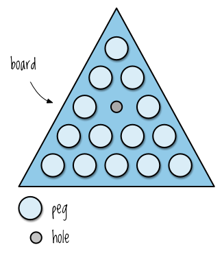
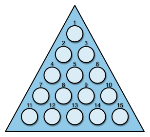
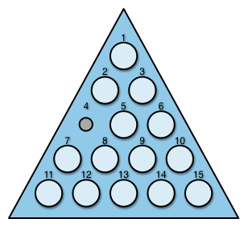

# Functional Programming

So far, you've focused on familiarizing yourself with the tools that
Clojure provides: immutable data structures, functions, abstractions,
and so on. In this chapter, you'll begin learning how to think about
your programming tasks in a way that makes the best use of those
tools. You'll begin integrating your experience into a new mindset,
the functional programming mindset.

The core concepts you'll learn include: what pure functions are and
why they're useful; how to work with immutable data structures and why
they're superior to their mutable cousins; how disentangling data and
functions gives you more power and flexibility; and why it's powerful
to program to a small set of data abstractions. The result of shoving
all this knowledge into your brain matter is that you'll have an
entirely new approach to problem solving!

After going over these topics you'll put everything you've learned to
use in order to write a terminal-based game based on an ancient mystic
mind-training device which can now be found in Cracker Barrel
restaurants across America: Peg Thing&reg;!

## Pure Functions, What and Why

With the exception of `println` and `rand`, all the functions you've
used up till now have been pure functions:

```clojure
(get [:chumbawumba] 0)
; => :chumbawumba

(reduce + [1 10 5])
; => 16

(str "wax on " "wax off")
; => "wax on wax off"
```

What makes them pure functions, and why does it matter? A function is
pure if it meets two qualifications:

1.  It always returns the same result given the same arguments. This is
    called "referential transparency" and you can add it to your list of
    five-dollar programming terms.
2.  It doesn't cause any side effects, e.g. it doesn't "change the
    external world" by changing external mutable objects or outputting
    to i/o.

These qualities matter because they make it easier for us to reason
about our programs. Pure functions are easier to reason about because
they're completely isolated, unable to impact other parts
of your system. When you use them, you don't have to ask yourself,
"What could I break by calling this function?" They're also
consistent; you'll never find yourself trying to figure out why the
passing a function the exact same arguments results in different
return values.

For example, when was the last time you fretted over adding two
numbers? Pure functions are as stable and problem-free as arithmetic.
They're these stupendous, stable little bricks of functionality
that you can confidently use as the foundation of your program.
Let's look at referential transparency and lack-of-side-effects in
more detail so that we'll know exactly what they are how they're
helpful.

### Pure Functions Are Referentially Transparent

Referentially transparent functions always returns the same result
when called with the same argument. In order to achieve this, they
only rely on 1) their own arguments and 2) immutable values to
determine their return value. Mathematical functions are referentially
transparent:


```clojure
(+ 1 2)
; => 3
```

If a function relies on an immutable value, it's referentially
transparent. The string ", Daniel-san" is immutable, so the following
function is referentially transparent:

```clojure
(defn wisdom
  [words]
  (str words ", Daniel-san"))
(wisdom "Always bathe on Fridays")
; => "Always bathe on Fridays, Daniel-san"
```

By contrast, the following functions do not yield the same result with
the same arguments and, therefore, are not referentially transparent.
Any function which relies on a random number generator cannot be
referentially transparent:

```clojure
(defn year-end-evaluation
  []
  (if (> (rand) 0.5)
    "You get a raise!"
    "Better luck next year!"))
```

If your function reads from a file, it's not referentially
transparent because the file's contents can change. The function
`analyze-file` below is not referentially transparent, but the
function `analysis` is:

```clojure
(defn analysis
  [text]
  (str "Character count: " (count text)))

(defn analyze-file
  [filename]
  (analysis (slurp filename)))
```

When using a referentially transparent function, you never have to
consider what possible external conditions could affect the return
value of the function. This is especially important if your function
is used multiple places or if it's nested deeply in a chain of
function calls. In both cases, you can rest easy knowing that changes
to external conditions won't cause your code to break.

Another way to think about this is that reality is largely
referentially transparent. This is what lets you form habits. If
reality weren't referentially transparent, you wouldn't be able to
mindlessly plug your iPod into your bathroom speakers and play "The
Final Countdown" by Europe every morning when you take a shower. Each
of these actions will have the same result pretty much every time you
perform them, which lets you put them on autopilot.

### Pure Functions Have No Side Effects

To perform a side effect is to change the association between a name
and its value within a given scope. For example, in Javscript:

```javascript
var haplessObject = {
  emotion: "Carefree!"
};

var evilMutator = function(object){
  object.emotion = "So emo :'(";
}

evilMutator(haplessObject);
haplessObject.emotion;
// => "So emo :'("
```

Of course, your program has to have some side effects; it writes to a
disk, which is changing the association between a filename and a
collection of disk sectors; it changes the rgb values of your
monitor's pixels, and so on. Otherwise, there'd be no point in running
it.

The reason why side effects are potentially harmful, though, is that
they prevent us from being certain what the names in our code are
referring to. This makes it difficult or impossible to know what our
code is doing. It's very easy to end up wondering how a name came to
be associated with a value and it's usually difficult to figure out
why. When you call a function which doesn't have side effects, you
only have to consider the relationship between the input and the
output, not the changes that could be rippling through your system.

Functions which have side effects, however, place more of a burden on
your mind grapes: now you have to worry about how the world is
affected when you call the function. Not only that, every function
which depends on a side-effecting function gets "infected". It's
another component which requires extra care and thought as you build
your program.

If you have any significant experience with a language like Ruby or
Javascript, you've probably run into this problem. As an object gets
passed around, its attributes somehow get changed and you can't figure
out why. Then you have to buy a new computer because you've chucked
yours out the window. If you've read anything about object-oriented
design, you'll notice that a lot of writing has been devoted to
strategies for managing state and reducing side effects for just this
reason.

Therefore, it's a good idea to look for ways to limit the use of side
effects in your code. Think of yourself as an overeager bureaucrat,
&mdash; let's call you Kafka Human &mdash; scrutinizing each side effect
with your trusty BureauCorp clipboard in hand. Not only will this lead
to better code, it's also sexy and dramatic!

Luckily for you, Clojure makes your job easier by going to great
lengths to limit side effects &mdash; all of its core data structures
are immutable. You cannot change them in place no matter how hard you
try! If you're unfamiliar with immutable data structures, however, you
might feel like your favorite tool has been taken from you. How can
you *do* anything without side effects? Well, guess what! That's What
the next sections all about! How about this segue, eh? Eh?

## Living with Immutable Data Structures

Immutable data structures ensure that your code won't have side
effects. As you now know with all your heart, this is a good thing.
But how do you get anything done without side effects?

### Recursion instead of for/while

Raise your hand if you've ever written something like this
(javascript):

```javascript
var wrestlers = getAlligatorWrestlers();
var totalBites = 0;
var l = wrestlers.length;
// Side effect on i! Bad!
for(var i=0; i < l; i++){
  // Side effect on totalBites! Bad!
  totalBites += wrestlers[i].timesBitten;
}
```

or this:

```javascript
var allPatients = getArkhamPatients();
var analyzedPatients = [];
var l = allPatients.length;
// Side effect on i! Bad!
for(var i=0; i < l; i++){
  if(allPatients[i].analyzed){
    // Side effect on analyzedPatients! Bad!
    analyzedPatients.push(allPatients[i]);
  }
}
```

Using side effects in this way &mdash; mutating "internal" variables
&mdash; is pretty much harmless. You're creating some value to be used
elsewhere, as opposed to changing an object you've received.

But Clojure's core data structures don't even allow these harmless
mutations. So what can you do?

First, ignore the fact that you can easily use `map` and `reduce` to
accomplish the work done above. In these situations &mdash; iterating
over some collection to build a result &mdash; the functional
alternative to mutation is recursion.

Let's look at the first example, building a sum. In Clojure, there is
no assignment operator. You can't associate a new value with a name
within the same scope:

```clojure
(defn no-mutation
  [x]
  (println x)

  ;; let creates a new scope
  (let [x "Kafka Human"]
    (println x))

  ;; Exiting the let scope, x is the same
  (println x))
(no-mutation "Existential Angst Person")
; => 
; Existential Angst Person
; Kafka Human
; Existential Angst Person
```

In Clojure, we can get around this apparent limitation through
recursion. The following example shows the general approach to
recursive problem-solving.

```clojure
(defn sum
  ([vals] (sum vals 0)) ;; ~~~1~~~
  ([vals accumulating-total]
     (if (empty? vals) ;; ~~~2~~~
       accumulating-total
       (sum (rest vals) (+ (first vals) accumulating-total)))))
```

This function takes two arguments, a collection to process (`vals`)
and an accumulator (`accumulating-total`), and we use arity
overloading (covered in "[Do Things](/do-things)") to provide a
default value of 0 for `accumulating-total` (1).

Like all recursive solution, this function checks the argument it's
processing against a base condition. In this case, we check whether
`vals` is empty (2). If it is, we know that we've processed all the
elements in the collection and so we return `accumulating-total`.

If `vals` isn't empty it means we're still working our way through the
sequence, so we recursively call `sum` with the "tail" of vals with
`(rest vals)` and the sum of the first element of vals and the
accumulating total with `(+ (first vals) accumulating-total)`. In this
way, we build up `accumulating-total` and at the same time reduce
`vals` until it reaches the base case of an empty collection.

Here's what the recursive function call might look like:

```clojure
(sum [39 5 1]) ; single-arity body calls 2-arity body
(sum [39 5 1] 0)
(sum [5 1] 39)
(sum [1] 44)
(sum [] 45) ; base case is reached, so return accumulating-total
; => 45
```

Each recursive call to `sum` creates a new scope where `vals` and
`accumulating-total` are bound to different values, all without
needing to alter the values originally passed to the function or
perform any internal mutation. As you can see, you can get along fine
without mutation.

One note: you should generally use `recur` when doing recursion for
performance reasons. This is because Clojure doesn't provide tail call
optimization, a topic we will never bring up again! So here's how
you'd do this with `recur`:

```clojure
(defn sum
  ([vals]
     (sum vals 0))
  ([vals accumulating-total]
     (if (empty? vals)
       accumulating-total
       (recur (rest vals) (+ (first vals) accumulating-total)))))
```

Using `recur` isn't too important if you're recursively operating on a
small collection, but if your collection contains thousands or
millions values then you will definitely need to whip out `recur`.

One last thing! You might be thinking, "Wait a minute, what if I end
up creating thousands of intermediate values? Doesn't this cause the
program to thrash because of garbage collection or whatever?

Very good question, eagle-eyed reader! The answer is no! This is
because, behind the scenes, Clojure's immutable data structures are
implemented using something called structural sharing, which is
totally beyond the scope of this book. Just, uh, it's kind of like
git! I don't know, google it!

### Functional Composition instead of Attribute Mutation

Another way you might be used to using mutation is to build up the
final state of an object. In the Ruby below example, the
GlamourShotCaption object uses mutation to clean input by removing
trailing spaces and capitalizing "lol":

```ruby
class GlamourShotCaption
  attr_reader :text
  def initialize(text)
    @text = text
    clean!
  end

  private
  def clean!
    text.trim!
    text.gsub!(/lol/, "LOL")
  end
end

best = GlamourShotCaption.new("My boa constrictor is so sassy lol!  ")
best.text
; => "My boa constrictor is so sassy LOL!"
```

`GlamourShotCaption` encapsulates the knowledge of how to clean a
glamour shot caption. On creating a `GlamourShotCaption` object, you
assign text to an instance variable and progressively mutate it. So
far so good, right? The example below shows how you might do this in
Clojure. It uses `require` in order to allow you to access the string
function library, a concept that will be covered in the next chapter.

```clojure
(require '[clojure.string :as s])
(defn clean
  [text]
  (s/replace (s/trim text) #"lol" "LOL"))

(clean "My boa constrictor is so sassy lol!  ")
; => "My boa constrictor is so sassy LOL!"
```

Easy peasy. No mutation required. Instead of progressively mutating an
object, you apply a chain of functions to an immutable value.
Incidentally, recursion is just a special case of function chaining:
you're just chaining the same function over and over.

This example also starts to show the limitations of object-oriented
programming. In OOP, one of the main purposes of classes is to provide
data hiding &mdash; something that isn't necessary with immutable data
structures. You also have to tightly couple methods with classes, thus
limiting the reusability of the methods. In the Ruby example, you have
to do extra work to reuse the `clean!` method. In Clojure, `clean`
will work on any string at all. By both a) decoupling functions and
data and b) programming to a small set of abstractions, you end up
with more reusable, composable code. You gain power and lose nothing.

If you think that this is a trivial example and not realistic, then
consider all the times you've created very simple Ruby classes which
essentially act as decorated hashes, but which aren't allowed to take
part in the hash abstraction without work. The takeaway here is that
you can just use function composition instead of a succession of
mutations.

Once you start using immutable data structures you'll quickly feel
confident in your ability to get stuff done. Then, you'll feel even
more confident because you won't have to worry about what dirty code
might be getting its greasy paws on your precious, mutable variables.
It'll be great!

## Cool Things to do With Pure Functions

Because you only need to worry about the input/output relationship in
pure functions, it's safe to compose them. Indeed, you will often see
code that looks something like this:

```clojure
(defn dirty-html->clean-md
  [dirty-html]
  (html->md (tidy (clean-chars dirty-html))))
```

This practice is so common, in fact, that there's a function for
composing functions, `comp`:

```clojure
((comp clojure.string/lower-case clojure.string/trim) " Unclean string ")
; => "unclean string"
```

The Clojure implementation of this function can compose any number of
functions. Here's an implementation which composes just two functions:

```clojure
(defn two-comp
  [f g]
  (fn [& args]
    (f (apply g args))))
```

I encourage you to try this out! Also, try re-implementing Clojure's
`comp` so that you can compose any number of functions.

Another cool thing you can do with pure functions is memoize them.
You can do this because, as you learned above, pure functions are
referentially transparent:

```clojure
;; + is referentially transparent. You can replace this...
(+ 3 (+ 5 8))

;; ...with this...
(+ 3 13)

;; ...or this...
16

;; and the program will have the same behavior
```

Memoization lets you take advantage of referential transparency by
storing the arguments passed to a function and the return value of the
function. That way, subsequent calls to the function with the same
arguments can return the result immediately. For example, in this
un-memoized function, the result is returned after 1 second:

```clojure
(defn sleepy-identity
  "Returns the given value after 1 second"
  [x]
  (Thread/sleep 1000)
  x)
(sleepy-identity "Mr. Fantastico")
; => "Mr. Fantastico" after 1 second
(sleepy-identity "Mr. Fantastico")
; => "Mr. Fantastico" after 1 second
```

If you create a new, memoized version of `sleepy-identity` with
`memoize`, however, then only the first call waits 1 second; every
subsequent function call returns immediately: 

```clojure
(def memo-sleep-identity (memoize sleepy-identity))
(memo-sleepy-identity "Mr. Fantastico")
; => "Mr. Fantastico" after 1 second
(memo-sleepy-identity "Mr. Fantastico")
; => "Mr. Fantastico" immediately
```

Pretty cool!

## Peg Thing&reg;

Let's look at these ideas and techniques in a larger system. For the
rest of the chapter, we'll create a terminal based game, Peg
Thing&reg;. As mentioned in the chapter introduction, this game is
based on the secret mind sharpening tool passed down from Ye Olden
Days and now distributed by Cracker Barrel, Inc.

If you're not familiar with the game, here are the mechanics. First,
you start out with triangular board consisting of holes filled with
pegs and with one hole missing a peg, like this:



The object of the game is to remove as many pegs as possible and you
do this by "jumping" over pegs. In the following diagram, peg A jumps
over peg B into the empty hole, removing peg B from the board:


Below is all the code for Peg Thing&reg;. You can also find it
[on github](https://github.com/flyingmachine/pegthing). After a brief
overview, we'll look at the code in detail.

```clojure
(ns pegthing.core
  (require [clojure.set :as set])
  (:gen-class))

(declare successful-move prompt-move game-over query-rows)

;;;;
;; Create the board
;;;;
(defn tri*
  "Generates lazy sequence of triangular numbers"
  ([] (tri* 0 1))
  ([sum n]
     (let [new-sum (+ sum n)]
       (cons new-sum (lazy-seq (tri* new-sum (inc n)))))))

(def tri (tri*))

(defn triangular?
  "Is the number triangular? e.g. 1, 3, 6, 10, 15, etc"
  [n]
  (= n (last (take-while #(>= n %) tri))))

(defn row-tri
  "The triangular number at the end of row n"
  [n]
  (last (take n tri)))

(defn row-num
  "Returns row number the position belongs to: pos 1 in row 1,
  positions 2 and 3 in row 2, etc"
  [pos]
  (inc (count (take-while #(> pos %) tri))))

(defn in-bounds?
  "Is every position less than or equal the max position?"
  [max-pos & positions]
  (every? (fn [pos] (>= max-pos pos)) positions))

(defn connect
  [board max-pos pos neighbor destination]
  (if (in-bounds? max-pos neighbor destination)
    (reduce (fn [new-board [p1 p2]] (assoc-in new-board [p1 :connections p2] neighbor))
            board
            [[pos destination] [destination pos]])
    board))

(defn connect-right
  [board max-pos pos]
  (let [neighbor (inc pos)
        destination (inc neighbor)]
    (if-not (or (triangular? neighbor) (triangular? pos))
      (connect board max-pos pos neighbor destination)
      board)))

(defn connect-down-left
  [board max-pos pos]
  (let [row (row-num pos)
        neighbor (+ row pos)
        destination (+ 1 row neighbor)]
    (connect board max-pos pos neighbor destination)))

(defn connect-down-right
  [board max-pos pos]
  (let [row (row-num pos)
        neighbor (+ 1 row pos)
        destination (+ 2 row neighbor)]
    (connect board max-pos pos neighbor destination)))

(defn add-pos
  "Pegs the position and performs connections"
  [board max-pos pos]
  (let [pegged-board (assoc-in board [pos :pegged] true)]
    (reduce (fn [new-board connector] (connector new-board max-pos pos))
            pegged-board
            [connect-right connect-down-left connect-down-right])))

(defn new-board
  [rows]
  (let [initial-board {:rows rows}
        max-pos (row-tri rows)]
    (reduce (fn [board pos] (add-pos board max-pos pos))
            initial-board
            (range 1 (inc max-pos)))))
;;;;
;; Move pegs
;;;;
(defn pegged?
  [board pos]
  (get-in board [pos :pegged]))

(defn valid-moves
  "Return a map of all valid moves for pos, where the key is the
  destination and the value is the jumped position"
  [board pos]
  (into {}
        (filter (fn [[destination jumped]]
                  (and (not (pegged? board destination))
                       (pegged? board jumped)))
                (get-in board [pos :connections]))))

(defn valid-move?
  "Return jumped position if the move from p1 to p2 is valid, nil
  otherwise"
  [board p1 p2]
  (get (valid-moves board p1) p2))

(defn remove-peg
  [board p]
  (assoc-in board [p :pegged] false))

(defn add-peg
  [board p]
  (assoc-in board [p :pegged] true))

(defn move-peg
  "Take peg out of p1 and place it in p2"
  [board p1 p2]
  (add-peg (remove-peg board p1) p2))

(defn make-move
  "Move peg from p1 to p2, removing jumped peg"
  [board p1 p2]
  (if-let [jumped (valid-move? board p1 p2)]
    (move-peg (remove-peg board jumped) p1 p2)))

(defn can-move?
  "Do any of the pegged positions have valid moves?"
  [board]
  (some (comp not-empty (partial valid-moves board))
        (map first (filter #(get (second %) :pegged) board))))

;;;;
;; Represent board textually and print it
;;;;
(def alpha-start 97)
(def alpha-end 123)
(def letters (map (comp str char) (range alpha-start alpha-end)))
(def pos-chars 3)

(def ansi-styles
  {:red   "[31m"
   :green "[32m"
   :blue  "[34m"
   :reset "[0m"})

(defn ansi
  "Produce a string which will apply an ansi style"
  [style]
  (str \u001b (style ansi-styles)))

(defn colorize
  "Apply ansi color to text"
  [text color]
  (str (ansi color) text (ansi :reset)))

(defn render-pos
  [board pos]
  (str (nth letters (dec pos))
       (if (get-in board [pos :pegged])
         (colorize "0" :blue)
         (colorize "-" :red))))

(defn row-positions
  "Return all positions in the given row"
  [row-num]
  (range (inc (or (row-tri (dec row-num)) 0))
         (inc (row-tri row-num))))

(defn row-padding
  "String of spaces to add to the beginning of a row to center it"
  [row-num rows]
  (let [pad-length (/ (* (- rows row-num) pos-chars) 2)]
    (apply str (take pad-length (repeat " ")))))

(defn render-row
  [board row-num]
  (str (row-padding row-num (:rows board))
       (clojure.string/join " " (map (partial render-pos board) (row-positions row-num)))))

(defn print-board
  [board]
  (doseq [row-num (range 1 (inc (:rows board)))]
    (println (render-row board row-num))))

;;;;
;; Interaction
;;;;
(defn letter->pos
  "Converts a letter string to the corresponding position number"
  [letter]
  (inc (- (int (first letter)) alpha-start)))

(defn get-input
  "Waits for user to enter text and hit enter, then cleans the input"
  ([] (get-input nil))
  ([default]
     (let [input (clojure.string/trim (read-line))]
       (if (empty? input)
         default
         (clojure.string/lower-case input)))))

(defn characters-as-strings
  "Given a string, return a collection consisting of each indivisual
  character"
  [string]
  (re-seq #"[a-zA-Z]" string))

(defn prompt-move
  [board]
  (println "\nHere's your board:")
  (print-board board)
  (println "Move from where to where? Enter two letters:")
  (let [input (map letter->pos (characters-as-strings (get-input)))]
    (if-let [new-board (make-move board (first input) (second input))]
      (successful-move new-board)
      (do
        (println "\n!!! That was an invalid move :(\n")
        (prompt-move board)))))

(defn successful-move
  [board]
  (if (can-move? board)
    (prompt-move board)
    (game-over board)))

(defn game-over
  [board]
  (let [remaining-pegs (count (filter :pegged (vals board)))]
    (println "Game over! You had" remaining-pegs "pegs left:")
    (print-board board)
    (println "Play again? y/n [y]")
    (let [input (get-input "y")]
      (if (= "y" input)
        (query-rows)
        (do
          (println "Bye!")
          (System/exit 0))))))

(defn prompt-empty-peg
  [board]
  (println "Here's your board:")
  (print-board board)
  (println "Remove which peg? [e]")
  (prompt-move (remove-peg board (letter->pos (get-input "e")))))

(defn prompt-rows
  []
  (println "How many rows? [5]")
  (let [rows (Integer. (get-input 5))
        board (new-board rows)]
    (prompt-empty-peg board)))

(defn -main
  [& args]
  (println "Get ready to play peg thing!")
  (prompt-rows))
```

The functions are separated into four sections by comment blocks: one
section for creating the board, one for moving pegs, one for
representing the board textually and printing it, and one for handling
input and game flow. Before all that, though, there's this:

```clojure
(ns pegthing.core
  (require [clojure.set :as set])
  (:gen-class))

(declare successful-move prompt-move game-over query-rows)
```

All of this gets explained in the next chapter. If you're curious
about what's going on, the short explanation is that know that
`(require [clojure.set :as set])` allows you to easily use functions
in the `clojure.set` namespace, `(:gen-class)` allows you to run the
program from the command line, and `(declare successful-move
prompt-move game-over query-rows)` allows functions to refer to those
names before they're defined. If that doesn't quite make sense yet,
just skip it for now and trust that it will get covered soon.

### Playing

To start Peg Thing, just run `lein run` in your terminal while in the
project's root directory. That will present you with a prompt that
looks like this:

```
Get ready to play peg thing!
How many rows? [5]
```

You can enter in the number of rows the board will have, with 5 as the
default. If you want 5 rows, just hit enter, otherwise type a number
and hit enter. After you do that, you'll see this:

```
Here's your board:
       a0
      b0 c0
    d0 e0 f0
   g0 h0 i0 j0
 k0 l0 m0 n0 o0
Remove which peg? [e]
```

Each letter identifies a position on the board. The number `0`
indicates that a position is filled. The prompt is asking you to enter
the position of the first to peg to remove, with a default of `e`.
After you remove the peg, this is what you'll see:

```clojure
Here's your board:
       a0
      b0 c0
    d0 e- f0
   g0 h0 i0 j0
 k0 l0 m0 n0 o0
Move from where to where? Enter two letters:
```

Notice that the `e` position now has a dash, `-`. This indicates that
the position is empty. In order to move, you enter the position of the
peg you want to "pick up" followed by the position of the empty
position that you to place it in. If you enter `le`, for example,
you'll get this:

```clojure
Here's your board:
       a0
      b0 c0
    d0 e0 f0
   g0 h- i0 j0
 k0 l- m0 n0 o0
Move from where to where? Enter two letters:
```

The game continues to prompt you for moves until no moves are
available, whereupon it prompts you to play again.

Now that you know how it's supposed to work, let's go through the code!

### Creating the Board

There are many ways that you could represent the board, but in this
case you're going to represent the board with a map with numerical
keys corresponding to each board position and values containing
information about that positions connections. The map will also
contain a `:rows` key, storing the total number of rows. Below is a
board with each position numbered, followed by the data structure
built to represent it:



```clojure
{1  {:pegged true, :connections {6 3, 4 2}},
 2  {:pegged true, :connections {9 5, 7 4}},
 3  {:pegged true, :connections {10 6, 8 5}},
 4  {:pegged true, :connections {13 8, 11 7, 6 5, 1 2}},
 5  {:pegged true, :connections {14 9, 12 8}},
 6  {:pegged true, :connections {15 10, 13 9, 4 5, 1 3}},
 7  {:pegged true, :connections {9 8, 2 4}},
 8  {:pegged true, :connections {10 9, 3 5}},
 9  {:pegged true, :connections {7 8, 2 5}},
 10 {:pegged true, :connections {8 9, 3 6}},
 11 {:pegged true, :connections {13 12, 4 7}},
 12 {:pegged true, :connections {14 13, 5 8}},
 13 {:pegged true, :connections {15 14, 11 12, 6 9, 4 8}},
 14 {:pegged true, :connections {12 13, 5 9}},
 15 {:pegged true, :connections {13 14, 6 10}},
 :rows 5}
```

You might be wondering why, when you play the game, each position is
represented by a letter but here the positions are represented by
numbers. Letters are for humans and numbers are for the data
structure, and there are some conversion functions covered below.

In the data structure, each position is associated with a map that
reads something like:

```clojure
{:pegged true, :connections {6 3, 4 2}}
```

The meaning of `:pegged` is clear &ndash; it represents whether that
position has a peg in it. `:connections` is a little more cryptic.
It's a map where each key identifies a *possible destination*, and
each value represents *the position that would bejumped over*. So pegs
in position 1, for example, can jump *to* position 6, *over*
position 3. This might seem a little backwards, but you'll see the
rationale for it later when you examine how move validation is
implemented.

In order to get there, I'll walk through the code from top to bottom.
This has the advantage that each bit of code will be fully
understandable in itself, but the disadvantage of hiding the general
approach taken. Therefore, I'll explain the general approach after all
the code's been covered.

The first few expressions deal with triangular numbers. Triangular
numbers are generated by adding the first *n* natural numbers. The
first triangular number is 1, the second is 3 (1 + 2), the third is 6
(1 + 2 + 3), and so on. These numbers line up nicely with the position
numbers at the end of every row on board, which will turn out to be
a useful property. First, a function defines how to generate a lazy
sequence of triangular numbers, as explained in the last chapter:

```clojure
(defn tri*
  "Generates lazy sequence of triangular numbers"
  ([] (tri* 0 1))
  ([sum n]
     (let [new-sum (+ sum n)]
       (cons new-sum (lazy-seq (tri* new-sum (inc n)))))))
```

The next expresion "initializes" the function, actually creating the
lazy sequence:

```clojure
(def tri (tri*))
```

You can verify that it actually works:

```clojure
(take 5 tri)
; => (1 3 6 10 15)
```

And the next few functions operate on the sequence of triangular
numbers. Here they are, along with example usage:

```clojure
(defn triangular?
  "Is the number triangular? e.g. 1, 3, 6, 10, 15, etc"
  [n]
  (= n (last (take-while #(>= n %) tri))))
(triangular? 5) ; => false
(triangular? 6) ; => true

(defn row-tri
  "The triangular number at the end of row n"
  [n]
  (last (take n tri)))
(row-tri 1) ; => 1
(row-tri 2) ; => 3
(row-tri 3) ; => 6

(defn row-num
  "Returns row number the position belongs to: pos 1 in row 1,
  positions 2 and 3 in row 2, etc"
  [pos]
  (inc (count (take-while #(> pos %) tri))))
(row-num 1) ; => 1
(row-num 5) ; => 3
```

The next function, `in-bounds?` is used when figuring out whether or
not to connect to positions. For example, if you have 5 rows then the
max position is 15, but the math used to determine connections might
try to connect position 7 with position 16. `in-bounds?` makes sure
your program doesn't do anything outrageous like this.

After that comes `connect`, used to actually form a mutual connection
between two positions:

```clojure
(defn connect
  "Form a mutual connection between two positions"
  [board max-pos pos neighbor destination]
  (if (in-bounds? max-pos neighbor destination)
    (reduce (fn [new-board [p1 p2]] (assoc-in new-board [p1 :connections p2] neighbor))
            board
            [[pos destination] [destination pos]])
    board))

(connect {} 15 1 2 4)
; => 
{1 {:connections {4 2}}
 4 {:connections {1 2}}}
```

`connect` uses recursion through `reduce` in order to progressively
"build up" the final state of the board. In the example above, you're
reducing over the nested vectors `[[1 4] [4 1]]`. This is what allows
you to return an updated board with both `pos` and `destination` (1
and 4) pointing to each other in their connections.

The anonymous function passed to `reduce` uses a function you haven't
seen before, `assoc-in`. Whereas the function `get-in` lets you look
up values in nested maps, `assoc-in` allows you to return a new map
with the given value at the specified nesting. Here are a couple
examples:

```clojure
(assoc-in {} [:cookie :monster :vocals] "Finntroll")
; => {:cookie {:monster {:vocals "Finntroll"}}}

(get-in {:cookie {:monster {:vocals "Finntroll"}}} [:cookie :monster])
; => {:vocals "Finntroll"}

(assoc-in {} [1 :connections 4] 2)
; => {1 {:connections {4 2}}}
```

In these examples, you can see that, new, nested maps are created to
accommodate all the keys provided.

Another thing to notice about `connect` is that it uses `in-bounds?`
to check whether all positions being associated are valid. Here's what
would happen if you tried to connect out-of-bounds positions:

```clojure
(connect {} 15 7 11 16)
; => {}
```

Now that you have a way to connect to positions, you need a way to
figure out which positions to connect. That's handled by
`connect-right`, `connect-down-left`, and `connect-down-right`. These
functions each take a position and use a little triangle math to
figure out which numbers to feed to `connect`. In case you're
wondering why there aren't `connect-left`, `connect-up-left`, and
`connect-up-right` functions, it's because the existing functions
actually cover these cases because `connect` returns a board with the
mutual connection established; when 4 "connects right" to 6, 6
"connects left" to 4. Here are a couple examples:

```clojure
(connect-down-left {} 15 1)
; =>
{1 {:connections {4 2}
 4 {:connections {1 2}}}}

(connect-down-right {} 15 3)
; =>
{3  {:connections {10 6}}
 10 {:connections {3 6}}}
```

The next function, `add-pos`, is interesting because it actually
reduces on a vector of *functions*, applying each in turn to build up
the resulting board. But first, it updates the board to indicate that
a peg is in the given position:

```clojure
(defn add-pos
  "Pegs the position and performs connections"
  [board max-pos pos]
  (let [pegged-board (assoc-in board [pos :pegged] true)]
    (reduce (fn [new-board connector] (connector new-board max-pos pos))
            pegged-board
            [connect-right connect-down-left connect-down-right])))

(add-pos {} 15 1)
{1 {:connections {6 3, 4 2}, :pegged true}
 4 {:connections {1 2}}
 6 {:connections {1 3}}}
```

Reducing over functions like this is another way of chaining
functions. To illustrate, here's another way of defining the `clean`
function in the glamour shot example above:

```clojure
(defn clean
  [text]
  (reduce (fn [string string-fn] (string-fn string))
          text  
          [s/trim #(s/replace % #"lol" "LOL")]))
```

Defining `clean` like this doesn't provide any benefits, but in
`add-pos` it makes sense because each function takes multiple
argument. If you didn't use reduce, your code could end up looking
like this:


```clojure
(defn add-pos
  "Pegs the position and performs connections"
  [board max-pos pos]
  (let [pegged-board (assoc-in board [pos :pegged] true)]
    (connect-down-right
     (connect-down-left
      (connect-right pegged-board max-pos pos)
      max-pos pos)
     max-pos pos)))
```

That's pretty confusing! Reducing over a collection of functions is
not something you'll do often, but it does demonstrate the versatility
of functional programming.

Last among our board creation functions is `new-board`. It's actually
pretty straightforward, reducing over a collection of board positions
to build up the final board.

### Moving Pegs

The next section of code deals with validating peg moves and actually
performing the move. Many of the functions (`pegged?`, `remove-peg`,
`add-peg`, `move-peg`) are simple one-liners which need no further
explanation, so let's start with `valid-moves`.

```clojure
(defn valid-moves
  "Return a map of all valid moves for pos, where the key is the
  destination and the value is the jumped position"
  [board pos]
  (into {}
        (filter (fn [[destination jumped]]
                  (and (not (pegged? board destination))
                       (pegged? board jumped)))
                (get-in board [pos :connections]))))
```

This goes through each of the given position's connections and tests
whether the destination position is empty and the jumped position has
a peg. To see this in action, you can create a board with the 4
position empty:

```clojure
(def my-board (assoc-in (new-board 5) [4 :pegged] false))
```

Here's what that board would look like:




Given this board, positions 1, 6, and 11 have valid moves, and all
others don't

```clojure
(valid-moves my-board 1)  ; => {4 2}
(valid-moves my-board 6)  ; => {4 5}
(valid-moves my-board 11) ; => {4 7}
(valid-moves my-board 5)  ; => {}
(valid-moves my-board 8)  ; => {}
```

You might be wondering why `valid-moves` returns a map instead of say,
a set or vector. The reason is that returning a map allows you to
easily look up a destination position to check whether a specific move
is valid, which is what `valid-move?` does:

```clojure
(defn valid-move?
  "Return jumped position if the move from p1 to p2 is valid, nil
  otherwise"
  [board p1 p2]
  (get (valid-moves board p1) p2))
  
(valid-move? my-board 8 4) ; => nil
(valid-move? my-board 1 4) ; => 2
```

Another nice benefit of having `valid-moves` return a map is that
`valid-move?` can return the position of the peg that's jumped over.
The function `make-move` makes use of this. By taking the time to
construct a rich data structure, it's easier to perform useful
operations:

```clojure
(defn make-move
  "Move peg from p1 to p2, removing jumped peg"
  [board p1 p2]
  (if-let [jumped (valid-move? board p1 p2)]
    (move-peg (remove-peg board jumped) p1 p2)))
```

Finally, the function `can-move?` is used to determine whether the
game is over by checking all pegged positions to see if they have any
moves available:

```clojure
(defn can-move?
  "Do any of the pegged positions have valid moves?"
  [board]
  (some (comp not-empty (partial valid-moves board))
        (map first (filter #(get (second %) :pegged) board))))
```

You can break this down into two parts. First, you get a sequence of
all pegged positions with `(map first (filter #(get (second %)
:pegged) board))`. Then, you call a predicate function on each
position, trying to find the first popsition which returns a truthy
value. The predicate function is created with `(comp not-empty
(partial valid-moves board))`, and it uses two functions from the last
chapter: `comp` and `partial`. The resulting function is equivalent to
these anonymous functions:

```clojure
(fn [pos] (not-empty (valid-moves board pos)))
#(not-empty (valid-moves board %))
```

This just shows that there are often multiple ways to express the same
idea in Clojure, and all of them are great!

### Rendering and Printing the Board

The first few expressions in the board representation and printing
section just define constants:

```clojure
(def alpha-start 97)
(def alpha-end 123)
(def letters (map (comp str char) (range alpha-start alpha-end)))
(def pos-chars 3)
```

The bindings `alpha-start` and `alpha-end` are the beginning and end
of the numerical values of the laters a through z. We use those to
build up a seq of `letters`: `char`, when applied to an integer,
returns the character corresponding to that integer, and `str` turns
the char into a string. `pos-chars` is used by the function
`row-padding` to determine how much spacing to add to the beginning of
each row. The next few definitions, `ansi-styles`, `ansi`, and
`colorize`, all deal with outputting colored text to the terminal.

The next few functions, `render-pos`, `row-positions`, `row-padding`,
and `render-row` are all concerned with creating strings to represent
the board.

```clojure
(defn render-pos
  [board pos]
  (str (nth letters (dec pos))
       (if (get-in board [pos :pegged])
         (colorize "0" :blue)
         (colorize "-" :red))))

(defn row-positions
  "Return all positions in the given row"
  [row-num]
  (range (inc (or (row-tri (dec row-num)) 0))
         (inc (row-tri row-num))))

(defn row-padding
  "String of spaces to add to the beginning of a row to center it"
  [row-num rows]
  (let [pad-length (/ (* (- rows row-num) pos-chars) 2)]
    (apply str (take pad-length (repeat " ")))))

(defn render-row
  [board row-num]
  (str (row-padding row-num (:rows board))
       (clojure.string/join " " (map (partial render-pos board) (row-positions row-num)))))
```

If you work from the bottom up, you can see that `render-row` calls
each of the above function to return the string representation of row.
Notice the expression `(map (partial render-pos board) (row-positions
row-num))`. This demonstrates a good use case for partials: applying
the same function multiple times with one or more arguments "filled
in".

You'll also notice that `render-pos` uses a letter to identify each
position, rather than a number. This is to save space a little in that
it allows a 5-row board to be represented with only one character per
position.

Finally, `print-board` merely iterates over each row number with
`doseq`, printing the string representation of that row. You use
`doseq` when you want perform stateful operations on the elements of a
collection.

```clojure
(defn print-board
  [board]
  (doseq [row-num (range 1 (inc (:rows board)))]
    (println (render-row board row-num))))
```

### Interaction

The last collection of functions handle player interaction. First,
there's `letter->pos`, which converts a letter to the corresponding
position number. This is necessary because the player identifies
positions with letters, but internally they're represented by numbers.

Next, the helper function `get-input` allows you to read and clean the
player's input. You can also provide a default value, which is used if
the player hits enter without typing anything.

The next function, `characters-as-strings` is a tiny helper function
used by `prompt-move` to split all letters and discard non-alphabetic
input:

```clojure
(characters-as-strings "a   b")
; => ("a" "b")

(characters-as-strings "a   cb")
; => ("a" "c" "b")
```

Once `prompt-move` has read its input, it uses the following to act on
the move:

```clojure
(if-let [new-board (make-move board (first input) (second input))]
  (successful-move new-board)
  (do
    (println "\n!!! That was an invalid move :(\n")
    (prompt-move board)))
```

Here, `make-move` returns nil if the player's move was invalid, and we
use that information to inform her of her mistake. If the move is
valid, however, the `new-board` gets passed off to `successful-move`,
which hands control back over to `prompt-move` if there are still
moves to be made:

```clojure
(defn successful-move
  [board]
  (if (can-move? board)
    (prompt-move board)
    (game-over board)))
```

In our board creation functions we saw how recursion was used to
"build up" a value using immutable data structures. The same thing is
happening here, only it involves two mutually recursive functions and
some user input. No mutable attributes in sight!

The rest of the functions (`game-over`, `prompt-empty-peg`,
`prompt-rows` and `-main`) are pretty straightforward, using all the
ideas we've covered so far, so I'm going to gloss right over them.
Moving along!

One final thing to note about the code as a whole: I tried as much as
possible to separate pure functions from impure functions. This is a
best practice for functional programming. By identifying the bits of
functionality that are referentially transparent and side-effect free
and placing those bits in their own functions, you're better able to
reap the benefits of pure functions. These functions are not capable
of causing bizarre bugs in unrelated parts of your program. They're
easier to test and develop in the REPL because they only rely on the
arguments you pass them, and not on some complicated hidden state
object.

## Chapter Summary

Pure functions are referentially transparent and side-effect free.
This makes them easy to reason about. To get the most out of Clojure,
try to keep your dirty, impure functions to a minimum. In an immutable
world, you use recursion instead of for/while and function composition
instead of successions of mutations. Pure functions allow powerful
techniques like function composition functions and memoization.
They're also super fun!
