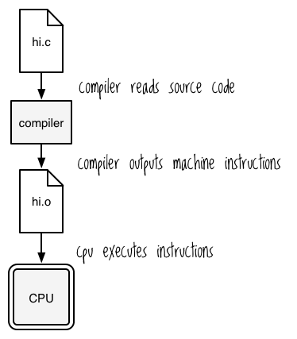
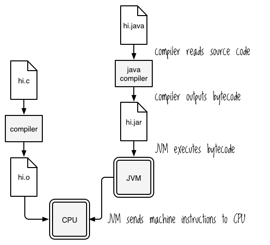

# Interacting with Java

There comes a day in every Clojurist's life when she must venture
forth from the sanctuary of pure functions and immutable data
structures into the wild and barbaric Land of Java. This treacherous
journey is necessary because Clojure is hosted on the Java Virtual
Machine (JVM), granting it three fundamental characteristics. First,
you run Clojure applications the same way you run Java
applications. Second, you need to use Java objects for core
functionality like reading files and working with dates. Third, Java
has a vast and wondrous ecosystem of incredible libraries, and Clojure
makes it painless for you to use them. In this way, Clojure is a bit
like a utopian community plunked down in the middle of a non-utopian
country. It's preferable to interact with other utopians, but every
once in a while you need to talk to the locals in order to get things
done.

This chapter is like a cross between a phrasebook and cultural
introduction for the Land of Java. It will give you an overview of
what the JVM is, how it runs programs, and how to compile programs for
it. It will also give you a brief tour of frequently-used Java classes
and methods and explain how to interact with them from Clojure. More
than that, it will show you how to think about and understand Java so
that you can incorporate any Java library into your Clojure program.

## The JVM

Developers use the term "JVM" to refer to a few different
things. You'll hear them say, "Clojure runs on *the* JVM", and you'll
also hear "Clojure programs run in *a* JVM". In the first case, "JVM"
refers to an abstraction - the general model of the Java Virtual
Machine. In the second, it refers to a process, an instance of a
running program.  Right now, we're only concerned with the JVM model;
I'll point out when we're talking about running JVM processes.

To understand the Java Virtual Machine, let's first take a step back
and review how plain-ol' machines (also known as computers) work. Deep
in the cockles of a computer's heart is its CPU, and the CPU's job is
to execute operations like "add" and "unsigned multiply". You've
probably heard about programmers encoding these instructions on punch
cards or in light bulbs or in the sacred cracks of a tortoise shell
when thrown into a fire, or *whatever*, but nowadays these operations
are represented in assembly language by mnemonics like "ADD" and
"MUL". What operations are availabe depends on the CPU architecture
(x86, ARMv7 and what have you) as part of the architecture's
*instruction set*.

Because it's no fun to program in assembly language, we humans have
invented higher-level languages like C and C++, which get compiled
into the instructions that a CPU will understand. Broadly speaking,
the process is:

1. Compiler reads source code.
2. Compiler outputs a file containing machine instructions
3. The CPU executes those instructions



The most important thing here is that, ultimately, you have to
translate programs into the instructions that a CPU will understand,
and the CPU doesn't care what programming language was used to produce
the instructions.

The JVM is analagous to a computer in that it also executes low-level
instructions, called Java bytecode. As a *virtual* machine, though,
it's implemented as software rather than hardware. A running JVM
executes bytecode by translating it on the fly into the machine code
that its host will understand, a process called just-in-time
compilation. (The JVM is like a computer in other ways, too. For
example, it implements its own memory model. Those details are too
advanced for this book, though.)

For a program to run on the JVM, then, it has to get compiled to Java
bytecode. Usually, when you compile programs the result is a ".class"
file. Then you'll often package these files in JAR (Java archive)
files. And just as a CPU doesn't care how machine instructions are
generated, the JVM doesn't care how bytecode gets created. It doesn't
care if you used Scala, JRuby, Clojure, or even Java to create Java
bytecode. Broadly speaking, the process is:

1. Java compiler reads source code
1. Compiler outputes bytecode, often to a JAR file
2. JVM executes bytecode
3. JVM sends machine instructions to the CPU



So when someone says that Clojure runs on the JVM, one of the things
they mean is that Clojure programs get compiled to Java bytecode and
JVM processes execute them. This matters because you treat Clojure
programs the same as Java programs from an operations perspective. You
compile them to JAR files and run them using the `java` command. If a
client needs a program that runs on the JVM, you could secretly write
it in Clojure instead of Java and they would be none the wiser. Seen
from the outside, you can't tell the difference between a Java and a
Clojure program any more than you can tell the difference between a C
and a C++ program. Clojure allows you to be productive *and* sneaky.

## Compiling and Running a Java Program

I think it's time to see how all of this works with real code. In this
section, you'll build a simple pirate phrasebook using Java. This will
help you feel much more comfortable with the JVM, it will prepare you
for the upcoming section on Java interop, and it will prove invaluable
should a scallywag ever attempt to scuttle your booty on the high
seas. To tie it all together, you'll take a peek at some of Clojure's
Java code.

### Hello World

Go ahead and create new directory called "phrasebook". Within that
directory, create a file named `PiratePhrases.java`, and write the
following in it:

```java
public class PiratePhrases
{
    public static void main(String[] args)
    {
        System.out.println("Shiver me timbers!!!");
    }
}
```

This defines a very simple program which will print the phrase "Shiver
me timbers!!!" (which is how pirates say "Hello, world!") to your
terminal when you run it. It consists of a class, `PiratePhrases`, and
a static method belonging to that class, `main`. Static methods are
essentially class methods.

#### Object-Oriented Programming in the World's Tiniest Nutshell

If you're unfamiliar with object-oriented programming, here's the
two-minute lowdown. The central players in OOP are *classes*,
*objects*, and *methods*.

I think of objects as really, really, ridiculously dumb
androids. They're the kind of android that would never inspire
philosophical debate about the ethics of relegating sentient creatures
to perpetual servitude. These androids do two things: they respond to
commands and they maintian data for me. (In my imagination they do
this by writing stuff down on little Hello Kitty clipboards.)  Both
the set of commands the android understands and the set of data it
maintains is determined by the factory that makes the android. In this
metaphor, commands correspond to methods and the factories correspond
classes. For example, you might have a `ScaryClown` factory producing
androids that respond to the command `makeBalloonArt`. The android
keeps track of the number of balloons it has by writing down the
number on its clipboard, then erasing that number and writing a new
one whenever the number of balloons it carries changes. It can report
that number with the command `balloonCount` and receive any number of
balloons with `receiveBalloons`. Here's how you might interact a Java
object representing Belly Rubs the Clown:

```java
ScaryClown bellyRubsTheClown = new ScaryClown();
bellyRubsTheClown.balloonCount();
// => 0

bellyRubsTheClown.receiveBalloons(2);
bellyRubsTheClown.balloonCount();
// => 2

bellyRubsTheClown.makeBalloonArt();
// => "Belly Rubs makes a balloon shaped like a clown, because Belly Rubs
// => is trying to scare you and nothing is scarier than clowns."
```

This example shows to create a new object, `bellyRubsTheClown`, using
the `ScaryClown` class. It also shows how to call methods on the
object (`balloonCount`, `receiveBalloons`, and `makeBalloonArt`),
presumably so that you can terrify children. A cynical person might
say that Java in itself is enough to terrify children, and if you find
such a person I recommend making two balloon art arms and hugging them
with them.

One final aspect of OOP, or at least of Java, is that you can also
send commands to the factory themselves. In real-life terms, you would
say that classes also have methods. For example, the built-in class
`Math` has many class methods, including `Math.abs`, which returns the
absolute value of a number:

```clojure
Math.abs(-50)
// => -50
```
 
#### Back to the Pirate Example

Back to our example! In your terminal, compile the PiratePhrases
source code with the command `javac PiratePhrases.java`. If you typed
everything correctly *and* you're pure of heart, you should see a file
named `PiratePhrases.class`:

```sh
$ ls
PiratePhrases.class PiratePhrases.java
```

You've just compiled your first Java program, son! Now run it with
`java PiratePhrases`. You should see:

```
Shiver me timbers!!!
```

What's happening here is you used the Java compiler, `javac`, to
create a Java class file, `PiratePhrases.class`. This file is packed
with oodles (well, for program this size, maybe only one oodle) of
Java bytecode.

When you ran `java PiratePhrases`, the JVM first looked on your
*classpath* for a class named `PiratePhrases`. You can think of the
classpath as the list of filesystem paths that the JVM will search in
order to find a file which defines a class. By default, the classpath
includes the directory you're in when you run `java`. Try running
`java -classpath /tmp PiratePhrases` and you will get an error, even
though `PiratePhrases.class` is right there in your current
directory. You can have multiple paths on your classpath by separating
them with colons. For example, the classpath `/tmp:/var/maven:.`
includes the `/tmp`, `/var/maven`, and `.` directories.

In Java, you're only allowed to have one public class per file and the
filename and class name must be the same. This is how `java` knows to
try looking in `PiratePhrases.class` for the PiratePhrases class's
bytecode. After `java` found the bytecode for the `PiratePhrases`
class, it executed that class's `main` method. Java's kind of like C
that way, in that whenever you say "run something, and use this class
as your entry point", it always will run that class's `main`
method. Which means that that method has to be `public`, as you can
see above.

In the next section you'll learn about handling program code that's
spread over more than one file. If you don't remove your socks now,
they're liable to get knocked off!

### Packages and Imports

In this section, you'll learn about how Java handles programs which
are spread over more than one file and you'll learn how to use Java
libraries. Once again, we'll look at both compiling and running a
program. This section has direct implications for Clojure, where
you'll learn ideas and terminology to interact with Java libraries.

First, a couple definitions:

* **package:** Similar to Clojure's namespaces, packages provide code
  organization. The directory that a Java file lives in must mirror
  the package it belongs to. If a file has the line `package
  com.shapemaster` in it, then it must be located at `com/shapemaster`
  somewhere on your classpath.
* **import:** Java allows you to import classes, which basically means
  that you can refer to them without using their namespace prefix. So,
  if you have a class in `com.shapemaster` named `Square`, you could
  write `import com.shapemaster.Square;` or `import com.shapemaster.*;`
  at the top of a `.java` file so that you can use `Square` in your
  code instead of `com.shapemaster.Square`.

Now it's time to try out `package` and `import`. To start, you'll
create three files. First, create PirateConversation.java:

```java
import pirate_phrases.*;

public class PirateConversation
{
    public static void main(String[] args)
    {
        Greetings greetings = new Greetings();
        greetings.hello();

        Farewells farewells = new Farewells();
        farewells.goodbye();
    }
}
```

The first line, `import pirate_phrases.*;`, imports all classes in the
`pirate_phrases` package, which will contain the `Greetings` and
`Farewells` classes. Let's create those now. First, create the
directory `pirate_phrases`. This is needed because Java package names
correspond to filesystem directories. Then, create `Greetings.java`
within `pirate_phrases` and write the following:

```java
package pirate_phrases;

public class Greetings
{
    public static void hello()
    {
        System.out.println("Shiver me timbers!!!");
    }
}
```

Now create `Farewells.java` within the `pirate_phrases` directory:

```java
package pirate_phrases;

public class Farewells
{
    public static void goodbye()
    {
        System.out.println("A fair turn of the tide ter ye thar, ye magnificent sea friend!!");
    }
}
```

If you navigate back to the parent directory of `pirate_phrases` and
run `javac PirateConversation.java` followed by `java
PirateConversation`, you should see this:

```
Shiver me timbers!!!
A fair turn of the tide ter ye thar, ye magnificent sea friend!!
```

And thar she blows, dear reader. Thar she blows indeed.

One thing to note is that, when you're compiling a Java program, Java
searches your classpath for packages. You can see this if you do the
following:

```sh
cd pirate_phrases
javac ../PirateConversation.java
```

Boom! The Java compiler just told you to hang your head in shame, and
maybe weep a little:

```
../PirateConversation.java:1: error: package pirate_phrases does not exist
import pirate_phrases.*;
^
```

It thinks that the `pirate_phrases` package doesn't exist. But that's
stupid, right? I mean, you're in the `pirate_phrases` directory and
everything!

What's happening here is that the default classpath only includes the
directory, which in this case is `pirate_phrases`. It's like `javac`
is trying to find the directory
`phrasebook/pirate_phrases/pirate_phrases`. Without changing
directories, try running `javac ../PirateConversation.java -classpath
../`. Shiver me timbers, it works!

If you feel like breaking things some more, you'll find that moving
either of the .class files in the `pirate_phrases` directory to
another directory will also result in a classpath error. 

To sum things up: packages organize code and require a matching
directory structure. Importing classes allows you to "de-namespace"
them. `javac` and `java` find packages using the classpath.

### JAR Files

JAR files allow you to bundle all your .class files into one single
file. Navigate to your `phrasebook` directory and run the following:

```sh
jar cvfe conversation.jar PirateConversation PirateConversation.class
pirate_phrases/*.class
java -jar conversation.jar
```

This displays the pirate conversation correctly. You bundled all the
class files into `conversation.jar`. You also indicated that the
`PirateConversation` class is the "entry point" with the `e` flag. The
"entry point" is the class that contains the `main` method which
should be executed when the JAR as a whole is run, and `jar` stores
this information in the file `META-INF/MANIFEST.MF` within the JAR
file. If you were to read that file, it would contain this line:

```
Main-Class: PirateConversation
```

By the way, when you execute JAR files, you don't have to worry what
directory you're in in relation to the file. You could change to the
`pirate_phrases` directory and run `java -jar ../conversation.jar` and
it would work fine. The reason is that the JAR file maintains the
directory structure. You can see its contents with `jar tf
conversation.jar`, which outputs:

```
META-INF/
META-INF/MANIFEST.MF
PirateConversation.class
pirate_phrases/Farewells.class
pirate_phrases/Greetings.class
```

One more fun fact about JARs: they're really just zip files with a
".jar" extension. You can treat them the same as any other zip file.

### clojure.jar

Now you're ready to get a peek at how Clojure works under the hood!
Download
[the 1.6.0 stable release](http://central.maven.org/maven2/org/clojure/clojure/1.6.0/clojure-1.6.0.jar)
and run it:

```sh
java -jar clojure-1.6.0.jar
```

You should see that most soothing of sights, the Clojure REPL. How did
it actually start up? Let's have a look at `META-INF/MANIFEST.MF` in
the jar file:

```
Manifest-Version: 1.0
Archiver-Version: Plexus Archiver
Created-By: Apache Maven
Built-By: hudson
Build-Jdk: 1.6.0_20
Main-Class: clojure.main
```

It looks like `clojure.main` is specified as the entry point. Where
does this class come from? Well, have a look at
[clojure/main.java on github](https://github.com/clojure/clojure/blob/master/src/jvm/clojure/main.java):

```java
/**
 *   Copyright (c) Rich Hickey. All rights reserved.
 *   The use and distribution terms for this software are covered by the
 *   Eclipse Public License 1.0 (http://opensource.org/licenses/eclipse-1.0.php)
 *   which can be found in the file epl-v10.html at the root of this distribution.
 *   By using this software in any fashion, you are agreeing to be bound by
 * 	 the terms of this license.
 *   You must not remove this notice, or any other, from this software.
 **/

package clojure;

import clojure.lang.Symbol;
import clojure.lang.Var;
import clojure.lang.RT;

public class main{

final static private Symbol CLOJURE_MAIN = Symbol.intern("clojure.main");
final static private Var REQUIRE = RT.var("clojure.core", "require");
final static private Var LEGACY_REPL = RT.var("clojure.main", "legacy-repl");
final static private Var LEGACY_SCRIPT = RT.var("clojure.main", "legacy-script");
final static private Var MAIN = RT.var("clojure.main", "main");

public static void legacy_repl(String[] args) {
    REQUIRE.invoke(CLOJURE_MAIN);
    LEGACY_REPL.invoke(RT.seq(args));
}

public static void legacy_script(String[] args) {
    REQUIRE.invoke(CLOJURE_MAIN);
    LEGACY_SCRIPT.invoke(RT.seq(args));
}

public static void main(String[] args) {
    REQUIRE.invoke(CLOJURE_MAIN);
    MAIN.applyTo(RT.seq(args));
}
}
```

As you can see, the file defines a class named `main`. It belongs to
the package `clojure` and defines a `public static main` method, and
the JVM is completely happy to use it as an entry point. Seen this
way, Clojure is a JVM program just like any other.

This isn't meant to be an in-depth Java tutorial, but I hope that it
helps clear up what's meant when programmers talk about Clojure
"running on the JVM" or being a "hosted" language. In the next
section, you'll be treated to more clearings up as you learn how to
use Java libraries within your Clojure project.

## Java Interop

One of Rich Hickey's design goals for Clojure was to create a
*practical* language, and for that reason Clojure was designed to make
it straightforward for you to interact with Java classes and
objects. That way, you can make use both Java's extensive native
functionality and its enormous ecosystem. The ability to use Java
classes, objects, and methods is called *Java Interop*. In this
section, you'll learn how to use Clojure' interop syntax, how to
import Java packages, and how to use the most-frequently used Java
classes.

### Interop Syntax

Interacting with Java objects and classes is straighforward. Let's
start with object interop syntax.

You can call methods on an object using `(.methodName object)`. For
example, since all Clojure strings are implemented as Java strings,
you can call Java methods on them:

```clojure
(.toUpperCase "By Bluebeard's bananas!")
; => "BY BLUEBEARD'S BANANAS!"

(.indexOf "Let's synergize our bleeding edges" "y")
; => 7
```

These are equivalent to the following Java:

```java
"By Bluebeard's bananas!".toUpperCase()
"Let's synergize our bleeding edges".indexOf("y")
```

Notice that Clojure's syntax allows you to pass arguments to Java
methods. In the example above, you passed the argument `"y"` to the
`indexOf` method.

You can also call static methods on classes and access classes' static
fields. Observe!

```clojure
(java.lang.Math/abs -3)
; => 3

java.lang.Math/PI
; => 3.141592653589793
```

In the first example, you called the `abs` static method on the
`java.lang.Math` class, and in the second you accessed that class's
`PI` static field.

All of these examples (except `java.lang.Math/PI`) use macros which
expand to use the *dot special form*. In general, you won't need to
use the dot special form unless you want to write your own macros to
interact with Java objects and classes. Nevertheless, here is each
example followed by its macroexpansion:

```clojure
(macroexpand-1 '(.toUpperCase "By Bluebeard's bananas!"))
; => (. "By Bluebeard's bananas!" toUpperCase)

(macroexpand-1 '(.indexOf "Let's synergize our bleeding edges" "y"))
; => (. "Let's synergize our bleeding edges" indexOf "y")

(macroexpand-1 '(Math/abs -3))
; => (. Math abs -3)
```

You can think of the general form of the dot operator as:

```clojure
(. object-expr-or-classname-symbol method-or-member-symbol optional-args*)
```

There are a few more details to the dot operator than that, and if
you're interested in exploring it further you can look at
[clojure.org's documentation on Java interop](http://clojure.org/java_interop#Java
Interop-The Dot special form).

### Creating and Mutating Instances

The previous section showed you how to call methods on objects that
already exist. This section will show you how to create new objects
and how to conveniently mutate them.

There are two ways to create a new object: `(new ClassName optional-args*)` and
`(ClassName. optional-args*)`:

```clojure
(new String)
; => ""

(String.)
; => ""

(String. "To Davey Jones' Locker with ye hardies")
; => "To Davey Jones' Locker with ye hardies"
```

Most people use the dot version, `(ClassName.)`.

To modify an object, you can just call methods on it like you did in
the last section. To show this, let's use `java.util.Stack`. This
class represents a last-in-first-out stack of objects. Here's how you
might add an object to it:

```clojure
(java.util.Stack.)
; => []

(let [stack (java.util.Stack.)]
  (.push stack "Latest episode of Game of Thrones, ho!")
  stack)
; => ["Latest episode of Game of Thrones, ho!"]
```

There are a couple interesting things here. First, you need to create
a `let` binding for `stack` and add it as the last expression in the
let form. If you didn't do that, then the value of the overall
expression would be the string `"Latest episode of Game of Fancy
Chairs, ho!"`, because that's the return value of `push`, as you can
see here:

```clojure
(.push (java.util.Stack.) "Latest episode of Game of Thrones, ho!")
; => "Latest episode of Game of Thrones, ho!"
```

Second, Clojure prints the stack with square brackets, the same as it
does a vector. It's not a vector, but it is a seqable data structure:

```clojure
(let [stack (java.util.Stack.)]
  (.push stack "Latest episode of Game of Thrones, ho!")
  (first stack))
; => "Latest episode of Game of Thrones, ho!"
```

That has nothing to do with mutating Java objects, but it *is* a nice
example of how Clojure's philosophy of programming to abstractions
makes your code flexible. Anyway, back to the topic at hand, me
mateys!

Clojure provides the `doto` macro, which allows you to execute
multiple methods on the same object more succinctly:

```clojure
(doto (java.util.Stack.)
  (.push "Latest episode of Game of Thrones, ho!")
  (.push "Whoops, I meant 'Land, ho!'"))
; => ["Latest episode of Game of Thrones, ho!" "Whoops, I meant 'Land, ho!'"]
```

The `doto` macro returns the object itself rather than the return
value of any of the method calls, and it's easier to understand. If
you expand it, you can see its structure is identical to the `let`
expression from a few examples ago:

```clojure
(macroexpand-1
 '(doto (java.util.Stack.)
    (.push "Latest episode of Game of Thrones, ho!")
    (.push "Whoops, I meant 'Land, ho!'")))
; => (clojure.core/let
; =>  [G__2876 (java.util.Stack.)]
; =>  (.push G__2876 "Latest episode of Game of Thrones, ho!")
; =>  (.push G__2876 "Whoops, I meant 'Land, ho!'")
; =>  G__2876)
```

Convenient!

### Importing

Importing in Clojure has the same effect as it does in Java: you get
to use classes without having to type out their entire package
prefix:

```clojure
(import java.util.Stack)
(Stack.)
; => []
```

You can also import multiple classes at once using this general form:

```clojure
(import [package.name1 ClassName1 ClassName2]
        [package.name2 ClassName3 ClassName4])
```

For example:

```clojure
(import [java.util Date Stack]
        [java.net Proxy URI])

(Date.)
; => #inst "2014-09-19T20:40:02.733-00:00"
```

Usually, though, you'll do all your importing in the `ns` macro, like
this:

```clojure
(ns pirate.talk
  (:import [java.util Date Stack]
           [java.net Proxy URI]))
```

And that's how you import classes! Pretty easy. To make life even
easier, Clojure automatically imports the classes in `java.lang`,
including `java.lang.String` and `java.lang.Math`, which is why you
were able to use `String` without a preceding package name.

## Commonly Used Java Classes

To round things out, let's take a quick tour of the Java classes that
you're most likely to use.

### System

From the
[Java 8 API docs](http://docs.oracle.com/javase/8/docs/api/java/lang/System.html):

    The System class contains several useful class fields and
    methods. It cannot be instantiated.
    
    Among the facilities provided by the System class are standard
    input, standard output, and error output streams; access to
    externally defined properties and environment variables; a means
    of loading files and libraries; and a utility method for quickly
    copying a portion of an array.

The most useful methods and members are `exit`, `getenv`,
`getProperty`. You might recognize `System/exit` from the
[Functional Programming chapter](/functional-programming), where you
used it to exit the Peg Thing game. `System/exit` terminates the
current program, and you can pass it a status code as an argument. (If
you're not familiar with status codes, I recommend
[Wikipedia's "Exit status" article](http://en.wikipedia.org/wiki/Exit_status).

`System/getenv` will return your system's environment variables as a
map:

```clojure
(System/getenv)
{"USER" "the-incredible-bulk"
 "JAVA_ARCH" "x86_64"}
```

`System/getProperty` returns a JVM property:

```clojure
(System/getProperty "user.dir")
; => "/Users/dabulk/projects/dabook"

(System/getProperty "java.version")
; => "1.7.0_17"
```

The first call returned the directory that the JVM was started from,
and the second of course returned the version of the JVM.

### Date

Java has good tools for working with dates. I won't go into too much
detail about the `java.util.Date` class because
[the online api documentation](http://docs.oracle.com/javase/7/docs/api/java/util/Date.html)
is already thorough. As a Clojure developer, though, there are three
things you should know about. First, Clojure allows you to represent
dates as literals using a form like this:

```clojure
#inst "2014-09-19T20:40:02.733-00:00"
```

In fact, you saw that exact date just a few paragraphs ago. Second,
you need to use the `java.util.DateFormat` class if you want to
customize how you convert dates to strings or if you want to convert
strings to dates. Lastly, if you're doing things like comparing dates
or trying to add minutes, hours, or other units of time to a date,
then you should use the immensely useful
[`clj-time`](https://github.com/clj-time/clj-time) library.

### Files and IO

In this section, you'll learn about Java's approach to IO and you'll
learn how Clojure simplifies it. The
[`clojure.java.io`](https://clojure.github.io/clojure/clojure.java.io-api.html)
namespace provides many handy functions for simplifying IO. This is
great because Java IO isn't exactly straightforward. Since you'll
probably want to perform IO at some point during your programming
career, let's start wrapping our mind tentacles around it.

Input/output involves resources, be they files, sockets, buffers, or
whatever. Java has separate classes for reading a resource's
contents, writings its contents, and for interacting with the
resource's properties.

For example, the `java.io.File` class is used to interact with a
file's properties. Among other things, you can use it to check whether
a file exists, to get the file's read/write/execute permissions, and
to get its filesystem path:

```clojure
(let [file (java.io.File. "/")]
  (println (.exists file))
  (println (.canWrite file))
  (println (.getPath file)))
; => true
; => false
; => /
```

Noticeably missing from this list of capabilities are reading and
writing. To read a file, you could use the `java.io.BufferedReader`
class or perhaps `java.io.FileReader`. Likewise, you can use the
`java.io.BufferedWriter` or `java.io.FileWriter` class for writing.
There are other classes available for reading and writing as well, and
which one you choose depends on your specific needs. Reader and Writer
classes all have the same base set of methods for their interfaces;
readers implement `read`, `close`, and more, while writers implement
`append`, `write`, `close`, and `flush`. So, Java gives you a variety
of tools for performing IO. A cynical person might say that Java gives
you enough rope to hang yourself, and if you find such a person I hope
you give them just enough arms to hug them.

Either way, Clojure makes things easier for you. First, there's `spit`
and `slurp`. Spit writes to a resource, and slurp reads from
one. Here's an example of using them to write and read a file:

```clojure
(spit "/tmp/hercules-todo-list"
"- kill dat lion brov
- chop up what nasty multi-headed snake thing")

(slurp "/tmp/hercules-todo-list")

; => "- kill dat lion brov
; =>  - chop up what nasty multi-headed snake thing"
```

You can also use these functions with objects representing resources
other than files. The next example uses a `StringWriter`, which allows
you to perform IO operations on a string:

```clojure
(let [s (java.io.StringWriter.)]
  (spit s "- capture cerynian hind like for real")
  (.toString s))
; => "- capture cerynian hind like for real"
```

Naturally, you can also read from a `StringReader` with `slurp`:

```clojure
(let [s (java.io.StringReader. "- get erymanthian pig what with the tusks")]
  (slurp s))
; => "- get erymanthian pig what with the tusks"
```

Of course, you can also use the `read` and `write` methods for
resources. It doesn't really make much of a difference which you use;
`spit` and `slurp` are often convenient because they work with just a
string representing a filesystem path or a URL.

The `with-open` macro is another convenience: it implicitly closes a
resource at the end of its body. There's also the `reader` function, a
nice utility which, according to the `clojure.java.io` api docs,
"attempts to coerce its argument to an open `java.io.Reader`." This is
convenient when you don't want to use `slurp` because you don't want
to try to read a resource in its entirety, and you don't want to
figure out which Java class you need to use. You could use it along
with `with-open` and the `line-seq` function if you're trying to read
a file one line at a time:

```clojure
(with-open [todo-list-rdr (clojure.java.io/reader "/tmp/hercules-todo-list")]
  (doseq [todo (line-seq todo-list-rdr)]
    (println todo)))
; => - kill dat lion brov
; => - chop up what nasty multi-headed snake thing
```

That should be enough for you to get started with IO in Clojure. If
you're trying to do something more sophisticated, definitely take a
look at the
[`clojure.java.io`](https://clojure.github.io/clojure/clojure.java.io-api.html)
docs, the
[java.nio.file package](http://docs.oracle.com/javase/7/docs/api/java/nio/file/package-summary.html)
docs, or the
[java.io package](http://docs.oracle.com/javase/7/docs/api/java/io/package-summary.html) docs.

## Summary

In this chapter, you learned what it means for Clojure to be hosted on
the JVM. Clojure programs get compiled to Java bytecode and executed
within a JVM process. Clojure programs also have access to Java
libraries, and you can easily interact with them using Clojure's
interop facilities.

## Resources

* [The Java Virtual Machine and Compilers Explained](https://www.youtube.com/watch?v=XjNwyXx2os8)
* [clojure.java.io](https://clojure.github.io/clojure/clojure.java.io-api.html)
* [clojure.org Java interop documentation](http://clojure.org/java_interop)
* [Wikipedia's "Exit status" article](http://en.wikipedia.org/wiki/Exit_status).
