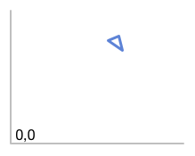
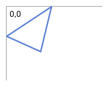

# Organizing Your Project: a Librarian's Tale

Within each of us is lives a librarian named Melvil, a fantastical
creature who delights in the organizational arts. Day and night, Melvil
yearns to bring order to your codebase. Happily, Clojure provides a
suite of tools designed specifically for aiding this homunculus in its
constant struggle against the forces of chaos.

These tools allow you to keep your code organized by grouping related
functions and data together. They also prevent name collisions,
ensuring that you don't accidentally overwrite someone else's code or
vice versa.

This chapter will instruct you in the proper usage of these tools.
Melvil quivers with excitement! By the end, you will understand:

* What `def` does
* What namespaces are and how to use them
* The relationship between namespaces and the filesystem
* How to use `refer`, `alias`, `require`, `use`, and `ns`

To get there, you'll explore the idea of your project as a library
using the REPL. This will give you a clear mental model of Clojure's
organizational system. You'll also join me in a tale of suspense and
mystery as we solve the heist of a lifetime! This will give you an
increased heartrate and a slight pain in your bum from sitting on the
edge of your seat. Finally, I'll show you how you'll organize projects
in real life using the filesystem. Put a pillow on your chair and read
on!

## Your Project as a Library

Real-world libraries store collections of objects like books,
magazines, and DVDs. They use addressing systems so that, given an
object's address, you can navigate the physical space and retrieve the
object you're looking for.

No human being is going to know off-hand what a book or DVD's address
is, though. Libraries therefore record the association between an
object's title and its address and provide tools for searching these
records.

For example, if you searched for "The Da Vinci Code" in your
local library's database, it would return the address "813.54" to you
(if it's using the Dewey Decimal System). Now you can efficiently
navigate your library and locate the physical space where _The Da
Vinci Code_ resides. Then you can engage in the literary and/or
hate-reading adventure of your lifetime.

It's useful to imagine a similar physical setup in Clojure. I think of
Clojure as storing objects like data structures and functions in a
vast set of numbered shelves. No human being is going to know off-hand
which shelf an object is stored in. Instead, we want to give Clojure
an identifier which it can use to retrieve the object.

In order for this to happen, Clojure has to maintain the associations
between our identifiers and shelf addresses. It does this using
*namespaces*. Namespaces contain maps between human-friendly *symbols*
and references to shelf addresses (known as *Vars*).

Technically, namespaces are objects of type `clojure.lang.Namespace`.
The current namespace is accessible with `*ns*` &ndash; try evaluating
that in the REPL. Namespaces have names, and you can get the name of
the current namespace with `(ns-name *ns*)`.

```clojure
(ns-name *ns*)
; => user
```

In Clojure programs, you are always "in" a namespace. When you start
the REPL, for example, you're in the `user` namespace (as you can see
above). The prompt will show the current namespace with something like
`user>`. In a later section we'll go over how to create and switch to
namespaces.

This terminology makes me think of namespaces as little cubicles lined
with cubbies. The cubbies have names like `str`, `ns-name`, and so on,
and within each is the corresponding var. This might sound like a
completely boring analogy, but believe me, Melvil loves it.

When you give Clojure a name like `str`, it finds the corresponding
cubby in the current cubicle. It then takes the Var, gets a shelf
address, and retrieves an object from that shelf for you. Clojure is
such an obedient little helper! We can tell it to do stuff all day
long, and it doesn't mind at all!

Now that we know about Clojure's organization system, let's look at
how we use it!

## Storing Objects with def

Our primary tool for storing objects is `def`. Other tools like `defn`
and `defmacro` use `def` under the hood. Here's an example of def in
action:

```clojure
(def great-books ["East of Eden" "The Glass Bead Game"])
; => #'user/great-books
great-books
["East of Eden" "The Glass Bead Game"]
```

This is like telling Clojure:

1. Find a Var named `great-books`. If it doesn't exist, create it and
  update the current namespace's map with the association between
  `great-books` and the Var that was just created
2. Find a free storage shelf
3. Shove `["East of Eden" "The Glass Bead Game"]` onto it
4. Write the address of the shelf on the Var
5. Return the Var (in this case, `#'user/great-books`)

This process is called *interning* a Var. You can interact with a
namespace's map of symbols-to-interned-Vars:

```clojure
;; Return map of interned Vars
(ns-interns *ns*)
; => {great-books #'user/great-books}

;; Get a specific Var
(get (ns-interns *ns*) 'great-books)
; => #'user/great-books
```

You can also get the map the namespace uses for looking up a Var when
given a symbol:

```clojure
(ns-map *ns*)
; => very large map which I won't print here; try it out!

;; The symbol 'great-books is mapped to the Var we created above
(get (ns-map *ns*) 'great-books)
; => #'user/great-books
```

`#'user/great-books` probably looks unfamiliar to you at this point.
That's the *reader form* of a Var. I explain reader forms in the
chapter
[Clojure Alchemy: Reading, Evaluation, and Macros](/read-and-eval).
For now, just know that `#'` can be used to grab hold of the Var
corresponding to the symbol that follows; `#'user/great-books` lets
you use the Var associated with the symbol `great-books` within the
`user` namespace. We can `deref` vars to get the objects they point
to:

```clojure
(deref #'user/great-books)
; => ["East of Eden" "The Glass Bead Game"]
```

This is like telling Clojure:

* Get the shelf number from the Var
* Go to that shelf number and grab what's inside
* Give it to me!

Normally, though, you'll just use the symbol:

```clojure
great-books
; => ["East of Eden" "The Glass Bead Game"]
```

This is like telling Clojure:

* Retrieve the Var associated with `great-books`
* `deref` that bad Jackson

So far, so good, right? Well, brace yourself, because this idyllic
paradise or organization is about to be turned upside down!

Call `def` again with the same symbol:

```clojure
(def great-books ["The Power of Bees" "Journey to Upstairs"])
great-books
; => ["The Power of Bees" "Journey to Upstairs"]
```

The Var has been updated with the address of the new vector. The
result is that you can no longer ask Clojure to find the first vector.
This is referred to as a *name collision*. Chaos! Anarchy!

You may have experienced this in other programming languages.
Javacript is notorious for it, and it happens in Ruby as well. It's a
problem because you can unintentionally overwrite your own code, and
if you use someone else's libraries you have no guarantee that they
won't overwrite your code. Melvil recoils in horror! Thankfully,
Clojure allows us to create as many namespaces as we like so that we
can avoid these collisions.

## Creating and Switching to Namespaces

Clojure has three tools for creating namespaces:

* The function `create-ns`
* The function `in-ns`
* The macro `ns`

Let's look at `create-ns` and `in-ns`. We'll examine `ns` in great
detail in an upcoming section.

`create-ns` takes a symbol, creates a namespace with that name if it
doesn't exist already, and returns the namespace. Remember from the
chapter [Do Things](/do-things) to quote a symbol when passing it as
an argument to a function:

```clojure
;; Creates the namespace if it doesn't exist and return
user> (create-ns 'cheese.taxonomy)
; => #<Namespace cheese.taxonomy>

;; Returns the namespace if it already exists
user> (create-ns 'cheese.taxonomy)
; => #<Namespace cheese.taxonomy>

;; Pass the returned namespace as an argument
; (ns-name (create-ns 'cheese.taxonomy))
; => cheese.taxonomy
```

This is pretty neat, but in practice you'll probably never use
`create-ns` in your code. It's not very useful to create a namespace
and not move into it. `in-ns` is what you need. It creates the
namespace if it doesn't exist and switches to it:

```clojure
user> (in-ns 'cheese.analysis)
; => #<Namespace cheese.analysis>
```

Notice that your REPL prompt is now `cheese.analysis>`, indicating
that you are indeed in the new namespace you just created. Now when
you use `def` it will store the named object in the
`cheese.analysis` namespace.

What if you want to use things from other namespaces, though? To do
that, you use what's called a "fully-qualified" symbol. The general
form is `namespace/name`:

```clojure
(in-ns 'cheese.taxonomy)
cheese.taxonomy> (def cheddars ["mild" "medium" "strong" "sharp" "extra sharp"])
cheese.taxonomy> (in-ns 'cheese.analysis)

;; We get an exception if we try to refer to the cheese.taxonomy
;; namespace's cheddars from within cheese.analysis

cheese.analysis> cheddars
; => Exception: Unable to resolve symbol: cheddars in this context

;; But using the fully-qualified symbol works:
cheese.analysis> cheese.taxonomy/cheddars
; => ["mild" "medium" "strong" "sharp" "extra sharp"]
```

The way I think about this is that I imagine I am an extremely
impatient academic specializing in semiotics-au-fromage, or the study
of symbols as they relate to cheese.

Suddenly, I'm thrust into the middle of an international plot. All
across the world, sacred and historically important cheeses have gone
missing. Wisconsin's Standard Cheddar: gone! The Great Cheese Jars of
Tutankhamun: stolen! Meanwhile, I'm being chased by the Illuminati,
the Freemasons, and the Foot Clan!

And now, this daring cheese thief has claimed the most famous cheese
of all: the Cheese of Turin, a crumb of cheese purported to have
fallen from the lips of a deity during his last dinner. This threatens
to throw the world into total chaos for some reason!

Because I'm an academic I attempt to solve this mystery the best way I
know how: by heading to the library and researching the shit out of
it. My trusty assistant, Clojure, accompanies me. As we bustle from
namespace to namespace, I shout at Clojure to hand me one thing after
another.

But Clojure is kind of dumb and has a hard time figuring out what I'm
referring to. From within the `user` namespace, I belt out "`join`!
Give me `join`!", specks of spittle flying out my mouth.
"`RuntimeException: Unable to resolve symbol: join`", Clojure whines
in response. "For the love of brie, just hand me
`clojure.string/join`"! I retort, and Clojure dutifully hands me the
function I was looking for.

After awhile, though, my voice gets hoarse. I need some way to tell
Clojure what objects to get me without having to use the fully
qualified symbol every. damn. time.

Luckily, Clojure has some tools that allow me to yell at it more
succinctly.

## refer and alias

The first tool, `refer`, gives us fine-grained control over how we
refer to objects in other namespaces. Fire up a new REPL session and
try the following (and keep in mind that this is not at all indicative
of how you should actually structure a Clojure project):

```clojure
user> (in-ns 'cheese.taxonomy)
cheese.taxonomy> (def cheddars ["mild" "medium" "strong" "sharp" "extra sharp"])
cheese.taxonomy> (def bries ["Wisconsin" "Somerset" "Brie de Meaux" "Brie de Melun"])
cheese.taxonomy> (in-ns 'cheese.analysis)
cheese.analysis> (clojure.core/refer 'cheese.taxonomy)
cheese.analysis> bries
; => ["Wisconsin" "Somerset" "Brie de Meaux" "Brie de Melun"]
cheese.analysis> cheddars
; => ["mild" "medium" "strong" "sharp" "extra sharp"]
```

Calling `refer` with a symbol allows us to refer to the corresponding
namespace's objects without having to use their fully-qualified names.
It updates the current namespace's symbol/object map. You can see the
new entries:

```clojure
cheese.analysis> (clojure.core/get (clojure.core/ns-map clojure.core/*ns*) 'bries)
#'cheese.taxonomy/bries

cheese.analysis> (clojure.core/get (clojure.core/ns-map clojure.core/*ns*) 'cheddars)
#'cheese.taxonomy/cheddars
```

It's as if Clojure does something like:

1. Call `ns-interns` on the `cheese.taxonomy` namespace
2. Merge that with the `ns-map` of the current namespace
3. Make the result the new `ns-map` of the current namespace

You can also pass `refer` the filters `:only`, `:exclude`, and
`:rename`. `:only` and `:exclude` limit the symbol/Var mappings which
get merged into the current namespace's `ns-map`. `:rename` lets you
use different symbols for the vars being merged in. Here's what would
happen if we had used these options in the example above:

```clojure
;; :only example
cheese.analysis> (clojure.core/refer 'cheese.taxonomy :only ['bries])
cheese.analysis> bries
; => ["Wisconsin" "Somerset" "Brie de Meaux" "Brie de Melun"]
cheese.analysis> cheddars 
; => RuntimeException: Unable to resolve symbol: cheddars

;; :exclude example
cheese.analysis> (clojure.core/refer 'cheese.taxonomy :exclude ['bries])
cheese.analysis> bries
; => RuntimeException: Unable to resolve symbol: bries
cheese.analysis> cheddars 
; => ["mild" "medium" "strong" "sharp" "extra sharp"]

;; :rename example
cheese.analysis> (clojure.core/refer 'cheese.taxonomy :rename {'bries 'yummy-bries})
cheese.analysis> bries
; => RuntimeException: Unable to resolve symbol: bries
cheese.analysis> yummy-bries
; => ["Wisconsin" "Somerset" "Brie de Meaux" "Brie de Melun"]
```

By the way, notice that we're having to use the fully-qualified names
of all the objects in `clojure.core`, like `clojure.core/ns-map` and
`clojure.core/refer`. We didn't have to do that in the `user`
namespace. That's because the REPL automatically refers `clojure.core`
within the `user` namespace.

Another thing to notice is that you have complete freedom over how to
organize your namespaces. It makes sense to group related functions
and data together in the same namespace. You might think that Clojure
imposes some kind of relationship between your namespace and the
objects it contains, but it doesn't.

Sometimes you may want a function to only be available to other
functions within the same namespace. Clojure allows you to define
*private* functions, like so:

```clojure
(in-ns 'cheese.analysis)
;; Notice the dash after "defn"
(defn- private-function
  "Just an example function that does nothing"
  [])
```

If you try to call this function from another namespace or refer it,
Clojure will throw an exception:

```clojure
cheese.analysis> (in-ns 'cheese.taxonomy)
cheese.taxonomy> (cheese.analysis/private-function)
; => throws exception
cheese.taxonomy> (clojure.core/refer 'cheese.analysis :only ['private-function])
; => also throws exception
```

So that's `refer`! `alias` is relatively simple by comparison. All it
does is let you use a shorter namespace name when using a
fully-qualified name:

```clojure
cheese.analysis> (clojure.core/alias 'taxonomy 'cheese.taxonomy)
cheese.analysis> taxonomy/bries
["Wisconsin" "Somerset" "Brie de Meaux" "Brie de Melun"]
```

And that's it! Those are all your basic tools for referring to objects
outside of your current namespace! They're great aids to REPL
development.

However, you're unlikely to create your entire program in the REPL. In
the next section I'll cover everything you need to know to organize
a real project with source code living on the filesystem.

## Real Project Organization

Up until now I've covered the building blocks of Clojure's
organization system. Now I'll show how to use them in real
projects. I'll cover:

* The relationship between file paths and namespace names
* Loading a file with `require` and `use`
* Using `ns` to set up a namespace

### The relationship between file paths and namespace names

To kill two birds with one stone (or feed two birds with one seed,
depending on how much of a hippie you are), our example will be used
to catch the pesky international cheese thief by mapping the locations
of his heists. Run the following:

```bash
lein new app the-divine-cheese-code
```

This should create a directory structure that looks like this:

```
| .gitignore
| doc
| | intro.md
| project.clj
| README.md
| resources
| src
| | the_divine_cheese_code
| | | core.clj
| test
| | the_divine_cheese_code
| | | core_test.clj
```

Now, open `src/the_divine_cheese_code/core.clj`. You should see this
on the first line:

```clojure
(ns the-divine-cheese-code.core
  (:gen-class))
```

`ns` is the primary way you that create and manage namespaces within
Clojure. I'm going to explain it fully shortly. For now, though, this
line is very similar to the `in-ns` function we used above. It creates
a namespace if it doesn't exist and then switches to it.
`(:gen-class)` will also be covered in detail later.

The name of the namespace is `the-divine-cheese-code.core`. In
Clojure, there's a one-to-one mapping between a namespace name and the
path of the file where the namespace is declared, relative to the
source code's root:

* The source code's root is `src` in this case. In general, the root
  is determine by the *classpath*, which is something I'll cover in a
  later chapter.
* Dashes in namespace names correspond with underscores in the
  filesystem. `the-divine-cheese-code` is mapped to
  `the_divine_cheese_code` on the filesystem
* The component preceding every period (`.`) in a namespace name
  corresponds with a directory. `the_divine_cheese_code` is a
  directory.
* The final component of a namespace corersponds with a file with the
  `.clj` extension; `core` is mapped to `core.clj`.

Your project is going to have one more namespace,
`the-divine-cheese-code.visualization.svg`. Go ahead and create the
file for it now:

```bash
mkdir src/the_divine_cheese_code/visualization
touch src/the_divine_cheese_code/visualization/svg.clj
```

Notice that the filesystem path follows the rules outlined above. With
the relationship between namespaces and the filesystem down, let's
look at `require` and `use`.

### Loading a file with `require` and `use`

`src/the_divine_cheese_code/core.clj` is going to coordinate the work
of your project. It's going to use the functions in `svg.clj` to
create SVG markup, save it to a file, and open the file in a browser.
To use `svg.clj`'s functions, `core.clj` will have to *load* it. But
first, it makes sense to add some code to `svg.clj`. Make it look like
this (you'll add in more later):

```clojure
(ns the-divine-cheese-code.visualization.svg)

(defn latlng->point
  "Convert lat/lng map to comma-separated string" 
  [latlng]
  (str (:lat latlng) "," (:lng latlng)))

(defn points
  [locations]
  (clojure.string/join " " (map latlng->point locations)))
```

This just converts a seq of latitude/longitude coordinates into a
string of points.

In order to use this code, though, we have to `require` it. `require`
takes a symbol and *loads* code if it hasn't already been loaded.
Go ahead and require `the-divine-cheese-code.visualization.svg` by
changing `core.clj` so that it looks like this:

```clojure
(ns the-divine-cheese-code.core)
;; Load our SVG code
(require 'the-divine-cheese-code.visualization.svg)
;; Refer it so that we don't have to use the fully-qualified name to
;; reference svg functions
(refer 'the-divine-cheese-code.visualization.svg)

(def heists [{:location "Cologne, Germany"
              :cheese-name "Archbishop Hildebold's Cheese Pretzel"
              :lat 50.95
              :lng 6.97}
             {:location "Zurich, Switzerland"
              :cheese-name "The Standard Emmental"
              :lat 47.37
              :lng 8.55}
             {:location "Marseille, France"
              :cheese-name "Le Fromage de Cosquer"
              :lat 43.30
              :lng 5.37}
             {:location "Zurich, Switzerland"
              :cheese-name "The Lesser Emmental"
              :lat 47.37
              :lng 8.55}
             {:location "Vatican City"
              :cheese-name "The Cheese of Turin"
              :lat 41.90
              :lng 12.45}])

(defn -main
  [& args]
  (println (points heists)))
```

If you run the project with `lein run` you should see

```bash
50.95,6.97 47.37,8.55 43.3,5.37 47.37,8.55 41.9,12.45
```

Hooray! You're one step closer to catching that purloiner of the
fermented curd! Using `require` successfully loaded
`the-divine-cheese-code.visualization.svg` for use.

The details of `require` are actually a bit complicated, and I'll
cover them in a later chapter, but for practical purposes you can
think of `require` as telling Clojure:

* Do nothing if you've already called `require` with this symbol
  (`the-divine-cheese-code.visualization.svg`). Otherwise...
* Find the file which corresponds with this symbol using the rules we
  described in "The relationship between file paths and namespaces"
  above. In this case, Clojure finds
  `src/the_divine_cheese_code/visualization/svg.clj`.
* Read and evaluate the contents of that file. Clojure expects the
  file to declare a namespace corresponding to its path (which ours
  does).

`require` also lets you alias a namespace when you require it:

```clojure
;; This:
(require '[the-divine-cheese-code.visualization.svg :as svg])

;; ...is equivalent to this:
(require 'the-divine-cheese-code.visualization.svg)
(alias 'svg 'the-divine-cheese-code.visualization.svg)

;; You can now use the aliased namespace
(svg/points heists)
; => "50.95,6.97 47.37,8.55 43.3,5.37 47.37,8.55 41.9,12.45"
```

Clojure provides another shortcut. Instead of calling `require` and
`refer` separately, the function `use` does both:

```clojure
;; This:
(require 'the-divine-cheese-code.visualization.svg)
(refer 'the-divine-cheese-code.visualization.svg)

;; ...is equivalent to this:
(use 'the-divine-cheese-code.visualization.svg)
```

You can alias a namespace with `use` just like you can with `require`:

```clojure
;; This:
(use '[the-divine-cheese-code.visualization.svg :as svg])

;; ...is equivalent to this:
(require 'the-divine-cheese-code.visualization.svg)
(refer 'the-divine-cheese-code.visualization.svg)
(alias 'svg 'the-divine-cheese-code.visualization.svg)

;; You can now access "points" with or without the aliased namespace
(= svg/points points)
; => true

;; You can access "latlng->point" as well
(= svg/latlng->point latlng->point)
; => true
```

The reason you might want to alias a namespace when using it is
because `use` takes the same options as `refer` above:

```clojure
;; This:
(use '[the-divine-cheese-code.visualization.svg :as svg :only [points]])

;; ...is equivalent to this:
(require 'the-divine-cheese-code.visualization.svg)
(refer 'the-divine-cheese-code.visualization.svg :only ['points])
(alias 'svg 'the-divine-cheese-code.visualization.svg)

;; This works as expected
(= svg/points points)
; => true

;; We can use the alias to reach latlng->point
svg/latlng->point
; => no exception

;: But we can't use the bare name
latlng->point
; => exception!
```

If you try all the above code in a REPL and `latlng->point` doesn't
throw an exception, it's because you referred `latlng->point` in the
previous code example. You'll need to restart your REPL session for
the code to behave as shown.

The takeaway here is that `require` and `use` load files and
optionally `alias` or `refer` their namespaces. This covers the main
use cases of `require` and `use`. As you write Clojure programs and
read code written by others, you might encounter even more ways of
writing `require` and `use`, at which point it'll make sense to read
Clojure's API docs to understand what's going on. However, what you've
learned so far should cover 95.3% of your needs.

Now it's time to look at the `ns` macro.

### Using ns

Everything we've covered so far &ndash; `in-ns`, `refer`, `alias`,
`require`, and `use` &ndash; are actually hardly ever used in your
source code files. Normally, you would only use them when playing
around in the REPL. Instead, you'll use the `ns` macro. In this
section, you'll learn about how one `ns` call can incorporate
`require`, `use`, `in-ns`, `alias`, and `refer`.

We mentioned already that `ns` is like calling `in-ns`. `ns` also
defaults to referring the `clojure.core` namespace. That's why we can
call `println` from within `the-divine-cheese-code.core` without using
the fully qualified name, `clojure.core/println`.

You can control what gets referred from `clojure-core` with
`:refer-clojure`. `:refer-clojure` takes the same options as `refer`:

```clojure
;; This will break our code, causing us to have to use
;; clojure.core/println within the -main function:
(ns the-divine-cheese-code.core
  (:refer-clojure :exclude [println]))
```

Within `ns`, the form `(:refer-clojure)` is called a *reference*. This
might look weird to you. Is this reference a function call? A macro?
What is it? You'll learn fully how to make sense of it in the chapter
[Clojure Alchemy: Reading, Evaluation, and Macros](/read-and-eval).
For now, though, it should be enough to understand how each reference
maps to functions calls. That way you'll have a practical
understanding, even if the underlying machinery isn't clear yet. For
example, the above code is equivalent to:

```clojure
(in-ns 'the-divine-cheese-code.core)
(refer 'clojure.core :exclude ['println])
```

There are six possible kinds of references within `ns`:

* `(:refer-clojure)`
* `(:require)`
* `(:use)`
* `(:import)`
* `(:load)`
* `(:gen-class)`

For now, I'm going to ignore `(:import)`, `(:load)`, and
`(:gen-class)`. They'll be covered in a later chapter.

`(:require)` works similarly to the require function. For example:

```clojure
;; This:
(ns the-divine-cheese-code.core
  (:require the-divine-cheese-code.visualization.svg))

;; ...is equivalent to this:
(in-ns 'the-divine-cheese-code.core)
(require 'the-divine-cheese-code.visualization.svg)
```

Notice that in the `ns` form you don't have to quote your symbol with
`'`. You'll never have to quote symbols within `ns`.

You can also `alias` a lib that you `require` within `ns`, just like
when you call the function:

```clojure
;; This:
(ns the-divine-cheese-code.core
  (:require [the-divine-cheese-code.visualization.svg :as svg]))

;; ...is equivalent to this:
(in-ns 'the-divine-cheese-code.core)
(require ['the-divine-cheese-code.visualization.svg :as 'svg])

;; ... which is equivalent to this:
(in-ns 'the-divine-cheese-code.core)
(require 'the-divine-cheese-code.visualization.svg)
(alias 'svg 'the-divine-cheese-code.visualization.svg)
```

You can require multiple libs in a `(:require)` reference:

```clojure
;; This:
(ns the-divine-cheese-code.core
  (:require [the-divine-cheese-code.visualization.svg :as svg]
            [clojure.java.browse :as browse]))

;; ...is equivalent to this:
(in-ns 'the-divine-cheese-code.core)
(require ['the-divine-cheese-code.visualization.svg :as 'svg])
(require ['clojure.java.browse :as 'browse])
```

One difference between the `(:require)` reference and the `require`
function, however, is that the reference allows you to refer names:

```clojure
;; This:
(ns the-divine-cheese-code.core
  (:require [the-divine-cheese-code.visualization.svg :refer [points]]))

;; ...is equivalent to this:
(in-ns 'the-divine-cheese-code.core)
(require 'the-divine-cheese-code.visualization.svg)
(refer 'the-divine-cheese-code.visualization.svg :only ['points])

;; You can also refer all symbols (notice the :all keyword):
(ns the-divine-cheese-code.core
  (:require [the-divine-cheese-code.visualization.svg :refer :all]))

;; ...same as doing this:
(in-ns 'the-divine-cheese-code.core)
(require 'the-divine-cheese-code.visualization.svg)
(refer 'the-divine-cheese-code.visualization.svg)
```

This is the preferred way to require code, alias namespaces, and refer
symbols. It's recommended that you not use `(:use)`, but since it's
likely that you'll come across it, it's good to know how it works.
Here's an example:

```clojure
;; You know the drill. This:
(ns the-divine-cheese-code.core
  (:use clojure.java.browse))

;; Does this:
(in-ns 'the-divine-cheese-code.core)
(use 'clojure.java.browse)

;; Whereas this:
(ns the-divine-cheese-code.core
  (:use [clojure.java browse io]))

;; Does this:
(in-ns 'the-divine-cheese-code.core)
(use 'clojure.java.browse)
(use 'clojure.java.io)
```

Notice that when you follow `:use` with a vector, it takes the first
symbol as the "base" and then calls use with each symbol that follows.

Oh my god that's it! Now you can use `ns` like a pro! And you're going
to need to, dammit, because that "voleur des fromages" (as they
probably say in French) is still running amok! Remember him/her!?!?

## To Catch a Burglar

We can't allow this plunderer of parmesan to make off with any more
cheese! It's time to finish drawing lines based on the coordinates of
his heists! That will surely reveal something!

If you draw lines using the given coordinates, though, it'll look
messed up. First, latitude coordinates ascend from south to north,
whereas SVG y coordinates ascend from top to bottom. In other words,
the drawing is going to be flipped so you need to flip it back.

Second, the drawing is going to be really small. To fix that, you'll
"zoom in" on it by translating and scaling it. It will be like taking
a drawing that looks like this:



and turning it into a drawing that looks like this:



Honestly, this is all completely arbitrary and it's no longer directly
related to code organization, but it's fun and I think you'll have a
good time going through the code! Make your `svg.clj` file look like
the code below. Note points are floating in the ocean, like `~~~1~~~`:

```clojure
;; ~~~1~~~
(ns the-divine-cheese-code.visualization.svg
  (:require [clojure.string :as s])
  (:refer-clojure :exclude [min max]))

;; ~~~2~~~
(defn comparator-over-maps
  [comparison-fn keys]
  (fn [maps]
    ;; ~~~2.3~~~
    (reduce (fn [result current-map]
              ;; ~~~2.2~~~
              (reduce merge
                      ;; ~~~2.1~~~
                      (map (fn [key]
                             {key (comparison-fn (key result) (key current-map))})
                           keys)))
            maps)))

;; ~~~3~~~
(def min (comparator-over-maps clojure.core/min [:lat :lng]))
(def max (comparator-over-maps clojure.core/max [:lat :lng]))

;; ~~~4~~~
(defn translate-to-00
  [locations]
  (let [mincoords (min locations)]
    (map #(merge-with - % mincoords) locations)))

;; ~~~5~~~
(defn scale
  [width height locations]
  (let [maxcoords (max locations)
        ratio {:lat (/ height (:lat maxcoords))
               :lng (/ width (:lng maxcoords))}]
    (map #(merge-with * % ratio) locations)))

(defn latlng->point
  "Convert lat/lng map to comma-separated string" 
  [latlng]
  (str (:lng latlng) "," (:lat latlng)))

(defn points
  "Given a seq of lat/lng maps, return string of points joined by space"
  [locations]
  (s/join " " (map latlng->point locations)))

(defn line
  [points]
  (str "<polyline points=\"" points "\" />"))

(defn transform
  "Just chains other functions"
  [width height locations]
  (->> locations
       translate-to-00
       (scale width height)))

(defn xml
  "svg 'template' which also flips the coordinate system"
  [width height locations]
  (str "<svg height=\"" height "\" width=\"" width "\">"
       ;; these two <g> tags flip the coordinate system
       "<g transform=\"translate(0," height ")\">"
       "<g transform=\"scale(1,-1)\">"
       (-> (transform width height locations)
           points
           line)
       "</g></g>"
       "</svg>"))
```

All the functions from `latlng->point` on are pretty straightforward.
They just take `{:lat x :lng y}` maps and transform them so that an
SVG can be created.

The rest of the code transforms your latitude/longitude points so that
your SVG will look nice. The approach is to find the rectangular
bounds of our drawing, translate that so its origin is 0,0, and then
scale it to a usable size.

In more detail:

1. Alias `clojure.string` as `s` to make the code more succinct. Also,
   exclude the `min` and `max` functions from `clojure.core` because
   you're going to define your own functions with the same names.
2. This is probably the trickiest bit, so bear with me. I'll go over
   the general purpose then deconstruct from the inside out.

   `comparator-over-maps` is a function which returns a function. We
   use it to construct the `min` and `max` functions below. `min`, for
   example, works like this:

   ```clojure
   (min [{:a 1 :b 3} {:a 5 :b 0}]) ; => {:a 1 :b 0}
   ```

    Here's how the returned function works:

     1. The innermost loop takes a seq of keys (`:lat` and `:lng`) and
        returns a seq of maps, like `'({:lat 47.37} {:lng 6.97})`. If
        the `comparison-fn` is `clojure.core/min`, then the `:lat` and
        `:lng` values will be the lowest ones encountered so far
     2. It calls `reduce` with `merge` to create a single map.
        `'({:lat 47.37} {:lng 6.97})` is reduced to `{:lat 47.37
        :lng 6.97}`. This map is now the `min` map.
     3. The encompassing `reduce` "feeds" in each map so that the
        inner `reduce` can run the comparison function and return the
        new `min` map. If `maps` is
        `the-divine-cheese-code.core/heists`, for example, then the
        result will be `{:lng 5.37, :lat 41.9}`.
3. You use `comparator-over-maps` to create our comparison functions.
   If you think of our drawing as being inscribed in a rectangle, then
   `min` is the corner of the rectangle closest 0,0 and `max` is the
   corner fathest from it.
4. `translate-to-00` works by finding the `min` of our locations and
   subtracting that from each location. It does this with
   `merge-with`. Here's an example of `merge-with`:

    ```clojure
    (merge-with - {:lat 50 :lng 10} {:lat 5 :lng 5})
    ; => {:lat 45 :lng 5}
    ```
5. Scale multiplies each point by the ratio between the maximum
   latitude and longitude and the desired height and width.

With `svg.clj` all coded up, make `core.clj` look like this:

```clojure
(ns the-divine-cheese-code.core
  (:require [clojure.java.browse :as browse]
            [the-divine-cheese-code.visualization.svg :refer [xml]])
  (:gen-class))

(def heists [{:location "Cologne, Germany"
              :cheese-name "Archbishop Hildebold's Cheese Pretzel"
              :lat 50.95
              :lng 6.97}
             {:location "Zurich, Switzerland"
              :cheese-name "The Standard Emmental"
              :lat 47.37
              :lng 8.55}
             {:location "Marseille, France"
              :cheese-name "Le Fromage de Cosquer"
              :lat 43.30
              :lng 5.37}
             {:location "Zurich, Switzerland"
              :cheese-name "The Lesser Emmental"
              :lat 47.37
              :lng 8.55}
             {:location "Vatican City"
              :cheese-name "The Cheese of Turin"
              :lat 41.90
              :lng 12.45}])

(defn url
  [filename]
  (str "file:///"
       (System/getProperty "user.dir")
       "/"
       filename))

(defn template
  [contents]
  (str "<style>polyline { fill:none; stroke:#5881d8; stroke-width:3}</style>"
       contents))

(defn -main
  [& args]
  (let [filename "map.html"]
    (->> heists
         (xml 50 100)
         template
         (spit filename))
    (browse/browse-url (url filename))))
```

Nothing too complicated going on here. Within `-main` you build up the
drawing and write it to a file, then open it. You should try that now!
Run `lein run` and you'll see something that looks like this:

<style>polyline { fill:none; stroke:#5881d8; stroke-width:3}</style><svg height="100" width="50"><g transform="translate(0,100)"><g transform="scale(1,-1)"><polyline points="11.299435028248586,100.0 22.457627118644073,60.441988950276205 0.0,15.469613259668485 22.457627118644073,60.441988950276205 50.0,0.0" /></g></g></svg>

Wait a minute&hellip; That looks a lot like&hellip; That looks a lot
like a lambda. Clojure's logo is a lambda&hellip;. Oh my God! Clojure,
it was you this whole time!

## Summary

You went over a lot of info in this chapter. By now, you should have
all the tools you need to start organizing your projects. Here's
everything that was covered:

* Namespaces organize maps between *symbols* and *Vars*
* Vars are references to Clojure objects (data structures, functions,
  etc.)
* You are always in a namespace. You can create namespaces with
  `create-ns`. It's more useful to use `in-ns`. You'll probably only
  use these functions in a REPL.
* There's a one-to-one relationship between a namespace and its path
  on the filesystem
* `def` stores an object and updates the current namespace with a map
  between a symbol and a Var that points at the object
* You can create private functions with `defn-`
* You can refer to objects in other namespaces by using the *fully
  qualified* name, like `cheese.taxonomy/cheddars`
* `refer` allows you to use names from other namespaces without having
  to fully qualify them
* `alias` allows you to use a shorter name for namespace when you're
  writing out a fully qualified name
* `require` and `use` load files and optionally let you `refer` and
  `alias` the corresponding namespaces
* `ns` is the preferred way to create namespaces and call `require`
  and `use`
* Lastly and most importantly: it ain't easy being cheesey.
